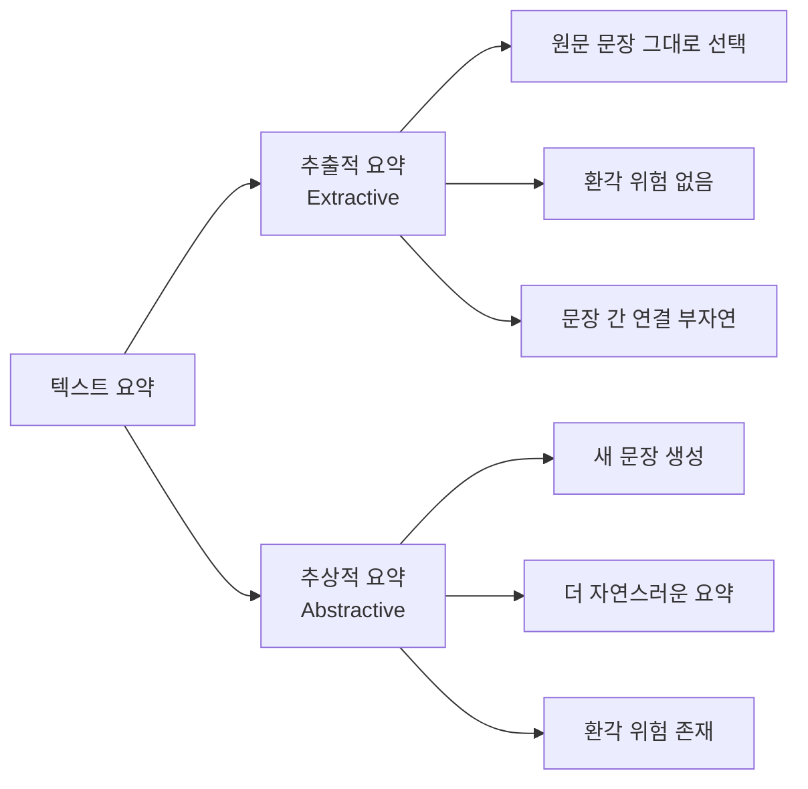

# 텍스트 요약 딥러닝 (Text Summarization with Deep Learning)

텍스트 요약은 긴 문서에서 핵심 정보를 추출해 짧고 응집된 텍스트로 변환하는 NLP 태스크다. 딥러닝, 특히 [[seq2seq]] 아키텍처와 [[transformer-architecture]]의 발전으로 요약 품질이 비약적으로 향상되었다. 요약 방식은 크게 추출적 요약과 추상적 요약으로 나뉜다.

## 추출적 요약 vs. 추상적 요약



### 추출적 요약 (Extractive Summarization)
원문에서 중요 문장이나 구절을 그대로 선택해 요약을 구성한다. 문장 중요도를 점수화하고 상위 N개 문장을 추출하는 방식이다.

- **장점**: 원문 내용을 그대로 사용하므로 사실적 오류(환각) 없음
- **단점**: 문장 간 연결이 어색하고, 원문에 없는 새로운 표현 불가
- **대표 모델**: BertSum, SummaRunner, TextRank(그래프 기반)

### 추상적 요약 (Abstractive Summarization)
원문을 이해하고 새로운 문장을 생성해 요약을 작성한다. 인간이 요약하는 방식과 유사하다.

- **장점**: 더 자연스럽고 응집된 요약 생성 가능
- **단점**: 환각(hallucination) 위험, 사실 오류 발생 가능
- **대표 모델**: PEGASUS, BART, T5, 최신 LLM 기반

## ROUGE 평가 지표

요약 품질을 측정하는 표준 지표는 ROUGE(Recall-Oriented Understudy for Gisting Evaluation)다.

| 지표 | 계산 방식 |
|------|----------|
| ROUGE-1 | 단어(unigram) 단위 재현율 |
| ROUGE-2 | 바이그램(bigram) 단위 재현율 |
| ROUGE-L | 최장 공통 부분 수열(LCS) 기반 |

ROUGE는 참조 요약(인간 작성)과 생성 요약 간 중복도를 측정한다. 단, ROUGE가 높다고 반드시 좋은 요약은 아니며 일관성, 사실성, 가독성 등 추가 평가가 필요하다.

## PEGASUS: 요약 특화 사전학습

PEGASUS(Zhang et al., 2020)는 요약 태스크를 위해 특별히 설계된 사전학습 방식을 도입했다.

### GSG (Gap Sentence Generation)
BERT의 MLM(Masked Language Modeling) 대신, 문서에서 중요한 문장 전체를 마스킹하고 이를 생성하도록 학습한다. 요약과 유사한 자기지도 학습 태스크다.

```text
원문 문서:
  문장1: 구글이 새로운 AI 모델을 발표했다. [MASK_SENT]
  문장2: 이 모델은 언어 이해 능력이 탁월하다.
  문장3: 연구팀은 6개월 만에 개발을 완료했다.

사전학습 목표: [MASK_SENT]에 들어갈 문장1 생성
```

PEGASUS는 XSum, CNN/DailyMail 등 12개 요약 데이터셋에서 당시 SOTA를 달성했으며, 적은 양의 파인튜닝 데이터로도 높은 성능을 보였다.

## BART를 활용한 요약

BART(Lewis et al., 2020)는 노이즈 제거 자동인코더(denoising autoencoder)로 사전학습된 seq2seq 모델이다. 다양한 노이즈 방식(텍스트 채우기, 문장 순서 섞기, 삭제, 교환 등)으로 학습해 범용적인 텍스트 생성 능력을 갖췄다.

```python
from transformers import BartForConditionalGeneration, BartTokenizer

model = BartForConditionalGeneration.from_pretrained("facebook/bart-large-cnn")
tokenizer = BartTokenizer.from_pretrained("facebook/bart-large-cnn")

article = "긴 기사 텍스트..."
inputs = tokenizer(article, max_length=1024, return_tensors="pt", truncation=True)

summary_ids = model.generate(
    inputs["input_ids"],
    num_beams=4,
    max_length=150,
    min_length=40,
    length_penalty=2.0,
    early_stopping=True
)
summary = tokenizer.decode(summary_ids[0], skip_special_tokens=True)
```

## 주요 데이터셋

| 데이터셋 | 도메인 | 특징 |
|---------|-------|------|
| CNN/DailyMail | 뉴스 | 추출적·추상적 혼합, 대규모 |
| XSum | BBC 뉴스 | 단문 추상적 요약, 높은 추상화 수준 |
| arXiv / PubMed | 학술 | 장문 과학 논문 요약 |
| SAMSum | 대화 | 대화 요약, 구어체 |
| KLUE-STS 기반 한국어 | 뉴스 | 한국어 요약 벤치마크 |

## 장문 문서 요약의 도전

표준 트랜스포머는 입력 길이에 제한(BERT 512, BART 1024 토큰)이 있어 장문 문서를 한 번에 처리하기 어렵다.

해결 전략:
- **계층적 요약**: 문서를 청크로 나눠 각각 요약 후 최종 요약
- **Longformer/BigBird**: 희소 어텐션(sparse attention)으로 4096-8192 토큰 처리
- **Sliding Window**: 슬라이딩 윈도우로 문서를 순차 처리

## LLM 시대의 텍스트 요약

GPT-4, Claude, Gemini 같은 대형 언어 모델은 프롬프팅만으로도 고품질 요약을 생성한다. 특히 컨텍스트 윈도우가 수십만 토큰에 달하는 최신 LLM은 책 분량의 문서도 직접 요약할 수 있다.

그러나 LLM 요약도 한계가 있다:
- **환각 위험**: 원문에 없는 내용을 생성할 수 있음
- **일관성 없는 길이**: 요청과 다른 길이의 요약 생성
- **사실 왜곡**: 수치·날짜·인명 오류

이를 완화하기 위해 인용 기반 요약(grounded summarization), 사실 검증 단계 추가 등이 연구되고 있다.

## 실무 적용 관점

- **도메인 특화 파인튜닝**: 법률 문서, 의료 기록 등 특수 도메인은 일반 모델보다 도메인 특화 데이터로 파인튜닝한 모델이 정확도가 높다
- **요약 길이 제어**: `max_length`, `min_length`, `length_penalty` 파라미터 조정이 필요하며, LLM에서는 프롬프트에 목표 길이를 명시
- **사실성 검증**: 중요도가 높은 사용처(의료·법률·금융)에서는 생성된 요약의 사실성을 원문과 자동·수동으로 교차 검증하는 단계가 필수

## 관련 문서

- [[seq2seq]] - 추상적 요약의 기반 아키텍처
- [[transformer-architecture]] - PEGASUS, BART, T5의 기반 구조
- [[bert]] - 추출적 요약 모델(BertSum)의 기반
- [[rag-pipeline]] - RAG 파이프라인에서 검색 결과 요약에 활용
- [[semantic-role-labeling]] - 요약 품질 평가 시 핵심 사건 보존 여부 검증
