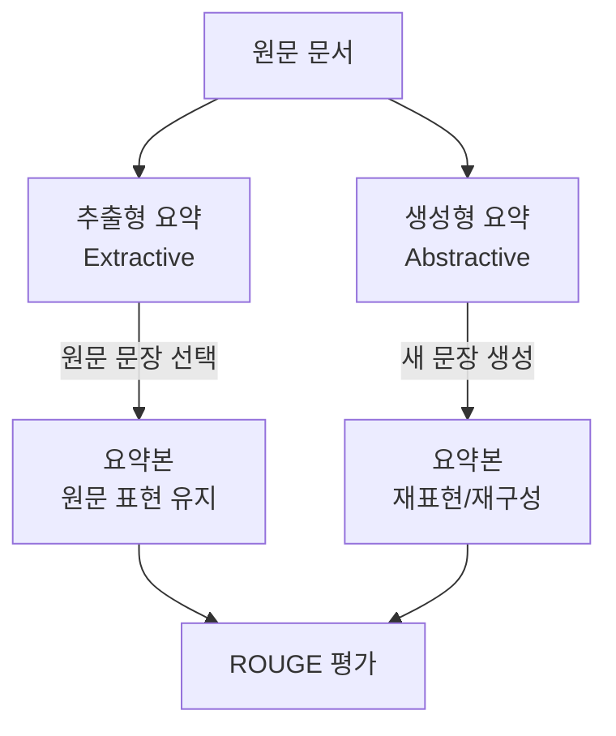
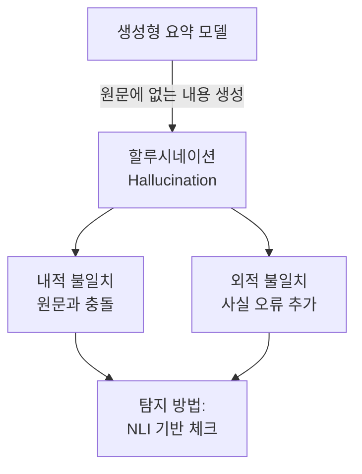
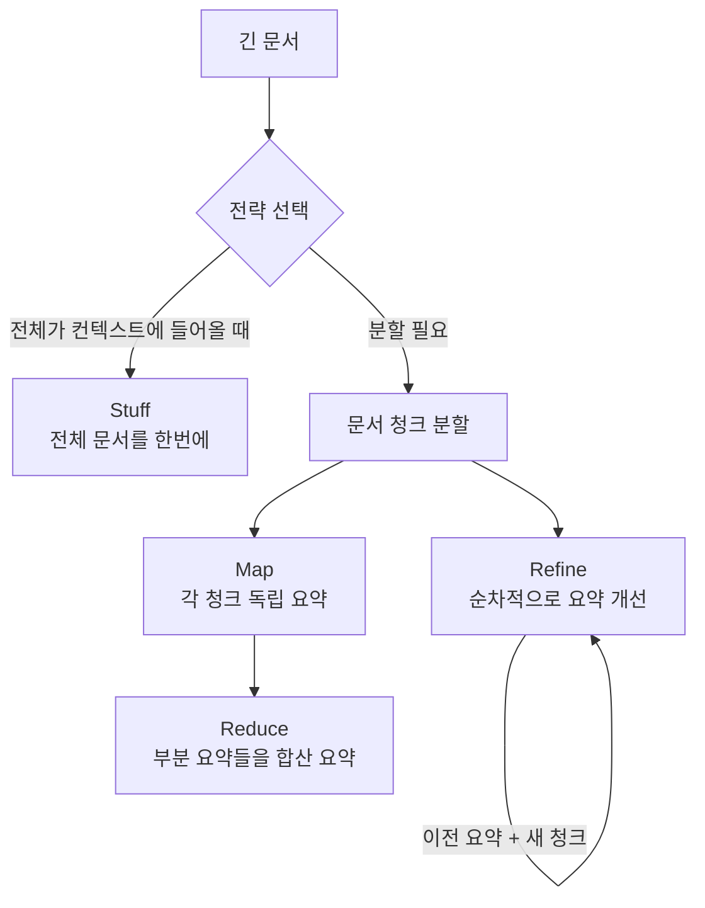

# 텍스트 요약 (Text Summarization)

## 핵심 개념

**텍스트 요약**은 긴 문서에서 핵심 정보를 보존하면서 압축된 텍스트를 생성하는 NLP 태스크다. 크게 두 가지 패러다임으로 나뉜다:

- **추출형 요약(Extractive Summarization)**: 원문에서 핵심 문장/구절을 그대로 선택
- **생성형 요약(Abstractive Summarization)**: 새로운 문장을 생성하여 내용을 재서술

## 추출형 요약 (Extractive)

원문 문장에 점수를 매겨 중요도가 높은 문장을 선택한다. 원문 표현이 그대로 유지되므로 **사실 오류(hallucination)가 없다**는 것이 최대 장점이다.

### TextRank

**TextRank**(Mihalcea & Tarau, 2004)는 PageRank 알고리즘을 문장에 적용한 비지도 방법이다.

- 문장을 TF-IDF 벡터로 표현, 코사인 유사도로 엣지 가중치 결정
- 외부 학습 데이터 불필요, 빠르고 범용적
- 단점: 문장 순서 정보 미활용, 긴 문서에서 일관성 부족

### BertSumExt

**BertSumExt**(Liu & Lapata, 2019)는 BERT를 문장 선택에 활용한다.

- 각 문장의 시작에 `[CLS]` 토큰 삽입, 특수 `[SEP]` 토큰으로 구분
- 각 `[CLS]` 표현을 문장 표현으로 사용
- 문장별 이진 분류(선택/비선택)로 학습
- 문서 수준 문맥을 반영한 문장 중요도 평가

## 생성형 요약 (Abstractive)

원문 내용을 이해하고 새로운 문장으로 재서술한다. 더 자연스럽고 압축적인 요약이 가능하지만, **사실 불일치(factual inconsistency)** 문제가 존재한다.

### BART (Bidirectional and Auto-Regressive Transformers)

**BART**(Lewis et al. 2020, Facebook AI)는 인코더-디코더 구조의 사전학습 모델이다.

- 인코더: 양방향 어텐션 (BERT 스타일)
- 디코더: 자기회귀 생성 (GPT 스타일)
- CNN/DailyMail, XSum 데이터셋에서 SOTA 달성
- 노이즈 제거(denoising) 사전학습: 토큰 마스킹, 문장 섞기, 텍스트 삽입 등

### Pegasus

**Pegasus**(Zhang et al. 2020, Google)는 요약에 특화된 사전학습 목표를 사용한다.

- **GSG(Gap Sentence Generation)**: 문서에서 핵심 문장을 제거하고 생성하는 방식으로 사전학습
- 요약 태스크와 사전학습 목표가 직접 정렬되어 소수 예제로도 높은 성능
- XSum, CNN/DailyMail, Reddit TIFU 등 다양한 도메인에서 우수

### T5 (Text-to-Text Transfer Transformer)

**T5**(Raffel et al. 2020, Google)는 모든 NLP 태스크를 텍스트-텍스트 변환으로 통일한다.

- 입력: `"summarize: {원문 텍스트}"`
- 출력: 요약 텍스트
- 하나의 프레임워크로 번역, QA, 요약 등 다양한 태스크 처리 가능

## ROUGE 평가 지표

**ROUGE(Recall-Oriented Understudy for Gisting Evaluation)**(Lin, 2004)는 요약 평가의 표준 지표다.

$$\text{ROUGE-N} = \frac{\sum_{s \in \text{참조}} \sum_{\text{n-gram} \in s} \text{Count}_{\text{match}}(\text{n-gram})}{\sum_{s \in \text{참조}} \sum_{\text{n-gram} \in s} \text{Count}(\text{n-gram})}$$

| 지표 | 의미 | 포착하는 것 |
|------|------|------------|
| **ROUGE-1** | 단어(유니그램) 겹침 | 핵심 단어 포함 여부 |
| **ROUGE-2** | 바이그램 겹침 | 구문 수준 일치 |
| **ROUGE-L** | 최장 공통 부분 수열 | 문장 구조 유사도 |
| **ROUGE-Lsum** | 문장 수준 ROUGE-L | 문서 수준 구조 유사도 |

**ROUGE의 한계**: 어휘 겹침만 측정하므로 의미적으로 같지만 다른 단어를 쓴 좋은 요약도 낮은 점수. BERTScore, QAEval 등 의미 기반 평가가 보완책으로 사용된다.

## 핵심 과제: 사실 일관성

생성형 요약의 가장 심각한 문제는 **할루시네이션(hallucination)**이다. 원문에 없는 사실을 만들어내거나, 원문과 상충하는 내용을 생성한다.

**완화 방법**:
- **추출-생성 혼합**: 먼저 핵심 문장을 추출하고, 이를 기반으로 생성 (BottomUp, FROST 등)
- **충실도 학습**: 사실 일관성을 보상으로 RL 파인튜닝
- **NLI 기반 필터링**: 생성된 요약이 원문과 모순되는지 자연어 추론 모델로 검증
- **인용 기반 생성**: 원문에서 구절을 직접 인용하도록 모델 유도

## LLM 기반 요약

GPT-4, Claude 등 대형 언어 모델은 프롬프트 지시만으로 높은 품질의 요약을 생성한다. 하지만 긴 문서는 컨텍스트 윈도우 제한 문제가 있다.

### 장문 문서 처리 전략

**Map-Reduce**:
- 병렬 처리 가능, 빠름
- 청크 간 문맥 연결이 약할 수 있음

**Refine**:
- 이전 요약을 다음 청크와 함께 처리하여 연속성 유지
- 순차 처리이므로 느림

**계층적(Hierarchical)**:
- 청크 → 중간 요약 → 최종 요약의 트리 구조
- 매우 긴 문서에 적합

## RAG + 요약 조합 패턴

**RAG(Retrieval-Augmented Generation)**와 요약을 결합하면 긴 문서 컬렉션에서 질의에 맞는 요약을 생성할 수 있다.

1. 질의로 관련 청크 검색 (벡터 유사도)
2. 검색된 청크들을 컨텍스트로 요약 생성
3. 출처 청크를 인용하여 할루시네이션 억제

이 패턴은 기업 지식베이스, 법률 문서, 논문 검색 등에서 광범위하게 사용된다.

## 실무 선택 가이드

| 상황 | 권장 접근 |
|------|----------|
| 사실 정확도 최우선 | 추출형 (BertSumExt, TextRank) |
| 자연스러운 요약 필요 | 생성형 (BART, Pegasus) |
| 긴 문서 (>100K 토큰) | Map-Reduce 또는 계층적 |
| 빠른 프로토타입 | LLM + 프롬프트 엔지니어링 |
| 도메인 특화 | 도메인 데이터 파인튜닝 |

## 관련 문서

- [[rag]] - 검색 증강 생성과 요약의 결합 패턴
- [[hallucination]] - 생성형 모델의 사실 불일치 문제
- [[bert-paper|bert-architecture]] - BertSumExt의 기반 아키텍처
- [[transformer-architecture|transformer-architectures]] - BART, T5 등의 기반 구조
- [[long-context-llm]] - 긴 컨텍스트 처리를 위한 LLM 기법
