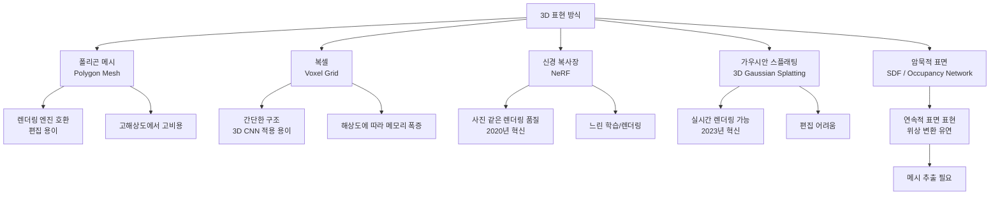
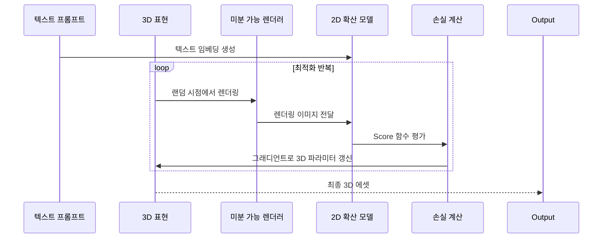
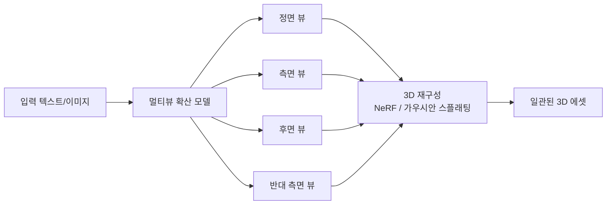

# 텍스트-3D 생성 (Text-to-3D Generation)

## 개요

텍스트-3D 생성(Text-to-3D)은 자연어 설명이나 참조 이미지를 입력받아 3차원 메시(mesh), 포인트 클라우드(point cloud), 신경 표현(neural representation) 형태의 3D 오브젝트나 씬(scene)을 생성하는 기술이다.

2024-2026년 동안 이 분야는 급격한 품질 향상을 이루었다. World Labs의 Marble, Tripo AI의 TripoSG 등이 상용 제품으로 등장하며 게임 개발, 건축 시각화, 영화 VFX, 전자상거래(3D 상품 뷰어) 분야에서 실용적 활용이 시작되었다. 기술적 기반은 [[diffusion-models|확산 모델]]과 [[latent-diffusion-model|잠재 확산 모델(Latent Diffusion Model)]]이다.

## 3D 표현 방식의 진화

AI가 3D 공간을 표현하는 방식은 여러 세대를 거쳐 발전했다.

## 핵심 기술: Score Distillation Sampling (SDS)

2D 확산 모델의 강력한 사전 지식(prior)을 3D 최적화에 활용하는 핵심 기법이다. 2022년 DreamFusion 논문이 제안했다.

**작동 원리**:
1. 3D 표현(NeRF 등)을 임의의 카메라 각도에서 2D로 렌더링
2. 렌더링된 이미지를 2D 확산 모델에 입력
3. 확산 모델의 점수(score) 함수가 "이 이미지가 텍스트 프롬프트에 얼마나 맞는가"를 평가
4. 이 신호로 3D 표현의 파라미터를 직접 최적화

**한계**: SDS는 "과포화(over-saturation)"와 "얼굴 다중 생성(multi-face)" 같은 아티팩트를 유발하는 경향이 있다. 이를 개선하기 위해 VSD(Variational Score Distillation) 등의 후속 기법이 제안되었다.

## 주요 제품 현황

### World Labs - Marble

Fei-Fei Li가 설립한 World Labs의 공간 AI(spatial intelligence) 연구 산물이다. 단일 이미지나 텍스트에서 일관된 3D 세계(월드)를 생성하는 것을 목표로 한다. 단순한 오브젝트 생성을 넘어 탐색 가능한 3D 씬을 생성하는 "월드 모델" 방향을 추구한다.

### Tripo AI - TripoSG

멀티뷰 일관성(multi-view consistency)에 특화된 모델이다. 텍스트나 단일 이미지에서 여러 시점에서 일관된 고품질 메시를 생성한다. 산업 디자인과 게임 에셋 제작에 실용적인 수준의 품질을 제공한다.

### 기타 주요 플랫폼

| 플랫폼 | 입력 | 출력 형식 | 강점 |
|--------|-----|---------|------|
| Tripo AI | 텍스트, 이미지 | GLB, OBJ | 빠른 생성, 게임 에셋 품질 |
| Meshy | 텍스트, 이미지 | FBX, GLB, OBJ | 텍스처 자동 생성 |
| Luma AI Genie | 텍스트 | 3D 씬 | 포토리얼리스틱 |
| Point-E (OpenAI) | 텍스트 | 포인트 클라우드 | 오픈소스 연구 |
| Shap-E (OpenAI) | 텍스트, 이미지 | NeRF, 메시 | 오픈소스 |

## 멀티뷰 일관성: 핵심 도전

텍스트-3D 생성의 가장 어려운 문제는 다양한 시점에서 일관된 외관을 유지하는 것이다.

단일 뷰 방법은 앞면을 그럴듯하게 생성해도 뒷면이 앞면의 단순 미러링이거나 무의미한 텍스처가 된다. 멀티뷰 확산 모델(Zero123, MVDiffusion, One-2-3-45)은 이를 해결하기 위해 여러 카메라 각도의 이미지를 동시에 생성하고 3D로 합성한다.

## 응용 분야

**게임 개발**: 인디 개발자가 수작업 없이 3D 에셋을 대량 생성. 프로토타이핑 속도를 10배 이상 높일 수 있다.

**전자상거래**: 실제 상품 사진 한 장에서 360도 뷰어용 3D 모델 자동 생성. 아마존, 쿠팡 등이 도입을 검토 중이다.

**건축/인테리어**: 텍스트 설명에서 시각화 모델 즉시 생성. 클라이언트 제안 단계 시간 단축.

**VFX/영상**: 배경 에셋 생성 자동화. 단 현재 품질은 히어로 에셋보다는 배경 소품에 적합하다.

**AR/VR**: 공간 컴퓨팅 기기용 3D 콘텐츠 수요 폭증에 대응. Apple Vision Pro 등장과 함께 수요가 급증했다.

## 평가 지표

| 지표 | 설명 |
|------|------|
| CLIP Score | 생성된 3D와 텍스트 프롬프트의 의미적 일치도 |
| FID (3D) | 생성 분포와 실제 3D 모델 분포의 거리 |
| 사용자 선호도 | 사람이 평가한 품질/충실도/다양성 |
| 멀티뷰 일관성 | 다른 시점에서의 외관 유사도 |

## 현재 한계

- 복잡한 위상(예: 체인, 꼬인 구조)에서 품질 저하
- 미세한 디테일(손가락, 얼굴 표정)에서 아티팩트 발생
- 생성 시간이 여전히 수분에서 수십분 소요 (고품질 기준)
- 애니메이션을 위한 리깅(rigging)은 별도 수동 작업 필요
- 물리 기반 재질(PBR material) 자동 생성은 아직 초기 단계

## 관련 문서
- [[3d-gaussian-splatting]] -- 3D Gaussian Splatting

- [[diffusion-models|확산 모델]] - 텍스트-3D의 핵심 생성 메커니즘
- [[latent-diffusion-model|잠재 확산 모델]] - 효율적 3D 생성을 가능하게 하는 잠재 공간 접근법
- [[ai-image-generation|AI 이미지 생성]] - 2D 생성 AI와의 기술 연계
- [[ai-video-generation|AI 비디오 생성]] - 멀티모달 생성 AI 생태계
