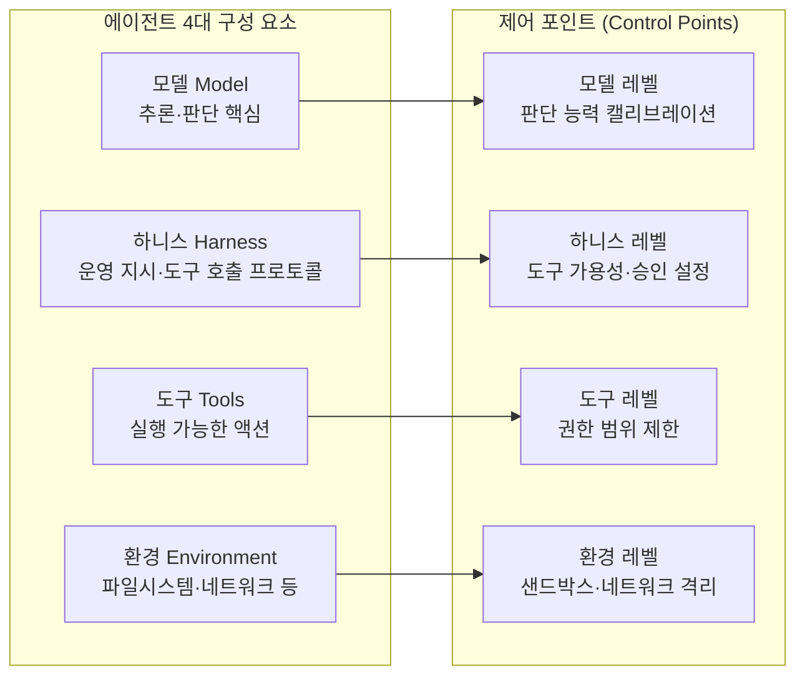
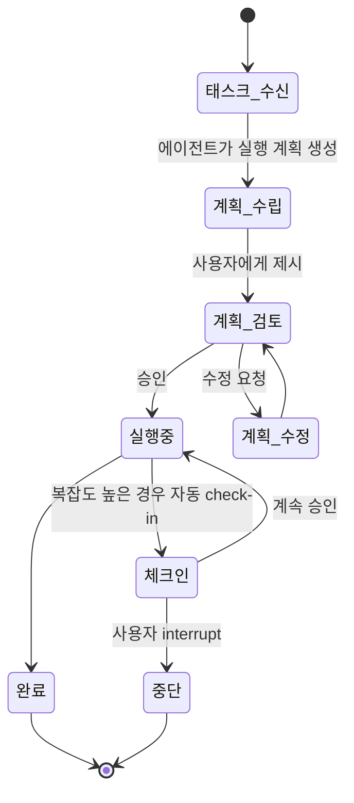

# 신뢰할 수 있는 에이전트 설계 (Anthropic 프레임워크)

## 개요

Claude Code, Claude Cowork 같은 고자율 에이전트 시스템이 확산되면서 생산성 향상(productivity gain)과 리스크가 동시에 커지는 상황에서, Anthropic이 "신뢰 가능한 에이전트" 설계의 실무 원칙을 제시한 가이드 문서다.

원문: [Trustworthy agents in practice (Anthropic, 2026-04-09)](https://www.anthropic.com/research/trustworthy-agents)

## 에이전트의 네 가지 구성 요소

에이전트 시스템은 네 개의 레이어로 구성된다. 각 레이어는 에이전트 역량(capability)인 동시에 제어 포인트(control point) -- 권한 축소 레버로 활용 가능하다.

위 다이어그램은 4개 구성 요소 각각이 독립적인 제어 포인트임을 보여준다. 권한 최소화는 한 레이어만이 아닌 전 레이어에서 동시에 적용되어야 한다.

## 신뢰 프레임워크 5원칙

| 원칙 | 핵심 내용 |
|------|-----------|
| **인간 제어 (Human Control)** | 사용자가 도구 가용성과 승인 요구 수준을 직접 결정 |
| **목표 정렬 (Goal Alignment)** | 모호한 상황에서 clarification을 요청하도록 학습 |
| **보안 (Security)** | 모델·하니스·도구·환경 각 레이어에 다층 방어 적용 |
| **투명성 (Transparency)** | 에이전트 능력과 한계에 대한 증거를 공유 |
| **프라이버시 (Privacy)** | 에이전트 작동 전반의 데이터 보호 |

5원칙은 독립적으로 작동하지 않는다. 예를 들어 투명성이 충족되어야 인간 제어가 실질적으로 작동하고, 보안 레이어가 갖춰져야 목표 정렬이 의미를 갖는다.

## Plan Mode

**Plan Mode**는 에이전트 오버사이트 방식의 패러다임 전환이다.

- **기존**: 개별 액션마다 승인 요청 -- 복잡한 작업에서 마찰(friction) 누적
- **Plan Mode**: 전체 실행 전략을 먼저 검토하고 종합 승인

복잡한 멀티스텝 작업에서 사용자는 "각 단계 승인"이 아닌 "계획 전체 검토"를 통해 더 효율적으로 오버사이트를 수행할 수 있다.

## 서브에이전트 조정(Subagent Orchestration)

여러 에이전트가 병렬로 다른 태스크 부분을 처리하는 새 패러다임에서는 오버사이트 접근 자체가 달라진다.

- 기존: 개별 에이전트 단위 감독
- 새 패러다임: **조정자(orchestrator) 수준의 오버사이트** 필요
- 개별 에이전트 행동보다 전체 실행 계획의 정합성을 검토하는 방식으로 전환

## 프롬프트 인젝션 다층 방어

단일 방어 레이어로는 충분하지 않다. Anthropic은 세 가지 층위의 방어를 권장한다:

1. **모델 학습**: injection 패턴을 인식하도록 훈련
2. **프로덕션 트래픽 모니터링**: 실제 배포 중 이상 패턴 탐지
3. **외부 Red-teaming**: 제3자 검증으로 내부 방어의 사각지대 보완

더불어 사용자와 조직이 도구, 권한, 환경을 신중히 구성해야 한다고 강조한다.

[[agent-prompt-injection-defense]] 페이지에서 계층적 방어 프레임워크의 상세 내용을 볼 수 있다.

## 정량 관찰

| 관찰 항목 | 결과 |
|-----------|------|
| 사용자 interrupt 빈도와 과제 복잡도의 상관 | 큰 차이 없음 |
| 복잡한 과제에서 Claude 자체 check-in 빈도 | 단순 과제 대비 약 **2배** |

자체 check-in이 복잡도에 비례해 증가한다는 관찰은 모델이 적절히 캘리브레이션되어 있음을 시사한다. 사용자 interrupt가 복잡도와 무관하다는 점은 오버사이트 부담이 복잡한 작업에서도 크게 증가하지 않는다는 긍정적 신호다.

## 업계 및 표준 권고

- prompt injection 저항성과 불확실성 탐지를 위한 표준 벤치마크 필요
- 제3자 검증을 포함한 평가 생태계 구축 권고
- [[model-context-protocol|MCP(Model Context Protocol)]] 같은 오픈 스탠다드로 인프라에 보안을 내재화

## 관련 문서

- [[agent-prompt-injection-defense]] -- 프롬프트 인젝션의 계층적 방어 프레임워크 상세
- [[model-context-protocol]] -- MCP 오픈 스탠다드 상세
- [[subagents]] -- 서브에이전트 패턴과 오케스트레이터 구조
- [[orchestrator-worker-pattern]] -- 오케스트레이터-워커 패턴 설계
