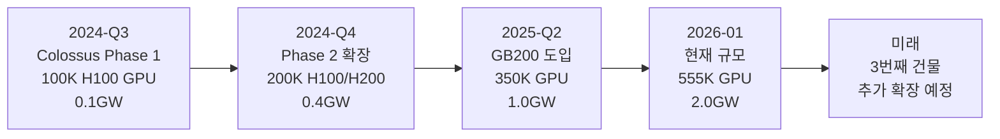
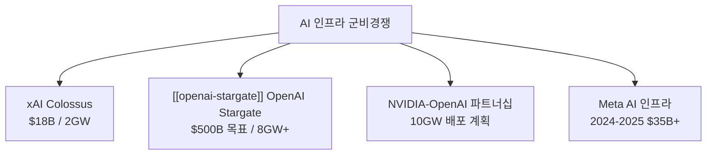
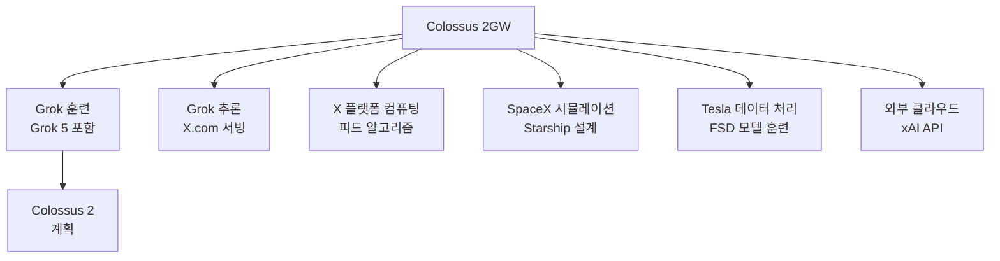

# xAI Colossus Memphis - 세계 최대 AI 슈퍼컴퓨터

## 개요

xAI의 Colossus 슈퍼컴퓨터는 미국 테네시 주 멤피스(Memphis, Tennessee)에 위치한 세계 최대 AI 컴퓨팅 시설이다. 2026년 1월 기준 총 전력 용량 2기가와트(GW), 555,000개의 NVIDIA GPU(H100, H200, GB200)를 보유한다. 총 투자액 180억 달러로, 미국 약 150만 가구가 소비하는 전력에 해당하는 에너지를 소모한다.

Grok 시리즈 훈련, X 플랫폼(구 트위터) 컴퓨팅, SpaceX 등 Musk 벤처 전체에 컴퓨팅 서비스를 제공하며, Elon Musk가 세 번째 건물 추가 매입을 발표하며 계속 확장 중이다.

## 건설 타임라인

위 타임라인은 Colossus의 주요 확장 단계를 보여준다. 2024년 하반기 초기 구축부터 2026년 초 세계 최대 규모 달성까지 약 18개월이 소요됐다.

## 규모 분석: 숫자로 보는 Colossus

### GPU 구성

| GPU 모델 | 특징 | Colossus 활용 |
|----------|------|--------------|
| NVIDIA H100 SXM | 80GB HBM2e, 3.35 TFLOPS BF16 | 초기 대규모 배포 기반 |
| NVIDIA H200 | 141GB HBM3e, 향상된 메모리 대역폭 | H100 업그레이드 |
| NVIDIA GB200 | Blackwell 아키텍처, NVLink 5 | 최신 고성능 배포 |

555,000개 GPU를 NVLink/InfiniBand 네트워크로 연결하는 것 자체가 엔지니어링 도전이다. 단일 훈련 잡(job)에 수만 GPU를 할당하려면 초저지연 통신 패브릭이 필수다.

### 전력 소비

2기가와트는 다음과 같은 규모다:

- 미국 가정 150만 가구 연간 소비 전력
- 중간 규모 원자력 발전소 2기 생산량
- 테네시 주 멤피스 시 전체 소비 전력의 약 30%

**전력 공급 구조:**
- 테네시 밸리 청(TVA, Tennessee Valley Authority) 전력 계약
- 멤피스 선택 이유 중 하나가 TVA의 상대적으로 저렴하고 안정적인 전력 공급
- 데이터센터 냉각을 위한 수냉식/공냉식 혼합 시스템

### 투자 규모 비교

## 멤피스 입지 선정 이유

xAI가 멤피스를 선택한 이유는 복합적이다:

1. **전력 가용성**: TVA의 풍부하고 안정적인 전력망
2. **토지 비용**: 실리콘밸리 대비 저렴한 산업용 부동산
3. **물 공급**: 데이터센터 냉각에 필요한 미시시피 강 수자원
4. **정치적 환경**: 테네시 주의 친기업 세금 정책
5. **물류**: 주요 물류 허브(FedEx 본사 소재지)

## 활용 워크로드

**Grok 5 훈련**: 600만+ 파라미터 모델을 훈련하려면 수만 개의 GPU를 수개월간 연속 가동해야 한다. 이는 Colossus의 핵심 용도다.

**X 플랫폼 알고리즘**: Nikita Bier(X 제품 총괄)가 "Grok을 X 알고리즘에 전면 통합하는 것이 X 역사상 가장 중요한 변경"이라고 언급했다. 이는 수억 명의 X 사용자에게 실시간 AI 추론을 제공하는 대규모 추론 인프라다.

## [[ai-accelerators]] 생태계와의 관계

Colossus는 현재 전적으로 NVIDIA GPU에 의존한다. 이는 다음을 의미한다:

- **NVIDIA 협상력**: 세계 최대 고객 중 하나로서 xAI는 GPU 가격과 공급 우선권에서 유리한 위치
- **NVIDIA 의존성**: H100 단종, 공급망 문제 발생 시 운영 위험
- **자체 칩 가능성**: [[openai-titan-custom-chip]] 처럼 xAI도 장기적으로 커스텀 칩 전략을 고려할 가능성

## Colossus 2 계획

Elon Musk는 세 번째 건물 매입으로 Colossus 2(또는 Phase 3)를 예고했다. 구체적 사양은 미발표이나:

- Grok 5 훈련 완료 이후 Grok 6/7 훈련을 위한 추가 용량 필요
- NVIDIA Vera Rubin(2026 H2) 플랫폼 도입으로 단위 당 컴퓨팅 밀도 향상 예상
- 전력 용량 3-5GW로 확장 가능성

## 환경 영향 논쟁

2GW 소비는 상당한 환경 발자국을 남긴다:

- **탄소 배출**: TVA 전력 믹스에 석탄/가스 포함. xAI는 재생에너지 전환 계획을 공개하지 않음
- **수자원**: 냉각을 위한 대량 수자원 소비
- **지역 영향**: 멤피스 전력망 용량에 대한 지역 주민 우려

Musk는 환경 비판에 대해 "AI 발전이 기후 솔루션을 만들 것"이라는 입장이지만, 단기 환경 비용은 실재한다.

## [[openai-stargate]]와의 비교

| 항목 | xAI Colossus | OpenAI Stargate |
|------|-------------|----------------|
| 현재 용량 | 2GW | 1GW (예상) |
| 목표 용량 | 확장 중 | 8GW+ |
| 투자 구조 | xAI 단독 | OpenAI+SoftBank+Oracle |
| GPU | NVIDIA 전용 | NVIDIA + 기타 |
| 지역 | 멤피스, 미국 | 텍사스, 전 세계 |

## 실무적 의의

- **AI 군비경쟁의 물질적 기반**: 모델 성능 경쟁이 결국 컴퓨팅 인프라 투자 경쟁으로 구체화된 사례
- **규모의 경제**: 2GW 수준의 집중 컴퓨팅이 어떤 모델 역량을 가능하게 하는지 2026-2027년에 검증될 것
- **에너지 정치**: AI 데이터센터가 국가 에너지 정책과 전력망 설계에 미치는 영향 확대

## 관련 문서

- [[ai-accelerators]] - AI 가속기 하드웨어 전반
- [[openai-stargate]] - OpenAI Stargate 인프라 프로젝트
- [[grok-4-3-beta-multimodal]] - Colossus에서 훈련되는 Grok 모델
