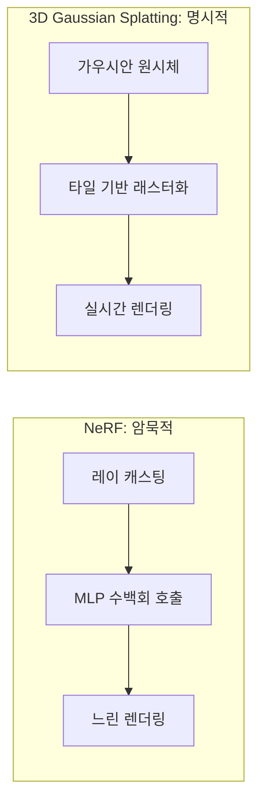

# 3D Gaussian Splatting

Kerbl et al. (SIGGRAPH 2023)이 제안한 3D 장면 표현 및 렌더링 기법. 장면을 수백만 개의 **3D 가우시안 원시체(primitive)**로 표현하고, 미분 가능한 래스터화로 **실시간 렌더링**(1080p 30+ FPS)을 달성한다.

## NeRF와의 비교

| 측면 | NeRF | 3D Gaussian Splatting |
|------|------|----------------------|
| 표현 | 암묵적 (MLP) | 명시적 (점 + 가우시안) |
| 렌더링 | 레이 마칭, 느림 | 래스터화, **실시간** |
| 학습 | 수시간 | **수분** |
| 편집 | 어려움 | 점 기반으로 직관적 |
| 메모리 | 적음 (MLP 가중치) | 많음 (수백만 가우시안) |

## 각 가우시안의 파라미터

- **위치** $\mu \in \mathbb{R}^3$: 3D 중심 좌표
- **공분산** $\Sigma \in \mathbb{R}^{3\times3}$: 형태와 방향 (스케일 + 회전으로 분해)
- **불투명도** $\alpha \in [0,1]$
- **색상**: Spherical Harmonics (SH) 계수로 시점 의존 색상

## 응용

- **VR/AR**: 실시간 3D 씬 렌더링
- **[[text-to-3d|텍스트-3D 생성]]**: DreamGaussian 등 확산 모델 + GS 결합
- **자율주행**: 동적 장면 재구성
- **디지털 트윈**: 실세계 공간 복제

## 관련 문서

- [[implicit-neural-representations]] -- INR/NeRF
- [[text-to-3d]] -- 텍스트-3D 생성
- [[diffusion-models]] -- 확산 모델 (SDS 결합)
