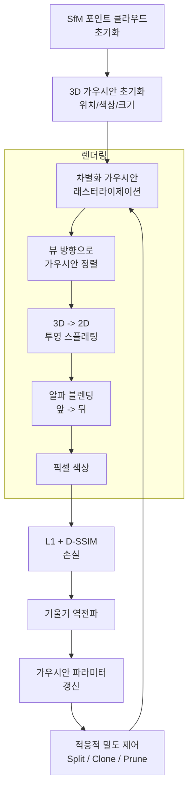
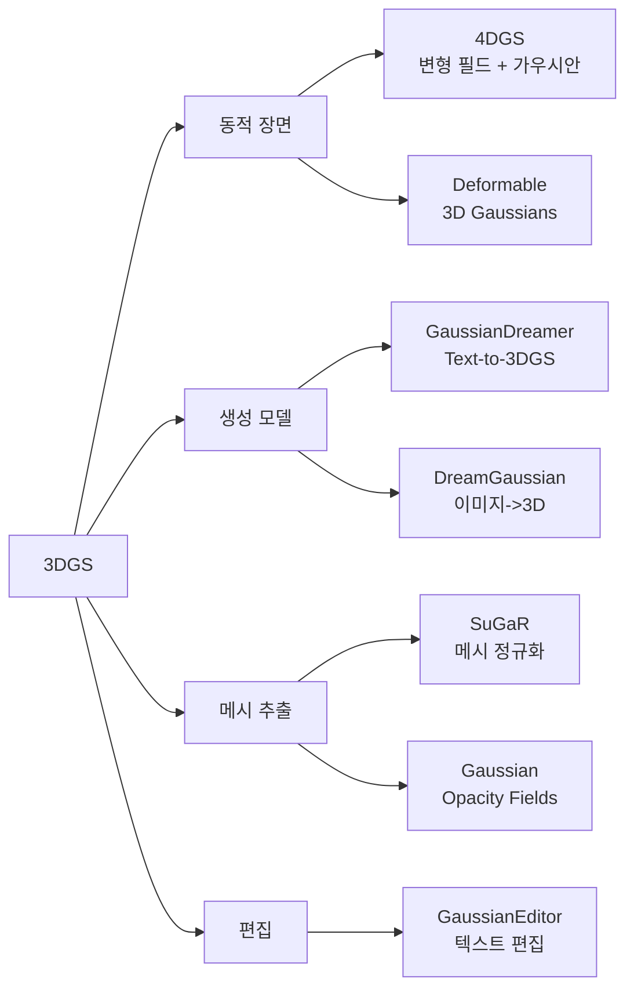

# 3D 가우시안 스플래팅 (3DGS)

## 개요

**3D Gaussian Splatting(3DGS)**은 2023년 Kerbl et al.이 SIGGRAPH에서 발표한 3D 장면 표현 및 실시간 렌더링 기법이다. ICCV 2023 Best Paper Award를 수상했으며, NeRF 기반 방식이 가진 느린 렌더링 속도 문제를 근본적으로 해결하여 현재 실시간 신경 렌더링의 사실상 표준이 되었다.

핵심 아이디어: 장면을 수백만 개의 **3D 가우시안 타원체(ellipsoid)**로 표현하고, GPU 래스터라이제이션 파이프라인으로 빠르게 렌더링한다.

## NeRF vs 3DGS 비교

| 항목 | NeRF | 3DGS |
|------|------|------|
| 표현 방식 | 암묵적 (MLP) | 명시적 (가우시안 집합) |
| 렌더링 방식 | 볼륨 렌더링 (광선 행진) | 래스터라이제이션 (splatting) |
| 렌더링 속도 | 수 초/프레임 | 실시간 (100+ FPS) |
| 학습 시간 | 수 시간~수십 시간 | 수십 분 |
| 메모리 크기 | 수십 MB (MLP 가중치) | 수백 MB~수 GB (가우시안 수에 비례) |
| 편집 가능성 | 어려움 | 개별 가우시안 조작 가능 |
| 표면 품질 | 연속적, 부드러움 | 가우시안 이산화로 노이즈 가능 |

## 가우시안 표현

각 3D 가우시안은 다음 속성을 가진다:

$$G(\mathbf{x}) = e^{-\frac{1}{2}(\mathbf{x} - \boldsymbol{\mu})^T \Sigma^{-1} (\mathbf{x} - \boldsymbol{\mu})}$$

- **위치** $\boldsymbol{\mu}$: 3D 공간 좌표 (3 파라미터)
- **공분산** $\Sigma$: 3D 타원체 형태, 쿼터니언 회전 $q$와 스케일 $s$로 분해하여 학습 (7 파라미터)
- **불투명도** $\alpha$: 투명도 (1 파라미터)
- **색상** $c$: 구면 조화 함수(SH, Spherical Harmonics)로 뷰 의존적 색상 표현 (최대 48 파라미터)

가우시안 하나당 약 59개 파라미터이며, 전형적인 장면은 수백만 개의 가우시안으로 구성된다.

## 파이프라인

## 적응적 밀도 제어 (Adaptive Density Control)

3DGS의 핵심 기법 중 하나로, 학습 중 가우시안의 수와 위치를 자동으로 최적화한다:

- **Split**: 큰 가우시안을 2개의 작은 가우시안으로 분할 (세밀한 부분 표현)
- **Clone**: 작은 가우시안을 복제하여 덜 채워진 영역 보완
- **Prune**: 불투명도가 낮은 가우시안 제거 (메모리 효율화)

초기에 SfM(Structure from Motion)으로 얻은 희소 포인트 클라우드에서 시작하여, 수천에서 수백만 개로 자동 성장한다.

## 초기화: SfM 포인트 클라우드

3DGS는 학습을 위해 COLMAP 등으로 생성한 **희소 포인트 클라우드**에서 초기화된다. 이는 장면의 개략적인 3D 구조를 미리 제공하여 최적화를 안정화한다.

랜덤 초기화도 가능하지만 SfM 초기화가 일반적으로 더 좋은 결과를 낸다.

## 렌더링: 타일 기반 래스터라이제이션

볼륨 렌더링(ray marching) 대신 GPU 래스터라이저를 사용한다:

1. 각 가우시안을 카메라 뷰에 2D로 투영 (splatting)
2. 깊이 순으로 정렬
3. 타일 단위로 병렬 알파 블렌딩

이 접근법이 NeRF 대비 100배 이상의 렌더링 속도를 가능하게 한다.

## 후속 연구

- **4DGS**: 변형 필드(deformation field)를 추가해 동적 장면 표현
- **GaussianDreamer**: Score Distillation Sampling으로 텍스트에서 3DGS 생성
- **SuGaR**: 가우시안에 메시 정규화를 추가해 깔끔한 폴리곤 메시 추출
- **GaussianEditor**: 자연어 지시로 장면 내 특정 부분 편집

## 한계

1. **메모리 사용량**: 가우시안 수에 비례해 GB 단위 메모리 필요
2. **표면 일관성**: 연속적 표면 보장이 없어 메시 추출이 어려움
3. **투명한 객체**: 알파 블렌딩 특성상 반투명/투명 물체 표현 부정확
4. **대규모 장면**: 도시 단위 장면에서 가우시안 수 폭발
5. **초기화 의존성**: SfM 실패 시 전체 최적화가 불안정

## 관련 문서

- [[nerf-neural-radiance-fields]] - NeRF: 3DGS의 전신이 된 암묵적 표현
- [[volume-rendering-differentiable|differentiable-rendering]] - 차별화 렌더링의 일반 원리
- [[structure-from-motion]] - 3DGS 초기화에 사용하는 SfM
- [[gaussian-splatting-applications]] - 실무 적용 사례 (AR/VR, 자율주행 등)
