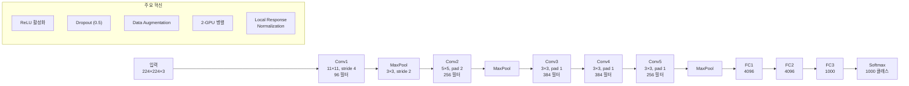
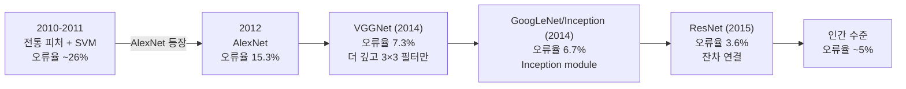

# AlexNet - 딥러닝 ImageNet 혁명

AlexNet은 Alex Krizhevsky, Ilya Sutskever, Geoffrey Hinton이 2012년 발표한 심층 합성곱 신경망이다. ImageNet ILSVRC(ImageNet Large Scale Visual Recognition Challenge) 2012 대회에서 top-5 오류율 15.3%를 기록해 2위(26.2%)와 압도적 격차로 우승했다. 이 결과는 현대 딥러닝 시대의 공식적 출발점으로 여겨진다.

## 왜 AlexNet이 혁명적이었나

2012년 이전 ImageNet 대회는 손수 설계한 피처(HOG, SIFT 등)와 SVM 조합이 주류였다. 신경망은 1980~90년대에 이론적으로 연구되었지만, 학습 데이터 부족과 컴퓨팅 제한으로 실용화되지 못했다. AlexNet은 세 가지 변화로 이 장벽을 돌파했다: GPU 병렬 학습, 대규모 레이블 데이터(ImageNet 120만 장), 그리고 새로운 정규화/활성화 기법.

## 아키텍처 상세

AlexNet은 5개의 합성곱 레이어(Convolutional Layer)와 3개의 완전 연결 레이어(Fully Connected Layer)로 구성된다. 총 파라미터 약 6천만 개.

| 레이어 | 필터 크기 | 필터 수 | 출력 크기 |
|--------|----------|---------|-----------|
| Conv1 | 11×11, s=4 | 96 | 55×55×96 |
| MaxPool1 | 3×3, s=2 | - | 27×27×96 |
| Conv2 | 5×5, pad=2 | 256 | 27×27×256 |
| MaxPool2 | 3×3, s=2 | - | 13×13×256 |
| Conv3 | 3×3, pad=1 | 384 | 13×13×384 |
| Conv4 | 3×3, pad=1 | 384 | 13×13×384 |
| Conv5 | 3×3, pad=1 | 256 | 13×13×256 |
| MaxPool3 | 3×3, s=2 | - | 6×6×256 |
| FC1 | - | 4096 | 4096 |
| FC2 | - | 4096 | 4096 |
| FC3 | - | 1000 | 1000 |

## 핵심 기술 혁신

### ReLU 활성화 함수

이전 주류 활성화 함수는 sigmoid와 tanh였다. 이들은 깊은 네트워크에서 그래디언트 소실(vanishing gradient) 문제가 심각했다. AlexNet은 $f(x) = \max(0, x)$로 정의되는 ReLU(Rectified Linear Unit)를 사용해 학습 속도를 수 배 향상시켰다. ReLU는 양의 입력에서 그래디언트가 1로 일정하므로 깊은 네트워크에서도 그래디언트가 잘 전파된다.

### Dropout

훈련 시 뉴런을 50% 확률로 랜덤하게 비활성화한다. 이는 매번 다른 서브네트워크를 학습하는 것과 같아 앙상블 효과를 낸다. AlexNet에서 FC1, FC2에 Dropout(p=0.5)을 적용해 과적합을 크게 줄였다. 이것이 Dropout의 첫 대규모 실용화 사례다.

### Data Augmentation

원본 256×256 이미지에서 224×224 패치를 랜덤 크롭하고 좌우 반전을 적용한다. 테스트 시에는 4개 코너 + 중앙에서 크롭하고 좌우 반전까지 10개 패치의 평균을 예측값으로 사용한다. 이 간단한 데이터 증강이 과적합 방지에 큰 역할을 했다.

### GPU 병렬 학습

당시 단일 GPU(GTX 580, 3GB VRAM)의 메모리가 부족했다. Krizhevsky는 모델을 두 GPU에 분할해, Conv2-4-5와 모든 FC 레이어는 두 GPU가 교차 통신하고, Conv1-3는 독립적으로 처리했다. 이 2-GPU 병렬 학습이 AlexNet 학습을 현실적으로 만들었다.

## ILSVRC 2012 결과 임팩트

AlexNet의 15.3%는 당시 2위(26.2%)와 11%p 차이였다. 이는 단순한 우승이 아니라 패러다임 전환이었다. 이후 모든 ILSVRC 우승 팀이 딥 뉴럴 네트워크를 사용했다.

## 현대적 관점에서의 한계

- Local Response Normalization(LRN)은 이후 연구에서 효과가 제한적임이 밝혀져 BatchNorm으로 대체
- 11×11 첫 필터는 비효율적으로 크다 (VGGNet은 3×3만 사용)
- 완전 연결 레이어의 6천만 파라미터 중 상당수는 과잉 (이후 Global Average Pooling으로 대체)

## 관련 문서

- [[realmlp-tabular]] - 신경망 아키텍처 개선 엔지니어링의 현대적 예시
- [[tabr-retrieval-augmented]] - 신경망에 검색을 결합하는 최신 패턴
- [[multi-task-ranking]] - 딥러닝이 추천 시스템으로 확장된 현재
