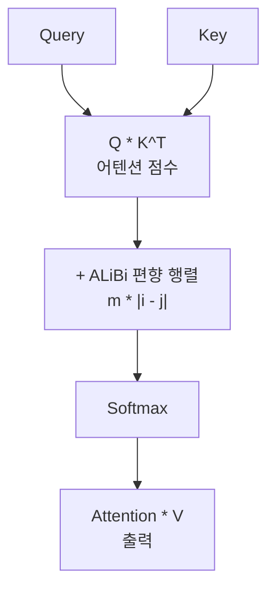
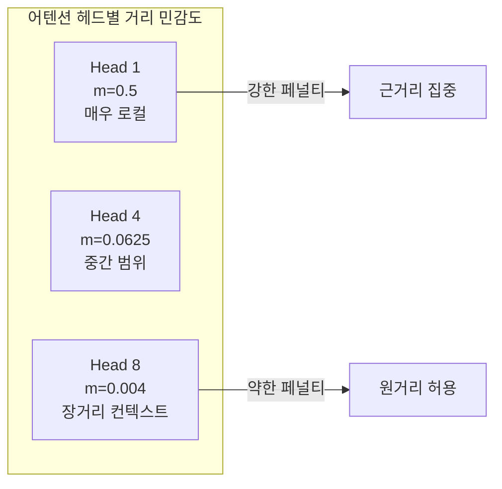

# ALiBi - 선형 거리 페널티 위치 인코딩

## 개요

ALiBi (Attention with Linear Biases)는 2022년 Press et al.이 제안한 위치 인코딩 방식이다. 기존 방식들이 어텐션 입력에 위치 임베딩을 **더하는** 방식인 것과 달리, ALiBi는 어텐션 점수 행렬에 **선형 거리 페널티를 직접 빼는** 접근을 취한다. 핵심 장점은 학습 시퀀스 길이 이상으로 **추론 시 외삽(extrapolation)**이 가능하다는 점이다 - 2048 토큰으로 학습한 모델이 4096 토큰 추론에서도 성능 저하가 적다.

## 기존 위치 인코딩의 외삽 문제

표준 사인파 위치 인코딩이나 학습 가능한 위치 임베딩은 학습 길이를 넘어가면 성능이 급격히 저하된다. 학습 중 본 적 없는 위치에 대한 임베딩이 없거나, 분포가 달라지기 때문이다.

[[rotary-position-embedding]](RoPE)도 외삽 시 주파수 기반으로 인코딩되지만, 훈련 길이의 2배를 넘으면 perplexity가 폭발적으로 증가하는 현상이 있다.

## ALiBi 수식



$$\text{Attention}(Q, K, V) = \text{softmax}\left(\frac{QK^T}{\sqrt{d}} + \mathbf{B}\right)V$$

ALiBi 편향 행렬 $\mathbf{B}$의 각 원소:

$$B_{ij} = -m_h \cdot |i - j|$$

- $|i - j|$: 쿼리 위치 i와 키 위치 j 사이의 거리
- $m_h$: 헤드(head) $h$에 따른 기울기 파라미터 (학습 불필요, 사전 결정)

## 헤드별 기울기 (Slopes)

각 어텐션 헤드가 서로 다른 기울기 $m_h$를 사용하여 **다양한 거리 범위**에 특화된다.

헤드 수 H에 대해 기울기 집합:

$$m_h = 2^{-\frac{8h}{H}}, \quad h = 1, 2, ..., H$$

예를 들어 8헤드 모델:
- Head 1: $m = 2^{-1} = 0.5$ (빠른 감쇠 - 매우 로컬)
- Head 4: $m = 2^{-4} = 0.0625$
- Head 8: $m = 2^{-8} = 0.00390625$ (느린 감쇠 - 넓은 범위)



## 외삽 메커니즘

ALiBi가 외삽에 강한 이유는 **편향이 절대 위치가 아닌 상대 거리에 의존**하기 때문이다.

| 위치 인코딩 방식 | 외삽 원리 | 외삽 한계 |
|----------------|----------|-----------|
| Sinusoidal | 사전 계산된 주파수 - 새 위치 외삽 가능 | 주기성 외에는 패턴 없음 |
| Learned PE | 각 위치에 독립 임베딩 | 훈련 길이 밖 = 미지 영역 |
| RoPE | 복소수 회전 - 상대 위치 내포 | 2배 이상 외삽 시 성능 저하 |
| ALiBi | 선형 페널티 - 상대 거리만 사용 | 학습 길이의 5-10배까지 안정 |

실험에서 ALiBi는 1024 토큰으로 학습 후 2048 토큰 추론에서 표준 사인파 대비 **perplexity 3.5 포인트 낮음**을 달성했다.

## 구현

ALiBi 편향 행렬은 학습 파라미터가 없으므로, 어텐션 계산 시 동적으로 생성한다.

```python
import torch
import math

def get_alibi_slopes(num_heads: int) -> torch.Tensor:
    """헤드별 ALiBi 기울기 계산."""
    def get_slopes_power_of_2(n):
        start = 2 ** (-(2 ** -(math.log2(n) - 3)))
        ratio = start
        return [start * ratio ** i for i in range(n)]

    if math.log2(num_heads).is_integer():
        return torch.tensor(get_slopes_power_of_2(num_heads))

    # 2의 거듭제곱이 아닌 경우 보간
    closest_power = 2 ** math.floor(math.log2(num_heads))
    base_slopes = get_slopes_power_of_2(closest_power)
    extra_slopes = get_slopes_power_of_2(2 * closest_power)[0::2]
    return torch.tensor(base_slopes + extra_slopes[:num_heads - closest_power])


def build_alibi_bias(seq_len: int, num_heads: int) -> torch.Tensor:
    """ALiBi 편향 행렬 생성: (num_heads, seq_len, seq_len)."""
    slopes = get_alibi_slopes(num_heads)  # (num_heads,)
    # 상대 거리 행렬 -(|i-j|)
    positions = torch.arange(seq_len)
    dist = -(positions.unsqueeze(0) - positions.unsqueeze(1)).abs()  # (seq, seq)
    # slopes * dist: (num_heads, seq, seq)
    return slopes.view(-1, 1, 1) * dist.unsqueeze(0)
```

## 장단점

**장점:**
- 파라미터 추가 없음 - 학습 비용 증가 없음
- 장거리 외삽 우수 - [[long-context-scaling]] 방향의 실용적 해결책
- 구현 단순 - 기존 어텐션 코드에 편향 행렬 한 줄 추가
- BloombergGPT, BLOOM (176B) 등 대형 모델에 채택

**단점:**
- 고정된 선형 감쇠 - 태스크에 따라 최적 감쇠 곡선이 다를 수 있음
- 매우 긴 컨텍스트(100K+)에서 RoPE + YaRN 조합에 밀림
- 인과적(causal) 어텐션에 최적화 - 양방향 인코더에서는 효과가 제한적

## 관련 문서

- [[rotary-position-embedding]] - ALiBi와 비교되는 RoPE 위치 인코딩
- [[long-context-scaling]] - 외삽 능력을 활용한 긴 컨텍스트 확장 전략
- [[transformer-architecture]] - 어텐션 메커니즘에서 위치 인코딩의 역할
- [[positional-encoding]] - 다양한 위치 인코딩 방식의 전반적 비교
