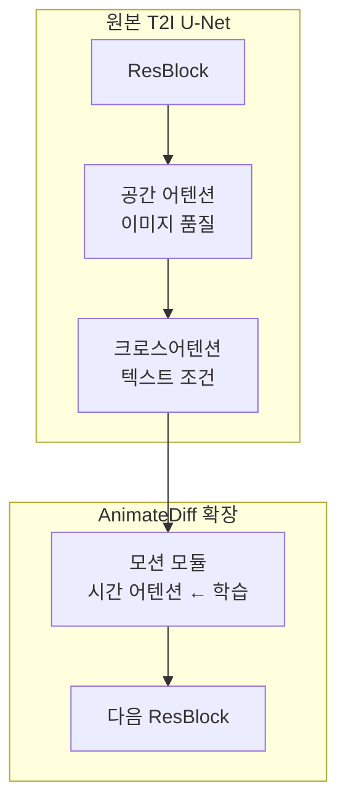
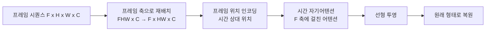
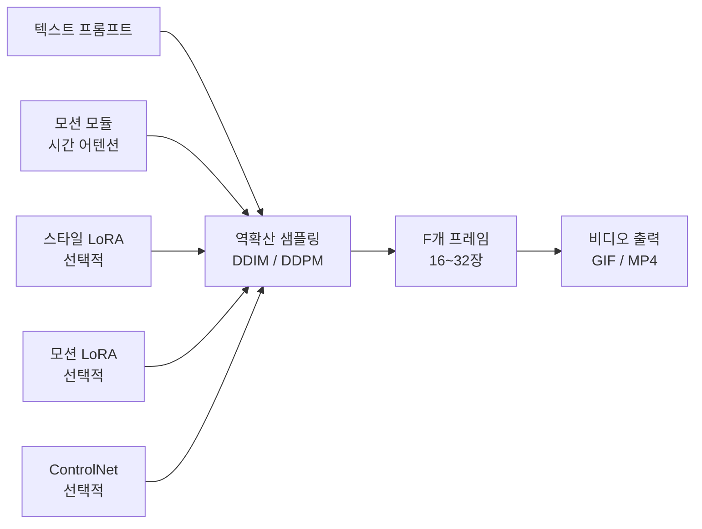

# AnimateDiff - 모션 모듈로 T2I를 비디오로

## 개요

AnimateDiff는 기존 텍스트-이미지(T2I) 확산 모델에 **시간 어텐션 모듈(temporal attention module)**을 삽입해 비디오 생성 능력을 부여하는 프레임워크다. Guo et al.(2023, Shanghai AI Lab)이 제안했으며, 수천 개의 개인화된 T2I 모델([[latent-diffusion-model|Stable Diffusion]] 계열 LoRA/DreamBooth 모델 포함)을 파인튜닝 없이 즉시 비디오 모델로 전환할 수 있다.

## 왜 중요한가

비디오 생성 모델을 처음부터 훈련하는 것은 막대한 데이터와 연산을 요구한다. AnimateDiff는 "모션만 별도로 학습"하는 분리 전략을 취해 다음 이점을 제공한다:

- 기존 T2I 에코시스템(수천 개의 커뮤니티 파인튜닝 모델) 재사용
- 모션 모듈 하나로 다양한 스타일의 비디오 생성 가능
- [[controlnet-conditioning|ControlNet]]·[[ip-adapter-image-prompting|IP-Adapter]] 등 기존 어댑터와 그대로 결합
- 비디오 데이터가 없어도 이미지 모델의 외관 품질 그대로 활용

## 아키텍처

### 모션 모듈 삽입 구조

U-Net의 각 해상도 레벨에서 공간 어텐션·크로스어텐션 블록 직후에 **모션 모듈**을 삽입한다. 나머지 모든 가중치는 동결된다.

### 모션 모듈 내부

핵심 연산은 **시간 자기어텐션(temporal self-attention)**이다. 동일한 공간 위치에서 서로 다른 프레임 간의 어텐션을 계산해 시간적 일관성을 학습한다.

수식으로 표현하면, 프레임 $f$에서의 공간 위치 $p$에 대한 시간 어텐션:

$$\text{TemporalAttn}(Q_f, K, V) = \text{Softmax}\left(\frac{Q_f K^T}{\sqrt{d}}\right) V$$

여기서 $K, V$는 모든 프레임의 같은 공간 위치 $p$에서의 키-값 집합이다.

### 위치 인코딩

AnimateDiff는 프레임 인덱스에 대한 정현파 위치 인코딩(sinusoidal positional encoding)을 사용한다. 훈련 시의 최대 프레임 수보다 더 긴 시퀀스를 추론 시에도 어느 정도 처리할 수 있다.

## 훈련 전략

### 도메인 어댑터 (Domain Adapter)

훈련 데이터인 비디오와 T2I 모델이 학습한 이미지 도메인 간의 분포 차이를 줄이기 위해 간단한 도메인 어댑터 레이어를 추가로 훈련한다. 이 어댑터는 비디오 프레임의 특성(압축 아티팩트, 모션 블러 등)이 생성 품질을 저하시키지 않도록 보정한다.

### 훈련 데이터

- 대규모 비디오 데이터셋(WebVid-10M 등)에서 모션 패턴만 학습
- 훈련 중 T2I 가중치는 완전 동결
- 학습 대상: 모션 모듈의 시간 어텐션 가중치 + 도메인 어댑터

## 모션 LoRA

AnimateDiff는 특정 모션 스타일을 소량의 비디오 클립으로 학습할 수 있는 **모션 LoRA(Motion LoRA)**를 지원한다.

| 모션 LoRA 유형 | 설명 |
|----------------|------|
| 카메라 패닝(pan) | 좌→우 또는 우→좌 카메라 이동 |
| 카메라 줌 | 줌인/줌아웃 |
| 롤링 | 회전 모션 |
| 틸팅 | 상하 카메라 이동 |

모션 LoRA를 스타일 LoRA(캐릭터, 화풍 등)와 결합하면 특정 스타일의 특정 움직임을 가진 비디오를 생성할 수 있다.

## 확장과 변형

### AnimateDiff v2 / v3

v2는 더 긴 프레임 길이와 향상된 움직임 자연스러움을 제공한다. v3는 SparseCtrl 등 추가 조건 제어와 통합됐다.

### SparseCtrl (AnimateDiff 확장)

희소 조건(sparse conditioning) — 비디오의 첫 프레임, 마지막 프레임만 지정하거나 간헐적 프레임 스케치로 전체 비디오 내용을 안내한다.

### AnimateDiff + [[controlnet-conditioning|ControlNet]]

각 프레임의 Canny/Pose 맵을 ControlNet 조건으로 사용해 동작의 공간 제어를 강화한다.

## 생성 파이프라인

여러 어댑터가 모두 동일한 [[latent-diffusion-model|잠재 확산]] 추론 루프에서 작동한다.

## 성능과 한계

| 항목 | 수치 (일반적) |
|------|--------------|
| 기본 프레임 수 | 16 프레임 (약 1-2초, 8fps) |
| 해상도 | 512x512 또는 768x512 |
| 추론 시간 | RTX 3090 기준 약 30-60초 (16프레임) |
| 모션 모듈 파라미터 | 약 200-400M |

**한계:**
- 전역 모션(긴 이동 경로)보다 국소적·반복적 모션에 강함
- 시맨틱 변화가 큰 장면 전환은 어려움
- 프레임 수가 늘어날수록 시간 어텐션 메모리가 $O(F^2)$로 증가
- 기반 T2I 모델에 없는 동작(스포츠 동작 등)은 생성 품질 저하

## 실무 활용

- AI 생성 숏폼 콘텐츠 제작
- 캐릭터 애니메이션 프로토타이핑
- 루프 영상(looping animation) 생성
- 텍스트→비디오 스토리보드

## 관련 문서

- [[latent-diffusion-model]] - AnimateDiff의 기반 프레임워크
- [[controlnet-conditioning]] - 공간 제어와 결합
- [[ip-adapter-image-prompting]] - 스타일 이전과 결합
- [[video-generation-architecture]] - 비디오 생성 아키텍처 전반
- [[sora-architecture]] - 대규모 비디오 생성 모델
- [[cogvideox-architecture]] - DiT 기반 비디오 생성
- [[cross-attention]] - 시간 어텐션의 기반 메커니즘
