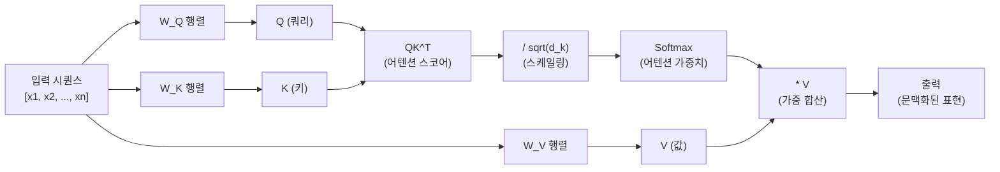
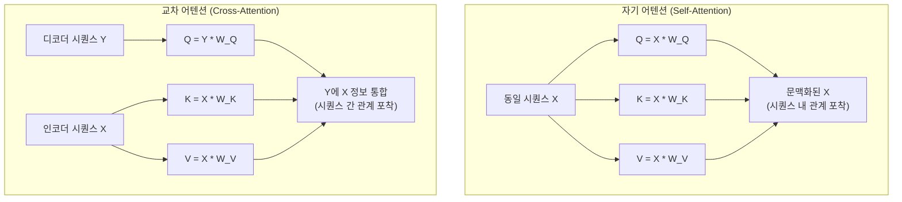
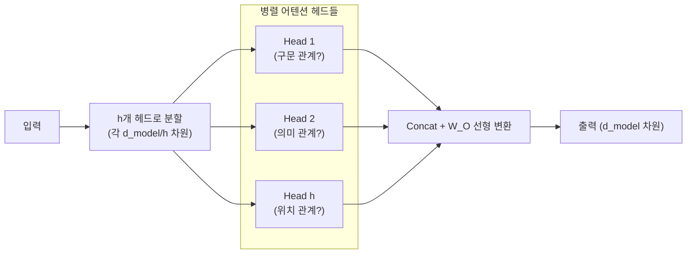
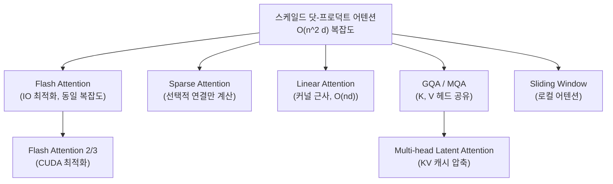

# 어텐션 메커니즘 (Attention Mechanism)

## 개요

**어텐션 메커니즘(Attention Mechanism)**은 신경망이 입력 시퀀스의 서로 다른 위치에 **선택적으로 집중**할 수 있게 하는 핵심 연산이다. 2014년 Bahdanau et al.이 기계 번역에 처음 도입한 이후, 2017년 Vaswani et al.의 "Attention Is All You Need" 논문에서 Transformer의 핵심 구성 요소로 자리 잡았다.

어텐션의 핵심 아이디어는 간단하다: **출력을 생성할 때, 입력의 모든 위치를 동일하게 보는 것이 아니라 관련성에 따라 가중치를 다르게 부여한다.** 이를 통해 순환 신경망(RNN) 없이도 장거리 의존성(long-range dependency)을 포착할 수 있다.

## 어텐션의 기본 형태

### 쿼리-키-값 프레임워크 (Query-Key-Value Framework)

현대 어텐션은 Q(Query), K(Key), V(Value) 세 행렬로 표현된다.

$$\text{Attention}(Q, K, V) = \text{softmax}\left(\frac{QK^T}{\sqrt{d_k}}\right) V$$

- **Query ($Q$)**: "무엇을 찾고 있는가" - 현재 처리 중인 위치의 표현
- **Key ($K$)**: "나는 이런 것이다" - 각 위치가 자신을 설명하는 표현
- **Value ($V$)**: "나의 내용은 이것이다" - 실제로 전달할 정보
- $d_k$: 키 차원 (스케일링 인수)



위 다이어그램은 입력이 Q/K/V로 선형 변환된 후 스케일된 닷-프로덕트 어텐션을 거쳐 출력되는 흐름을 보여준다.

## Additive Attention vs Scaled Dot-Product Attention

두 가지 주요 어텐션 변형이 있으며, 실용적으로는 스케일된 닷-프로덕트가 지배적이다.

### 1. Additive Attention (Bahdanau Attention, 2014)

Bahdanau et al.이 기계 번역에 처음 도입한 방식:

$$e_{ij} = v^T \tanh(W_1 s_i + W_2 h_j)$$
$$\alpha_{ij} = \frac{\exp(e_{ij})}{\sum_k \exp(e_{ik})}$$

- 점수 계산에 별도 학습 가능 네트워크($W_1, W_2, v$) 사용
- Q, K 차원이 달라도 됨
- 시간 복잡도: $O(n^2 d)$

### 2. Scaled Dot-Product Attention (Luong, Transformer, 2015/2017)

$$\text{Score}(Q, K) = \frac{QK^T}{\sqrt{d_k}}$$

- Q와 K의 내적으로 유사도 계산
- $\sqrt{d_k}$로 나누는 이유: $d_k$가 크면 내적값이 커져 softmax 기울기가 소실되는 것을 방지
- 행렬 연산으로 **GPU에서 병렬화 용이**
- 시간 복잡도: $O(n^2 d)$ (동일하지만 상수 인자가 작음)

| 비교 항목 | Additive | Scaled Dot-Product |
|---------|---------|-------------------|
| 유사도 계산 | 선형 변환 + tanh | 내적 |
| 추가 파라미터 | O (W1, W2, v) | X |
| GPU 효율 | 낮음 | 높음 |
| d_k 민감도 | 낮음 | 높음 (스케일링 필요) |
| 현재 사용 | 드묾 | Transformer 표준 |

## 자기 어텐션 (Self-Attention) vs 교차 어텐션 (Cross-Attention)



**자기 어텐션(Self-Attention)**: Q, K, V 모두 같은 입력에서 생성. 시퀀스 내부의 위치 간 관계를 포착한다.
- 사용처: Transformer 인코더/디코더의 모든 레이어

**교차 어텐션(Cross-Attention)**: Q는 디코더에서, K/V는 인코더에서 생성. 두 다른 시퀀스 간의 관계를 포착한다.
- 사용처: Transformer 디코더의 중간 레이어, T5의 인코더-디코더 연결

관련: [[cross-attention]], [[self-attention-mechanism]]

## 멀티헤드 어텐션 (Multi-Head Attention)

단일 어텐션으로는 "한 관점"에서만 정보를 볼 수 있다. 멀티헤드 어텐션은 여러 어텐션 헤드를 병렬로 실행하여 **다양한 관점의 관계를 동시에 포착**한다.

$$\text{MultiHead}(Q, K, V) = \text{Concat}(\text{head}_1, ..., \text{head}_h) W^O$$

$$\text{head}_i = \text{Attention}(Q W_i^Q, K W_i^K, V W_i^V)$$



- 각 헤드는 독립적으로 서로 다른 어텐션 패턴을 학습
- 결과를 연결(concat)하고 선형 변환으로 원래 차원으로 복원
- GPT-4 수준 모델은 보통 96개 헤드 사용

관련: [[multi-head-attention]]

## 어텐션 변형 계보

### 효율적 어텐션 (Efficient Attention)

기본 어텐션의 시간 복잡도는 $O(n^2 d)$로 시퀀스 길이 제곱에 비례한다. 긴 시퀀스를 다루기 위한 여러 최적화가 제안되었다.



관련: [[flash-attention-fundamentals]], [[gqa-mqa]], [[multi-head-latent-attention]]

### 위치 인코딩과 어텐션

어텐션 자체는 위치 정보가 없다. 따라서 **위치 인코딩(Positional Encoding)**을 별도로 추가해야 한다.

| 방식 | 설명 | 사용 모델 |
|------|------|---------|
| 절대 위치 인코딩 (사인 함수) | Vaswani et al. 원 논문 | 원래 Transformer |
| 학습 가능 절대 위치 임베딩 | 위치별 임베딩 학습 | BERT, GPT-2 |
| RoPE (Rotary PE) | 회전 행렬로 상대 위치 | LLaMA, GPT-NeoX |
| ALiBi | 어텐션 스코어에 선형 바이어스 | MPT | 관련: [[alibi-positional-encoding]]

## 인과 어텐션 (Causal Attention / Masked Attention)

디코더 전용 언어 모델(GPT 계열)에서는 미래 토큰을 볼 수 없도록 **마스킹**을 적용한다.

$$\text{Score}_{ij} = \begin{cases} \frac{q_i \cdot k_j}{\sqrt{d_k}} & \text{if } j \leq i \\ -\infty & \text{if } j > i \end{cases}$$

$-\infty$는 softmax 후 0이 되어 해당 위치의 어텐션 가중치가 0이 된다.

```python
# 인과 마스크 생성
import torch

seq_len = 5
# 하삼각 행렬: i번째 토큰은 j<=i인 위치만 볼 수 있음
causal_mask = torch.tril(torch.ones(seq_len, seq_len)).bool()
# [[True, False, False, False, False],
#  [True, True,  False, False, False],
#  ...
#  [True, True,  True,  True,  True ]]
```

## 전체 구현 예시

```python
import torch
import torch.nn as nn
import torch.nn.functional as F
import math


class ScaledDotProductAttention(nn.Module):
    """스케일드 닷-프로덕트 어텐션"""

    def forward(
        self,
        q: torch.Tensor,  # (B, n_head, T, d_k)
        k: torch.Tensor,
        v: torch.Tensor,
        mask: torch.Tensor | None = None,
    ) -> tuple[torch.Tensor, torch.Tensor]:
        d_k = q.size(-1)
        scores = torch.matmul(q, k.transpose(-2, -1)) / math.sqrt(d_k)

        if mask is not None:
            scores = scores.masked_fill(mask == 0, float("-inf"))

        attn_weights = F.softmax(scores, dim=-1)
        output = torch.matmul(attn_weights, v)
        return output, attn_weights


class MultiHeadAttention(nn.Module):
    """멀티헤드 어텐션 (Transformer 표준)"""

    def __init__(self, d_model: int, n_heads: int, dropout: float = 0.0):
        super().__init__()
        assert d_model % n_heads == 0
        self.d_model = d_model
        self.n_heads = n_heads
        self.d_k = d_model // n_heads

        self.W_q = nn.Linear(d_model, d_model, bias=False)
        self.W_k = nn.Linear(d_model, d_model, bias=False)
        self.W_v = nn.Linear(d_model, d_model, bias=False)
        self.W_o = nn.Linear(d_model, d_model, bias=False)
        self.dropout = nn.Dropout(dropout)
        self.attn = ScaledDotProductAttention()

    def forward(
        self,
        query: torch.Tensor,   # (B, T_q, d_model)
        key: torch.Tensor,     # (B, T_k, d_model)
        value: torch.Tensor,   # (B, T_k, d_model)
        mask: torch.Tensor | None = None,
    ) -> torch.Tensor:
        B, T_q, _ = query.shape

        # 선형 변환 후 헤드로 분할
        def split_heads(x: torch.Tensor, T: int) -> torch.Tensor:
            return x.view(B, T, self.n_heads, self.d_k).transpose(1, 2)

        q = split_heads(self.W_q(query), T_q)       # (B, n_heads, T_q, d_k)
        k = split_heads(self.W_k(key), key.size(1))
        v = split_heads(self.W_v(value), value.size(1))

        # 어텐션 계산
        out, _ = self.attn(q, k, v, mask)

        # 헤드 합치기
        out = out.transpose(1, 2).contiguous().view(B, T_q, self.d_model)
        return self.W_o(out)
```

## 어텐션 패턴의 해석

연구자들이 학습된 어텐션 가중치를 시각화한 결과, 헤드마다 다른 패턴이 나타난다:

- **문법적 관계 헤드**: 동사-주어 관계, 명사-수식어 관계 포착
- **위치적 헤드**: 인접 토큰 또는 고정 거리 토큰에 집중
- **희귀 단어 헤드**: 문장 내 특이한 단어에 집중
- **코리퍼런스 헤드**: 대명사-명사 참조 관계 포착

단, 어텐션 가중치가 항상 모델의 "추론"을 반영하지는 않는다는 연구도 있어 해석에 주의가 필요하다.

## 왜 중요한가 / 실무 관점

- **LLM 기반 모델 선택**: 사용 사례에 따라 GQA, MQA 등 변형의 KV 캐시 크기를 고려해야 한다
- **배포 최적화**: Flash Attention 2/3 적용으로 훈련/추론 속도를 2-4배 향상 가능
- **컨텍스트 길이 확장**: RoPE + 슬라이딩 윈도우 등 조합으로 128K+ 토큰 처리 가능
- **파인튜닝**: LoRA는 W_Q, W_K, W_V, W_O 행렬을 저랭크 근사하는 어텐션 최적화 기법

## 관련 문서

- [[self-attention-mechanism]] - 자기 어텐션 심층 설명
- [[transformer]] - 어텐션을 활용한 Transformer 전체 구조
- [[multi-head-latent-attention]] - DeepSeek의 KV 캐시 압축 어텐션
- [[gqa-mqa]] - 그룹 쿼리 어텐션 / 멀티 쿼리 어텐션
- [[flash-attention-fundamentals]] - IO-Aware 어텐션 구현
- [[linear-attention]] - 선형 복잡도 어텐션
- [[cross-attention]] - 교차 어텐션 상세
