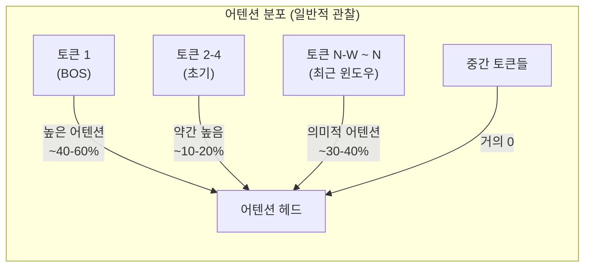
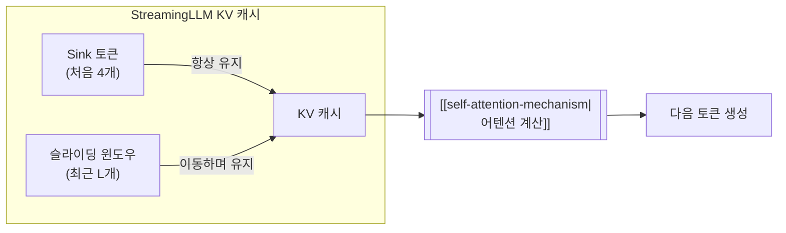

# Attention Sink (어텐션 싱크 현상)

## 개요

Attention Sink는 Xiao et al.(2024, ICLR)이 "Efficient Streaming Language Models with Attention Sinks"에서 체계적으로 분석한 현상으로, [[transformer-architecture|Transformer]] 기반 LLM에서 시퀀스의 첫 번째(또는 처음 몇 개) 토큰에 어텐션 점수가 비정상적으로 집중되는 패턴이다. 이 토큰들이 의미적으로 중요하지 않더라도 발생하며, SoftMax 정규화의 수학적 특성에서 기인한다. 이 발견을 바탕으로 제안된 StreamingLLM 프레임워크는 초기 토큰(attention sink) + 슬라이딩 윈도우의 KV 캐시만 유지하여, 유한한 길이로 학습된 LLM을 400만 토큰 이상의 무한 스트리밍 추론으로 확장할 수 있다. Llama-2, MPT, Falcon, Pythia 등에서 재학습 없이 적용 가능하며, 슬라이딩 윈도우 재계산 대비 최대 22.2배 속도 향상을 달성했다.

## 현상의 발견

### 관찰

LLM의 어텐션 맵을 시각화하면 일관된 패턴이 나타난다: **거의 모든 레이어와 헤드에서, 시퀀스의 첫 번째 토큰이 비정상적으로 높은 어텐션 점수를 받는다.** 이 토큰이 문장의 시작 토큰(BOS), 패딩 토큰, 또는 의미 없는 단어이더라도 동일하다. 이 현상은 다양한 모델 아키텍처와 규모에서 보편적으로 관찰된다.

### 원인: SoftMax의 수학적 제약

[[self-attention-mechanism|셀프 어텐션]]에서 어텐션 가중치는 SoftMax를 통해 계산되며, **모든 토큰에 대한 어텐션 점수의 합이 반드시 1이 되어야 한다:**

```
Attention(Q, K, V) = softmax(Q * K^T / sqrt(d_k)) * V
softmax(z_i) = exp(z_i) / sum(exp(z_j))    (합 = 1)
```

문제는 현재 생성할 토큰이 **이전 토큰 중 어느 것과도 의미적으로 관련이 없는 경우**에도 발생한다. SoftMax 정규화 특성상 어텐션 점수를 0으로 만들 수 없으므로, 모델은 "불필요한" 어텐션 가중치를 어딘가에 할당해야 한다.

LLM은 학습 과정에서 이 잉여 어텐션을 첫 번째 토큰에 집중시키는 전략을 자연스럽게 학습한다. 첫 번째 토큰은 항상 존재하고, 모든 후속 토큰이 접근할 수 있으며, autoregressive 특성상 가장 많은 레이어에서 처리되어 "쓰레기통(dump)" 역할에 적합하기 때문이다.

### 싱크 토큰의 특성



- 첫 1-4개 토큰이 전체 어텐션의 상당 부분을 흡수
- 이 토큰들의 **value 벡터는 실제 출력에 큰 영향을 주지 않음** -- 어텐션은 높지만 정보 전달 역할은 미미
- 의미적으로 중요한 정보는 주로 최근 토큰들의 어텐션에서 전달

## StreamingLLM 프레임워크

### 기존 접근법의 한계

LLM의 KV 캐시 메모리는 시퀀스 길이에 비례하여 증가한다. 무한히 긴 텍스트를 처리하려면 KV 캐시를 제한해야 하는데, 기존 접근법들은 각각 문제가 있었다:

**Dense Attention (전체 캐시)**: 메모리가 무한히 증가하므로 긴 시퀀스에서 사용 불가

**Window Attention (슬라이딩 윈도우)**: 최근 L개 토큰의 KV만 유지. 문제는 **초기 토큰이 윈도우에서 제거되는 순간 모델이 붕괴한다.** 어텐션 싱크가 사라지면 SoftMax 분포가 급격히 불안정해지며, perplexity가 폭발적으로 증가한다.

**Window Attention + 재계산**: 윈도우가 이동할 때마다 어텐션을 처음부터 재계산. 정확하지만 극도로 느리다(O(TL^2) 연산).

### StreamingLLM의 해법



StreamingLLM은 놀랍도록 단순한 해법을 제시한다:

1. **처음 4개 토큰의 KV를 영구 보존** (attention sink 역할)
2. **최근 L개 토큰의 KV를 슬라이딩 윈도우로 유지** (의미적 컨텍스트)
3. 중간 토큰의 KV는 폐기

이 구조로 KV 캐시 크기가 고정(4 + L)되어 메모리가 일정하게 유지되면서도, 어텐션 싱크가 보존되어 모델 안정성이 유지된다.

### 성능 비교

| 방식 | 최대 시퀀스 | 메모리 | Perplexity 안정성 | 속도 |
|------|-----------|--------|------------------|------|
| Dense Attention | 학습 길이 | O(T) 증가 | 안정 | 기준 |
| Window Attention | 무제한 (이론) | O(L) 고정 | 불안정 (붕괴) | 빠름 |
| Window + 재계산 | 무제한 | O(L) 고정 | 안정 | 매우 느림 |
| **StreamingLLM** | **400만+ 토큰** | **O(4+L) 고정** | **안정** | **최대 22.2x** |

Llama-2-7B에서 캐시 크기 256일 때, 400만 토큰까지 perplexity가 안정적으로 유지되었다. 동일 조건에서 window attention은 캐시 크기를 초과하는 순간 perplexity가 >10^3으로 폭발했다.

## 위치 인코딩과의 상호작용

StreamingLLM에서 중간 토큰을 제거하면 남은 토큰들의 위치가 불연속적이 된다. 예를 들어 위치 [0,1,2,3, ..., 100,101,...,200]에서 중간을 제거하면 [0,1,2,3, 100,101,...,200]이 된다.

- **RoPE (Rotary Position Embedding)**: 위치 ID의 불연속이 문제를 일으킬 수 있다. StreamingLLM은 남은 토큰에 연속적인 위치 ID(0,1,2,3,4,5,...,L+3)를 재할당하여 이를 해결한다
- **ALiBi (Attention with Linear Biases)**: 상대적 거리를 기반으로 하므로 위치 재할당이 불필요하며, StreamingLLM과 자연스럽게 호환된다

## 전용 싱크 토큰 학습

Xiao et al.은 추가 실험에서 사전 학습 시 시퀀스 맨 앞에 **전용 "싱크 토큰"**을 삽입하면 스트리밍 성능이 더 향상됨을 발견했다. 기존 BOS 토큰이 우연히 어텐션 싱크 역할을 맡는 대신, 의도적으로 설계된 싱크 토큰이 더 효과적으로 잉여 어텐션을 흡수한다.

이 발견은 향후 LLM 아키텍처 설계에서 스트리밍 추론을 고려한 특수 토큰 설계가 필요할 수 있음을 시사한다.

## 관련 연구 및 활용

- **LM-Infinite (Chi et al., 2023)**: 유사한 시기에 Lambda-shaped attention mask 개념을 제안. 초기 토큰과 지역 토큰에 마스크를 적용하는 접근
- **Sink Token in Vision**: ViT에서도 [CLS] 토큰이 유사한 어텐션 싱크 역할을 하는 것이 관찰됨
- **KV 캐시 압축**: [[long-context-scaling|긴 컨텍스트 처리]] 연구에서 어텐션 싱크 패턴을 활용한 선택적 KV 캐시 제거(eviction) 전략에 활용

## 참고 자료

- Xiao, G. et al. (2024). [Efficient Streaming Language Models with Attention Sinks](https://arxiv.org/abs/2309.17453). ICLR 2024
- [StreamingLLM - MIT HAN Lab](https://hanlab.mit.edu/projects/streamingllm)
- [Attention Sinks in LLMs for endless fluency](https://huggingface.co/blog/tomaarsen/attention-sinks). Hugging Face Blog
