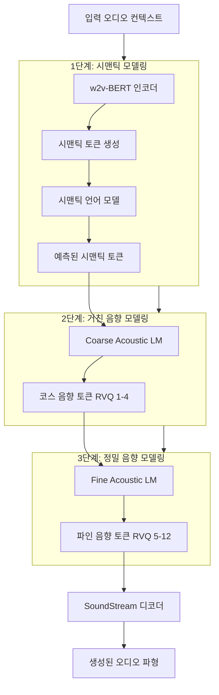

# AudioLM 프레임워크

## 개요

AudioLM은 Google Research가 2022년 발표한 오디오 생성 프레임워크로, 오디오 신호를 **이산 토큰(discrete token)** 시퀀스로 변환한 뒤 언어 모델링 기법을 적용해 오디오를 생성한다. 텍스트 없이도 음성이나 음악을 자연스럽게 이어서 생성할 수 있으며, 장기 일관성(long-range coherence)과 단기 음향 품질을 동시에 달성하는 것이 핵심 기여다.

## 핵심 아이디어: 두 종류의 토큰

AudioLM은 오디오를 두 레벨의 이산 토큰으로 표현한다.

| 토큰 종류 | 소스 모델 | 역할 |
|----------|----------|------|
| 시맨틱 토큰(semantic token) | w2v-BERT | 언어적 내용, 화자 특성, 장기 구조 포착 |
| 음향 토큰(acoustic token) | [[soundstream-neural-codec]] / [[encodec-audio-tokenizer]] | 파형 세부사항, 음질 복원 |

시맨틱 토큰은 고수준 언어 구조를 담고, 음향 토큰은 실제 파형을 재구성하는 데 필요한 저수준 세부정보를 담는다. 이 두 레벨을 분리해 모델링함으로써 장기 일관성과 음향 품질 사이의 트레이드오프를 효과적으로 해결한다.

## 3단계 계층적 생성 파이프라인

각 단계는 독립적인 Transformer 언어 모델로 구성되며, 이전 단계의 출력을 조건(condition)으로 받아 다음 단계를 예측한다.

## [[causal-language-modeling]]과의 연결

AudioLM의 각 단계는 [[causal-language-modeling]] 방식으로 훈련된다. 텍스트 LLM이 이전 단어를 보고 다음 단어를 예측하듯, AudioLM은 이전 오디오 토큰을 보고 다음 오디오 토큰을 예측한다. 이 덕분에:

- 임의 길이의 오디오를 자기회귀(autoregressive) 방식으로 생성 가능
- 프롬프트(컨텍스트) 기반 조건부 생성 지원
- 텍스트 언어 모델의 스케일링 법칙을 오디오 도메인에 적용 가능

## 훈련 목표

모든 단계는 교차 엔트로피(cross-entropy) 손실로 훈련된다. 별도의 오디오 특화 손실 함수 없이 표준 언어 모델링 목표만으로 고품질 오디오 생성이 가능함을 보여준다.

## 주요 성과 및 특징

- **텍스트 없는 음성 연속**: 3초 음성 컨텍스트만으로 화자 정체성과 녹음 환경을 유지하며 음성을 이어서 생성
- **피아노 음악 연속**: 악기 특성과 음악 구조를 유지하며 음악을 이어서 생성
- **장기 일관성**: 시맨틱 토큰이 수십 초 이상의 구조적 일관성을 보장
- **단기 음질**: 음향 토큰의 계층적 RVQ가 세밀한 음향 품질을 복원

## [[voxcpm2]]와의 관계

[[voxcpm2]] 같은 후속 연구들은 AudioLM의 계층적 토크나이제이션 아이디어를 발전시켜 더 빠르거나, 더 제어 가능하거나, 다국어를 지원하는 방향으로 확장했다. AudioLM은 이 계열 연구의 출발점이자 기준 프레임워크로 자리잡고 있다.

## 한계

- 텍스트 프롬프트를 직접 조건으로 사용하지 않음 (텍스트 조건부 생성이 기본 설계에 없음)
- 3단계 순차적 생성으로 실시간 생성이 어려움
- 각 단계별 별도 모델 훈련 필요 - 학습 복잡도 높음

## 실무 관점

AudioLM이 중요한 이유는 오디오를 "언어처럼" 다루는 패러다임을 확립했다는 점이다. 이후 VALL-E([[valle-zero-shot-tts]]), MusicLM([[musiclm-music-generation]]) 등의 모델이 모두 이 계층적 토큰 패러다임을 채택하며 발전했다. 음성 합성, 음악 생성, 오디오 편집 등 다양한 응용에서 AudioLM의 아이디어가 기반으로 쓰이고 있다.

## 관련 문서

- [[soundstream-neural-codec]] - AudioLM의 음향 토크나이저
- [[encodec-audio-tokenizer]] - Meta의 유사한 RVQ 기반 오디오 코덱
- [[valle-zero-shot-tts]] - AudioLM 패러다임을 TTS에 적용한 후속 연구
- [[causal-language-modeling]] - AudioLM의 핵심 학습 방식
- [[rvq-residual-vector-quantization]] - 음향 토큰 생성에 사용되는 양자화 기법
- [[voxcpm2]] - 관련 음성 언어 모델
- [[musiclm-music-generation]] - AudioLM을 음악 생성으로 확장한 연구
