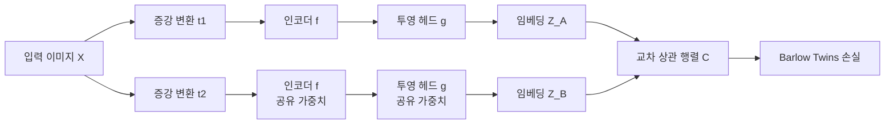

# Barlow Twins - 중복 감소 자기지도 학습

## 배경 및 동기

자기지도 표현 학습(self-supervised representation learning)의 핵심 과제는 **모드 붕괴(mode collapse)** 방지다. 두 증강 뷰의 표현을 단순히 같아지도록 학습하면 모든 입력에 같은 벡터를 출력하는 붕괴 해가 발생한다.

기존 방법들은 이를 다음 방식으로 해결했다:
- **SimCLR / MoCo**: 음수 샘플(negative pair)로 반발력 추가
- **BYOL**: 타겟 네트워크 + 예측 헤드로 비대칭 구조 유지
- **VICReg**: 분산(variance), 불변성(invariance), 공분산(covariance) 손실 명시적 분리

Barlow Twins(Zbontar et al., 2021, Facebook AI Research)는 정보 이론적 관점에서 완전히 다른 해법을 제시한다. 음수 샘플도, 비대칭 구조도, 명시적 정규화 항도 없이 **교차 상관 행렬(cross-correlation matrix)을 항등 행렬에 근접시키는 것** 하나로 모드 붕괴를 방지한다.

이름 "Barlow Twins"는 신경과학자 Horace Barlow가 제안한 **잉여 감소 원리(redundancy-reduction principle)**에서 유래했다. 시각 피질의 뉴런들이 서로 독립적인 특징을 부호화하도록 설계되어 있다는 이론을 자기지도 학습에 직접 적용한 것이다.

## 핵심 메커니즘

### 전체 아키텍처



두 증강 뷰 $Z^A$, $Z^B$에서 배치 단위로 교차 상관 행렬을 계산한다. 인코더와 투영 헤드는 두 뷰 간에 완전히 공유된다(Siamese 구조).

### 교차 상관 행렬

배치 크기 $N$, 임베딩 차원 $d$인 경우 교차 상관 행렬 $\mathcal{C} \in \mathbb{R}^{d \times d}$는:

$$\mathcal{C}_{ij} = \frac{\sum_b z^A_{b,i} \cdot z^B_{b,j}}{\sqrt{\sum_b (z^A_{b,i})^2} \cdot \sqrt{\sum_b (z^B_{b,j})^2}}$$

각 원소는 **두 뷰의 $i$번째, $j$번째 차원 사이의 코사인 유사도**다. 배치 내 각 임베딩을 L2 정규화한 뒤 내적을 계산하는 것과 동일하다.

### 손실 함수

$$\mathcal{L}_{BT} = \underbrace{\sum_i (1 - \mathcal{C}_{ii})^2}_{\text{불변성 항}} + \lambda \underbrace{\sum_i \sum_{j \neq i} \mathcal{C}_{ij}^2}_{\text{중복 감소 항}}$$

두 항의 역할:

| 항 | 목표 | 효과 |
|----|------|------|
| **불변성 항** | 대각 원소를 1로 | 같은 차원의 두 뷰 표현이 일치하도록 |
| **중복 감소 항** | 비대각 원소를 0으로 | 서로 다른 차원이 상관되지 않도록 |

$\lambda$는 두 항의 균형을 조절하는 하이퍼파라미터(기본값 $5 \times 10^{-3}$). 중복 감소 항의 차원이 불변성 항보다 훨씬 많으므로 $\lambda < 1$로 스케일 조정한다.

### 항등 행렬 목표의 의미

$\mathcal{C} \to I$ 를 달성하면:
- **대각**: 동일 증강 쌍의 같은 특징이 일치 - 증강 불변성 확보
- **비대각**: 서로 다른 특징 간 상관이 0 - 정보 이론적으로 각 차원이 독립적인 정보를 담음

이는 정보 최대화(information maximization)와 등가다. 각 임베딩 차원이 독립적이면서 원본 이미지에 대한 정보를 최대한 담도록 강제된다.

## 모드 붕괴 방지 원리

모드 붕괴가 발생하면 모든 샘플이 동일한 벡터 $z^*$를 출력한다. 이 경우:
- $\mathcal{C}_{ii} = 1$ (불변성 항은 0으로 만족됨)
- **하지만** $\mathcal{C}_{ij} = 1$ for all $i, j$ (비대각도 모두 1)

중복 감소 항이 이를 0으로 끌어내려야 하므로 모드 붕괴 상태는 최적해가 될 수 없다. 추가 아키텍처 트릭 없이 손실 함수 자체가 붕괴를 방지한다.

## 구현 세부사항

```python
import torch
import torch.nn.functional as F

def barlow_twins_loss(z_a: torch.Tensor, z_b: torch.Tensor, lmbda: float = 5e-3) -> torch.Tensor:
    """
    z_a, z_b: (N, D) - 배치 정규화된 투영 임베딩
    """
    N, D = z_a.shape

    # 배치 차원으로 정규화 (각 차원의 평균=0, 분산=1)
    z_a = (z_a - z_a.mean(0)) / z_a.std(0)
    z_b = (z_b - z_b.mean(0)) / z_b.std(0)

    # 교차 상관 행렬 계산
    c = torch.mm(z_a.T, z_b) / N  # (D, D)

    # 항등 행렬 손실
    on_diag = torch.diagonal(c).add_(-1).pow_(2).sum()
    off_diag = off_diagonal(c).pow_(2).sum()

    loss = on_diag + lmbda * off_diag
    return loss

def off_diagonal(x: torch.Tensor) -> torch.Tensor:
    """대각선을 제외한 원소 추출"""
    n, m = x.shape
    assert n == m
    return x.flatten()[:-1].view(n - 1, n + 1)[:, 1:].flatten()
```

**핵심 구현 포인트**:
- 배치 정규화는 샘플 단위가 아닌 **특징 차원 단위**로 수행
- 투영 헤드 출력 차원을 크게 설정(8192 권장)해야 성능이 좋음
- BN(Batch Normalization) 없이도 동작하지만 있으면 더 안정적

## 다른 방법과 비교

| 방법 | 음수 샘플 | 비대칭 구조 | 모드 붕괴 방지 원리 |
|------|----------|------------|-------------------|
| SimCLR | 필요(대형 배치) | 없음 | 반발 손실 |
| MoCo | 필요(큐) | 모멘텀 인코더 | 반발 손실 |
| BYOL | 불필요 | 타겟 네트워크 + 예측 헤드 | 비대칭 그래디언트 |
| VICReg | 불필요 | 없음 | 분산/공분산 명시 정규화 |
| **Barlow Twins** | **불필요** | **없음** | **중복 감소(교차 상관)** |
| SwAV | 불필요 | 없음 | 온라인 클러스터링 |

### VICReg와의 관계

VICReg와 Barlow Twins는 밀접한 관련이 있다.

- VICReg의 공분산 항(off-diagonal covariance = 0)이 Barlow Twins의 중복 감소 항과 동일한 역할
- VICReg의 분산 항이 Barlow Twins의 불변성 항을 보완하는 방식으로 붕괴 방지
- 두 방법 모두 동일 구조(Siamese without asymmetry)지만 손실 함수의 형태가 다름

VICReg 저자들은 자신들의 방법이 Barlow Twins보다 각 정규화 목적이 더 명시적이라 이해하기 쉽다고 주장한다.

## 투영 헤드 설계

Barlow Twins에서 투영 헤드는 성능에 결정적 영향을 미친다:

```
인코더(ResNet-50) → 2048
투영 헤드: 2048 → 8192 → 8192 → 8192
(각 레이어: Linear + BN + ReLU, 마지막은 ReLU 없음)
```

- 차원이 클수록 성능 향상(8192가 실험적 최적)
- 깊은 투영 헤드(3층)가 얕은 것보다 유리
- **투영 헤드는 사전학습 후 버림** - 다운스트림 태스크엔 인코더만 사용

## 실무 적용

### 강점
1. **구현 단순성**: 추가 트릭(모멘텀 인코더, 큐, stop-gradient) 없이 동작
2. **배치 크기 효율**: SimCLR 대비 작은 배치로도 경쟁력 있는 성능
3. **정보 이론적 해석**: 각 임베딩 차원이 무엇을 배우는지 직관적 이해 가능
4. **비전 외 도메인**: NLP, 오디오 등 다양한 도메인으로 확장 가능

### 한계
1. **임베딩 차원 민감성**: 작은 차원(256 이하)에서 성능 급락
2. **배치 정규화 의존**: BN이 없는 환경(소형 배치)에서 불안정
3. **하이퍼파라미터 $\lambda$**: 태스크/아키텍처별 튜닝 필요
4. **대형 배치 선호**: 안정적 학습을 위해 여전히 배치 크기 512+ 권장

### ImageNet 선형 평가 성능 (ResNet-50 기준)

| 방법 | Top-1 정확도 | 에포크 |
|------|------------|--------|
| SimCLR v2 | 74.2% | 800 |
| MoCo v3 | 74.6% | 300 |
| BYOL | 74.3% | 1000 |
| **Barlow Twins** | **73.2%** | **1000** |
| VICReg | 73.2% | 1000 |

경쟁력 있는 성능을 음수 샘플 없이 달성했다는 점이 핵심 기여다.

## 확장 및 변형

- **BarlowBERT**: 텍스트 도메인에서 BT 손실 적용, 마스크 언어 모델과 결합
- **HSIC-Bottleneck**: HSIC(Hilbert-Schmidt Independence Criterion)를 교차 상관 대신 사용하는 변형
- **Twins-SVD**: SVD로 교차 상관 행렬을 분해해 계산 효율 개선

## 관련 문서

- [[vicreg-variance-invariance]] - 유사한 정규화 접근, 항목 분리 방식 비교
- [[byol-bootstrap]] - 비대칭 구조로 붕괴 방지
- [[simclr-augmentation]] - 음수 샘플 기반 대조 학습
- [[swav-clustering-features]] - 클러스터링 기반 붕괴 방지
- [[moco-momentum-contrast]] - 모멘텀 인코더 기반
- [[self-supervised-learning]] - 자기지도 학습 전반
- [[contrastive-learning]] - 대조 학습 개요
