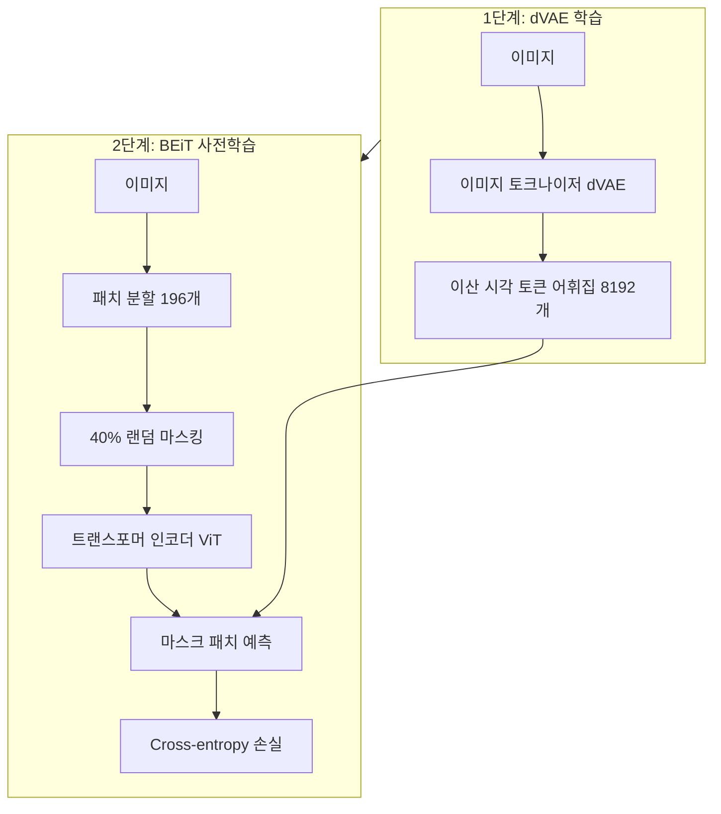

# BEiT - 이미지용 BERT 사전학습 (BERT Pre-Training of Image Transformers)

## 개요

BEiT(BERT Pre-Training of Image Transformers)는 Microsoft Research가 2021년 발표한 비전 트랜스포머 사전학습 방법이다. NLP의 BERT가 마스크 언어 모델링(MLM)으로 텍스트를 학습하듯이, BEiT는 **마스크 이미지 모델링(MIM)**으로 이미지를 학습한다. 핵심은 픽셀 복원 대신 **이산 시각 토큰(discrete visual token)**을 예측 대상으로 삼는다는 점이다.

## 동기: 왜 픽셀 복원이 아닌가

단순하게 마스크된 패치의 픽셀값을 복원하는 방식은 모델이 저수준(low-level) 세부사항에 집중하게 만든다. 색상 노이즈, 질감의 미묘한 변화 등 의미와 무관한 정보를 복원하는 데 모델 용량이 소모된다. BEiT는 이 문제를 해결하기 위해 고수준 시각 의미(semantic visual token)를 예측 대상으로 사용한다.

## 아키텍처: 두 단계 구성



### 1단계: dVAE (discrete VAE) 토크나이저

BEiT는 DALL-E의 dVAE(discrete Variational Autoencoder)를 이미지 토크나이저로 활용한다.

- 입력 이미지를 14x14 패치로 분할
- 각 패치를 8192개 어휘에서 하나의 이산 코드로 매핑
- 결과적으로 이미지 한 장 = 196개의 이산 시각 토큰 시퀀스

이 토크나이저는 BEiT 사전학습 전에 먼저 학습되며, 이후 고정(frozen)된다.

### 2단계: 마스크 이미지 모델링

[[vision-transformer]] 구조를 베이스로 다음 절차를 따른다:

1. 196개 패치 중 약 75개(40%)를 랜덤 블록 마스킹
2. 가시 패치만 트랜스포머 인코더에 입력 (마스크 토큰도 포함)
3. 마스크된 위치의 출력으로 dVAE 토큰 ID 예측
4. Cross-entropy 손실로 학습

## [[masked-autoencoder-mae]]와의 비교

| 항목 | BEiT | MAE |
|------|------|-----|
| 예측 대상 | 이산 시각 토큰 (dVAE) | 픽셀 값 |
| 마스킹 비율 | ~40% | ~75% |
| 인코더 입력 | 마스크 토큰 포함 | 가시 패치만 |
| 외부 토크나이저 | 필요 (dVAE) | 불필요 |
| 계산 효율 | 상대적 낮음 | 높음 |
| ImageNet 파인튜닝 | 경쟁력 있음 | 경쟁력 있음 |

BEiT는 의미론적 토큰을 예측하는 반면, MAE는 단순 픽셀을 복원한다. 실험적으로 두 방식 모두 강력한 표현을 학습하지만 다른 특성을 보인다.

## 주요 성능

| 모델 | ImageNet 파인튜닝 Top-1 | 비고 |
|------|------------------------|------|
| BEiT-B/16 | 83.2% | ViT-B 기반 |
| BEiT-L/16 | 85.2% | ViT-L 기반 |
| BEiT-3 (후속) | ~87%+ | 멀티모달 확장 |

## 블록 마스킹 전략

BEiT는 랜덤 패치 마스킹 대신 **블록 마스킹(block-wise masking)**을 사용한다. 연속된 패치들을 함께 마스킹해 공간적으로 연결된 영역을 예측하도록 유도한다. 이는 모델이 지역적 패턴이 아닌 더 넓은 맥락을 이해하도록 강제한다.

```mermaid
flowchart LR
    subgraph Random[랜덤 마스킹]
        R1[X] R2[O] R3[X] R4[O]
        R5[O] R6[X] R7[O] R8[X]
    end

    subgraph Block[블록 마스킹 BEiT]
        B1[X] B2[X] B3[O] B4[O]
        B5[X] B6[X] B7[O] B8[O]
    end
```

블록 단위 마스킹은 인접 패치들이 서로를 통해 쉽게 복원되는 것을 방지해, 더 어려운 학습 과제를 만든다.

## BEiT v2와 후속 발전

- **BEiT v2**: CLIP 기반 시각-언어 토크나이저를 사용, 의미론적 표현을 강화
- **BEiT-3**: 멀티모달 파운데이션 모델로 확장, 이미지-텍스트 공동 마스크 학습
- **캐스케이드 토크나이저**: 다중 단계 이산화로 표현력 향상

## 자기지도 학습에서의 위치

[[masked-image-modeling-survey|마스크 이미지 모델링]] 패러다임의 선구자로서 BEiT는 다음을 확립했다:

1. 이산 토큰 예측이 픽셀 복원보다 고수준 의미 학습에 효과적
2. NLP의 BERT식 사전학습이 이미지에도 적용 가능
3. 대규모 레이블 없는 데이터로 강력한 표현 학습 가능

## 관련 문서

- [[vision-transformer]] - 기반 아키텍처
- [[masked-autoencoder-mae]] - MAE: 다른 접근의 마스크 이미지 모델링
- [[masked-image-modeling-survey]] - MIM 방법론 전체 비교
- [[deit-data-efficient-image-transformer]] - 감독학습 기반 데이터 효율화
- [[self-supervised-learning]] - 자기지도 학습 일반 개념
