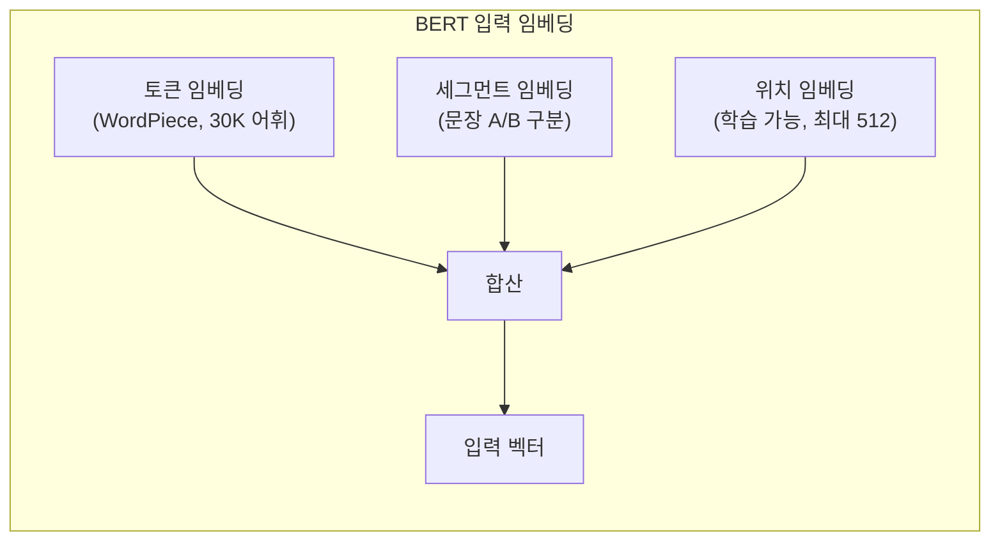
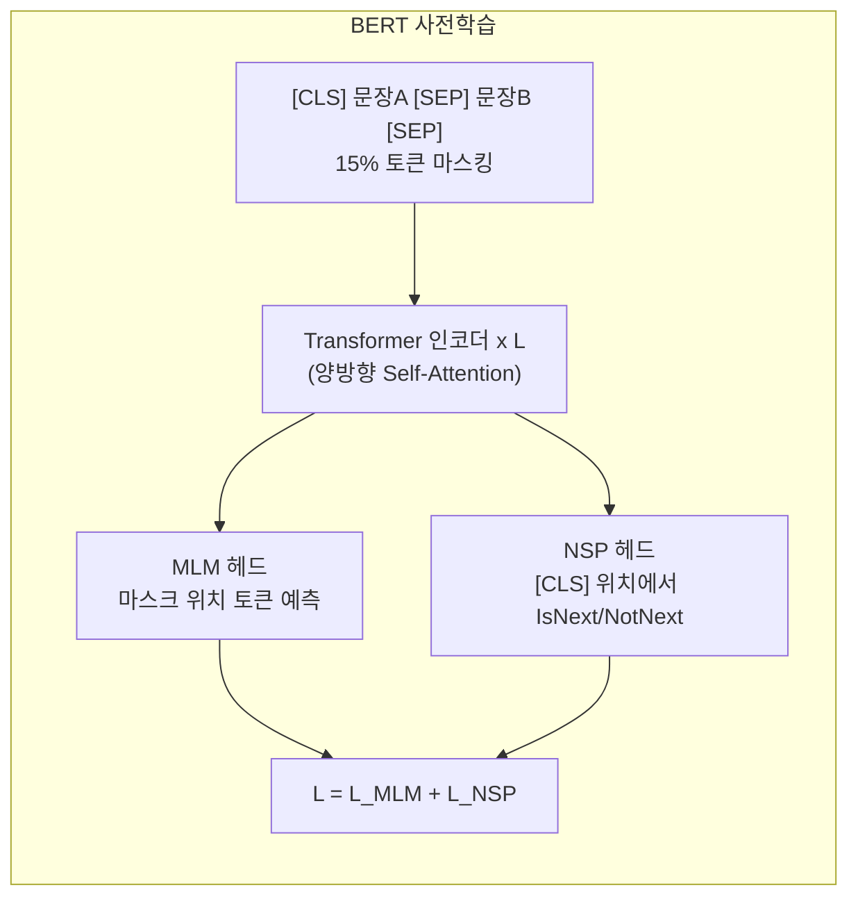
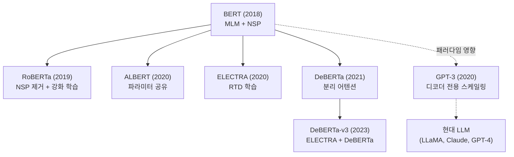

# BERT (Bidirectional Encoder Representations from Transformers)

## 개요

BERT(Bidirectional Encoder Representations from Transformers)는 Devlin et al.(2018, Google AI)이 "BERT: Pre-training of Deep Bidirectional Transformers for Language Understanding" 논문에서 제안한 사전학습 언어 모델이다. [[masked-language-modeling]](MLM)과 Next Sentence Prediction(NSP)을 통해 양방향 문맥을 학습하는 인코더 전용(encoder-only) 아키텍처로, GLUE, SQuAD 등 11개 NLP 벤치마크에서 당시 최고 성능을 달성하며 NLP에 "사전학습 + 파인튜닝" 패러다임을 확립했다. 2026년 현재 프론티어 LLM은 디코더 전용 구조로 전환되었지만, BERT가 시작한 [[transfer-learning-for-nlp|전이 학습]] 패러다임은 현대 AI의 근본 토대이며, 인코더 모델은 분류, 임베딩, 검색 등의 영역에서 여전히 활발히 사용된다.

## 아키텍처

### 모델 구성

BERT는 [[transformer-architecture]]의 인코더 블록만 사용하는 encoder-only 구조다.

| 구성 | BERT-base | BERT-large |
|------|-----------|------------|
| 레이어(L) | 12 | 24 |
| 은닉 차원(H) | 768 | 1,024 |
| 어텐션 헤드(A) | 12 | 16 |
| 파라미터 | 110M | 340M |
| 최대 시퀀스 길이 | 512 토큰 | 512 토큰 |

### 입력 표현

BERT의 입력은 세 가지 임베딩의 합으로 구성된다:

- **토큰 임베딩**: WordPiece 토크나이저(30,522개 어휘)로 분할된 서브워드 임베딩
- **세그먼트 임베딩**: 두 문장 구분 (문장 A = 0, 문장 B = 1)
- **위치 임베딩**: 학습 가능한 절대 위치 임베딩 (최대 512 위치)

특수 토큰으로 [CLS](분류 표현), [SEP](문장 구분), [MASK](마스킹)를 사용한다.

## 사전학습 목적 함수

### Masked Language Modeling (MLM)

BERT 사전학습의 핵심인 [[masked-language-modeling]]은 입력 토큰의 15%를 마스킹하고, 양방향 문맥을 활용해 원래 토큰을 복원하는 과제다.

마스킹 전략 (80-10-10):
- 80%: [MASK] 토큰으로 교체
- 10%: 무작위 다른 토큰으로 교체
- 10%: 원래 토큰 유지

이 전략은 사전학습(마스크 존재)과 파인튜닝(마스크 없음) 사이의 불일치를 완화하기 위해 설계되었다.

### Next Sentence Prediction (NSP)

두 문장 A, B를 입력받아, B가 A의 실제 다음 문장인지(IsNext) 무관한 문장인지(NotNext)를 이진 분류한다. 문장 간 관계 이해(QA, NLI 등)를 위한 보조 과제로 설계되었으나, 후속 연구에서 효용성에 대한 논란이 있었다.

### 양방향 문맥의 핵심

GPT-1이 좌->우 단방향 어텐션(causal mask)만 사용한 반면, BERT는 마스크 없는 양방향 self-attention으로 각 토큰이 시퀀스 전체를 참조한다. "bank" 같은 다의어를 좌우 문맥 모두 보고 의미를 결정할 수 있다는 점이 NLU 태스크에서의 우위를 만들었다.

## 학습 세부사항

| 항목 | 값 |
|------|-----|
| 학습 데이터 | BooksCorpus (800M 단어) + English Wikipedia (2,500M 단어) |
| 옵티마이저 | Adam (lr=1e-4, beta1=0.9, beta2=0.999) |
| 배치 크기 | 256 시퀀스 |
| 학습 스텝 | 1,000,000 (약 40 에포크) |
| 학습률 스케줄 | 10K 스텝 워밍업 후 선형 감쇠 |
| 드롭아웃 | 0.1 (모든 레이어) |
| 활성화 함수 | GELU |
| 정규화 | LayerNorm (Post-LN) |
| 학습 장비 | TPU v3 (16 TPU 칩, base 4일 / large 4일) |

## 파인튜닝 패러다임

BERT의 혁명적 기여는 사전학습된 모델에 태스크별 출력 레이어 하나만 추가하고 파인튜닝하면 다양한 NLP 태스크를 높은 성능으로 수행할 수 있다는 것을 입증한 점이다.

| 태스크 유형 | 입력 형식 | 출력 위치 | 대표 벤치마크 |
|-------------|-----------|-----------|---------------|
| 문장 분류 | [CLS] 문장 [SEP] | [CLS] 벡터 | SST-2, CoLA |
| 문장쌍 분류 | [CLS] A [SEP] B [SEP] | [CLS] 벡터 | MNLI, QQP |
| 질의응답 | [CLS] 질문 [SEP] 문서 [SEP] | 시작/끝 위치 | SQuAD 1.1/2.0 |
| 시퀀스 라벨링 | [CLS] 토큰들 [SEP] | 각 토큰 벡터 | NER (CoNLL) |

[[supervised-fine-tuning]]은 BERT 시대에 본격적으로 확립된 패턴이며, 이후 GPT 계열의 instruction tuning, RLHF로 발전했다.

## 벤치마크 성과 (2018-2019 당시)

| 벤치마크 | BERT-large 성능 | 이전 최고 대비 |
|----------|-----------------|----------------|
| GLUE (평균) | 80.5 | +7.7 |
| SQuAD 1.1 (F1) | 93.2 | +1.5 |
| SQuAD 2.0 (F1) | 83.1 | +5.1 |
| SWAG (정확도) | 86.3 | +27.1 |

GLUE의 8개 태스크 중 다수에서 인간 기준선을 초과했으며, 특히 SWAG에서의 27.1% 개선은 당시 큰 충격이었다.

## 후속 모델: BERT 계보

BERT 이후 인코더 계열 모델은 사전학습 방법, 효율, 어텐션 구조를 개선하며 발전했다:

| 모델 | 시기 | 핵심 개선점 |
|------|------|-------------|
| RoBERTa (Liu et al.) | 2019 | NSP 제거, 동적 마스킹, 더 큰 배치/데이터로 학습 |
| ALBERT (Lan et al.) | 2020 | 크로스레이어 파라미터 공유, SOP(문장 순서 예측)으로 NSP 대체 |
| ELECTRA (Clark et al.) | 2020 | MLM 대신 replaced token detection, 전 토큰 학습 신호 활용 |
| DeBERTa (He et al.) | 2021 | disentangled attention (내용/위치 분리), enhanced mask decoder |
| DeBERTa-v3 | 2023 | ELECTRA 스타일 학습 + DeBERTa 구조, 인코더 모델의 현 시점 최강 |

## BERT의 역사적 의의

### 패러다임 전환

BERT 이전의 NLP는 태스크별 모델을 처음부터 설계하고 학습하는 방식이었다. BERT는 [[transfer-learning-for-nlp]]의 "사전학습 + 파인튜닝" 패러다임을 NLP에 대규모로 입증한 전환점이다. 이 패러다임은 현재 "사전학습 -> 지시문 파인튜닝 -> RL 정렬"이라는 현대 LLM 학습 파이프라인의 직접적 원형이다.

### 왜 디코더 전용이 대세가 되었나

BERT의 인코더 구조는 NLU에 강하지만, 텍스트 생성에는 자기회귀(autoregressive) 디코딩이 필요하다. GPT-3(2020)가 스케일링을 통해 디코더 전용 모델로도 NLU 태스크를 충분히 수행할 수 있음을 보인 이후, 생성과 이해를 모두 하나의 모델로 처리하는 디코더 전용 구조가 지배적이 되었다.

### 2026년 현재 BERT의 위치

프론티어 LLM은 디코더 전용이지만, 인코더 모델은 다음 영역에서 여전히 실용적 가치를 가진다:

- **문장 임베딩/검색**: Sentence-BERT, E5 등 -- RAG 파이프라인의 인코더
- **분류/NER**: 양방향 문맥이 유리한 시퀀스 라벨링 태스크
- **[[bertscore]]**: BERT 임베딩 기반 텍스트 유사도 평가 메트릭
- **경량 배포**: 110M 파라미터로 모바일/엣지 환경에서 실행 가능
- **지식 증류**: 대형 LLM의 지식을 소형 인코더로 압축

## 대표 자료

- [Devlin et al., "BERT: Pre-training of Deep Bidirectional Transformers for Language Understanding" (arXiv:1810.04805)](https://arxiv.org/abs/1810.04805)
- [Liu et al., "RoBERTa: A Robustly Optimized BERT Pretraining Approach" (arXiv:1907.11692)](https://arxiv.org/abs/1907.11692)
- [Clark et al., "ELECTRA: Pre-training Text Encoders as Discriminators Rather Than Generators" (arXiv:2003.10555)](https://arxiv.org/abs/2003.10555)

## 관련 문서
- [[sentiment-analysis-aspect]] -- 관점 기반 감성 분석 (ABSA)

- [[masked-language-modeling]] -- BERT의 핵심 사전학습 목적 함수
- [[transfer-learning-for-nlp]] -- BERT가 확립한 사전학습+파인튜닝 패러다임
- [[supervised-fine-tuning]] -- BERT 파인튜닝에서 발전한 현대 SFT
- [[encoder-decoder-architectures]] -- 인코더/디코더/인코더-디코더 구조 비교
- [[bertscore]] -- BERT 임베딩 기반 텍스트 평가 메트릭
- [[self-attention-mechanism]] -- BERT의 양방향 어텐션 메커니즘
- [[transformer-architecture]] -- BERT의 기반 아키텍처
