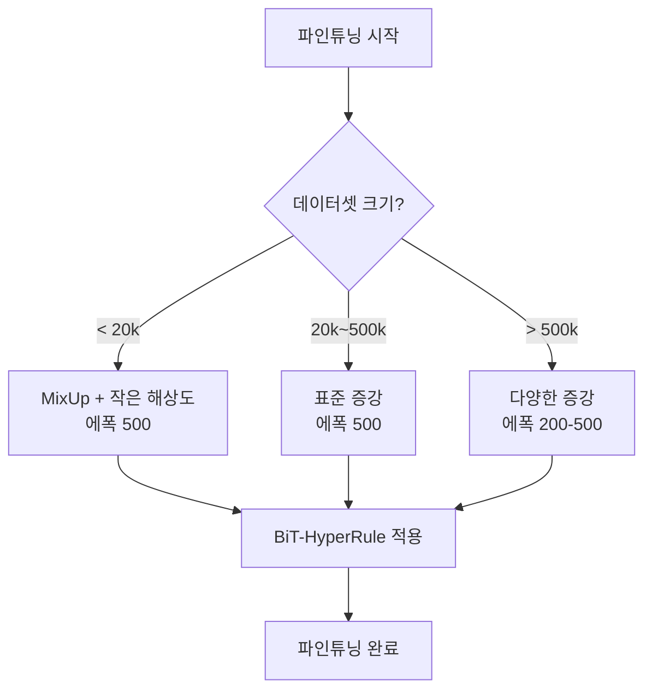

# BiT (Big Transfer) - 대규모 사전학습과 전이 학습

## 배경과 문제 의식

컴퓨터 비전에서 **전이 학습(Transfer Learning)**은 ImageNet 등 대규모 데이터셋으로 사전학습한 모델을 다운스트림 태스크에 파인튜닝하는 방식이다. 그런데 사전학습 데이터셋의 규모가 커질수록(수억 장 이상) 배치 정규화(Batch Normalization)가 심각한 문제를 일으킨다.

**배치 정규화의 대규모 사전학습 문제**:
- 배치 크기가 매우 작아지면(멀티 GPU 학습 시 장치당 배치 수 감소) 배치 통계 추정이 불안정해진다
- 분산 학습 환경에서 배치 통계 동기화 비용이 크다
- 사전학습된 이동 평균(moving average) 통계가 파인튜닝 데이터 분포와 달라 전이 품질이 저하된다

Google Brain의 Kolesnikov et al.(2019)은 이 문제를 해결하기 위해 **GroupNorm(그룹 정규화) + Weight Standardization(가중치 표준화)** 조합을 제안하고, 이를 기반으로 대규모 사전학습 후 단순한 파인튜닝만으로 다양한 다운스트림 태스크에서 SOTA를 달성하는 **BiT(Big Transfer)** 프레임워크를 발표했다.

## 핵심 기술: GroupNorm + Weight Standardization

### GroupNorm (그룹 정규화)

[[batch-norm-layer-norm|배치 정규화]]와 달리 그룹 정규화는 배치 차원이 아닌 **채널 차원**에서 정규화한다. 채널을 G개의 그룹으로 나누어 각 그룹 내에서 정규화한다.

$$\text{GroupNorm}(x) = \frac{x - \mu_g}{\sqrt{\sigma_g^2 + \epsilon}} \cdot \gamma + \beta$$

배치 크기에 무관하게 동작하므로, 수백억 장 규모의 데이터셋 학습에서도 배치 크기를 자유롭게 선택할 수 있다.

### Weight Standardization (가중치 표준화)

합성곱 가중치 행렬 $W$를 정규화하는 기법이다.

$$\hat{W}_{i,j} = \frac{W_{i,j} - \mu_{W_i}}{\sigma_{W_i}}$$

각 출력 채널($i$)의 가중치를 평균 0, 분산 1로 표준화한다. 이를 통해 활성값의 분산이 레이어를 거쳐도 안정적으로 유지된다. GroupNorm과 함께 사용하면 효과가 배가된다.

GroupNorm+WS 조합은 배치 정규화보다 **작은 배치에서 일관되게 더 높은 성능**을 보이며, 사전학습-파인튜닝 간 분포 차이 문제도 완화한다.

## BiT 사전학습 데이터셋

BiT는 세 가지 규모의 사전학습 데이터셋을 사용한다.

| 변형 | 사전학습 데이터셋 | 이미지 수 | 클래스 수 |
|------|------------------|-----------|-----------|
| **BiT-S** | ILSVRC-2012 (ImageNet) | 1.28M | 1,000 |
| **BiT-M** | ImageNet-21k | 14.2M | 21,841 |
| **BiT-L** | JFT-300M (Google 내부) | 300M+ | 30,000+ |

규모가 클수록 다운스트림 태스크 전이 성능이 일관되게 향상된다는 것을 실증했다.

## BiT-HyperRule: 단순화된 파인튜닝 레시피

BiT의 중요한 기여 중 하나는 복잡한 파인튜닝 하이퍼파라미터 탐색 없이 **단순한 규칙(BiT-HyperRule)**만으로 대부분의 태스크에서 좋은 결과를 얻는다는 점이다.

**BiT-HyperRule 핵심 요소**:
- 학습률: SGD + Momentum, 코사인 감소(cosine decay)
- 해상도: 데이터셋 크기에 따라 128~512 선택
- 정규화: MixUp, 데이터 증강
- 학습 에폭: 20~500 (데이터셋 크기에 반비례)

이 단순한 레시피로 20개 이상의 다운스트림 벤치마크에서 기존 SOTA를 달성하거나 능가했다.

## 성능 결과

| 벤치마크 | BiT-L 결과 | 이전 SOTA |
|----------|-----------|-----------|
| CIFAR-10 | 99.4% | 99.0% |
| CIFAR-100 | 93.5% | 91.3% |
| Oxford 102 Flowers | 99.6% | 97.5% |
| Food-101 | 94.5% | 90.3% |
| VTAB (19개 태스크 평균) | 76.3% | 66.7% |

특히 **Few-shot 설정**에서 두드러지는 결과를 보였다. BiT-L 모델은 클래스당 1-5개 샘플만으로도 충분히 강력한 성능을 낸다.

## 모델 크기 변형

BiT는 ResNet 구조를 기반으로 여러 크기 변형을 제공한다.

| 변형 | 구조 | 파라미터 수 |
|------|------|-------------|
| BiT-S/R50x1 | ResNet-50 (1x 너비) | 25M |
| BiT-M/R50x3 | ResNet-50 (3x 너비) | 217M |
| BiT-L/R101x3 | ResNet-101 (3x 너비) | 387M |
| BiT-L/R152x4 | ResNet-152 (4x 너비) | 936M |

x1, x3, x4는 채널 너비 배수를 의미한다. 너비를 늘리는 방식이 [[wide-resnet]]과 유사하다.

## NAS 없는 대규모 전이 학습의 의미

BiT가 제시한 핵심 시사점은 다음과 같다.

> "충분히 큰 사전학습 데이터셋 + 안정적인 정규화 + 단순한 파인튜닝 레시피"만으로 복잡한 NAS나 태스크별 특화 설계 없이 강력한 전이 학습이 가능하다.

이 철학은 이후 GPT, BERT, ViT 등 대형 사전학습 모델 시대의 **스케일링 법칙(scaling law)** 연구와 맥을 같이한다.

## 실무 적용 관점

**BiT가 적합한 상황**:
- 레이블이 적은 다운스트림 태스크 (few-shot, low-resource)
- 도메인이 ImageNet과 다소 다른 태스크 (의료, 위성 이미지 등)
- 빠르게 베이스라인을 구축해야 하는 프로토타이핑

**주의사항**:
- BiT-L은 JFT-300M 사전학습 가중치로 공개되어 있지 않다. 공개된 BiT-M(ImageNet-21k) 기반 모델을 사용한다
- 파인튜닝 시 GroupNorm 통계는 배치에 무관하므로 작은 배치도 안전하다
- [[vision-transformer|ViT]] 등장 이후에는 ViT 기반 사전학습 모델이 BiT를 대부분 능가했으나, 순수 CNN 기반 전이학습 레퍼런스로 여전히 의미 있다

## 관련 문서

- [[resnet-skip-connections]] - BiT의 기반 아키텍처
- [[batch-norm-layer-norm]] - GroupNorm과의 비교
- [[nfnet-normalizer-free]] - 배치 정규화 제거의 다른 접근법
- [[wide-resnet]] - 너비 확장으로 성능 향상
- [[vision-transformer]] - BiT 이후 ViT 기반 대규모 사전학습
- [[self-supervised-learning]] - 레이블 없는 대규모 사전학습 방향
