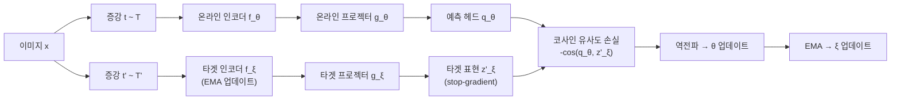

# BYOL - Bootstrap Your Own Latent

## 동기와 배경

2020년 DeepMind에서 발표한 BYOL(Bootstrap Your Own Latent)은 자기지도 시각 표현 학습의 패러다임을 바꾼 연구다. 핵심 기여는 **음수 샘플(negative pairs) 없이도 대표적인 시각 표현을 학습**할 수 있음을 증명한 것이다.

당시 SOTA인 SimCLR은 수천 개의 음수 샘플과 큰 배치(배치 크기 4096 이상)가 필요했다. 이는 음수가 없으면 학습이 반드시 모드 붕괴(mode collapse)로 이어진다는 업계의 믿음을 전제로 했다. BYOL은 이 믿음을 정면으로 뒤집었다.

단, "왜 BYOL이 모드 붕괴 없이 학습되는가"는 논문 발표 당시 충분히 설명되지 않아 이후 많은 분석 연구를 낳았다.

## 핵심 메커니즘

### 온라인/타겟 네트워크 구조

BYOL은 두 개의 네트워크를 유지한다:

- **온라인 네트워크**: 역전파로 직접 학습되는 네트워크. 인코더 $f_\theta$, 프로젝터 $g_\theta$, **예측 헤드 $q_\theta$** 로 구성
- **타겟 네트워크**: 온라인 파라미터의 지수 이동 평균(EMA)으로 업데이트되는 네트워크. 인코더 $f_\xi$, 프로젝터 $g_\xi$로만 구성 (예측 헤드 없음)

### 손실 함수

각 배치에서 두 방향 대칭 손실을 계산한다:

$$\mathcal{L}_\text{BYOL} = \mathcal{L}_{\theta, \xi}(v, v') + \mathcal{L}_{\theta, \xi}(v', v)$$

단방향 손실:
$$\mathcal{L}_{\theta, \xi}(v, v') = -\frac{q_\theta(z_\theta)}{\|q_\theta(z_\theta)\|_2} \cdot \frac{z'_\xi}{\|z'_\xi\|_2}$$

즉, 온라인 네트워크의 **예측 헤드 출력**과 타겟 네트워크 **프로젝터 출력** 사이의 코사인 유사도를 최대화한다.

### EMA 업데이트

$$\xi \leftarrow \tau \cdot \xi + (1 - \tau) \cdot \theta, \quad \tau \in [0.996, 1]$$

$\tau$는 학습이 진행될수록 1에 가까워지도록 코사인 스케줄로 증가시킨다.

### 증강 전략

SimCLR과 유사하게 강한 랜덤 증강을 적용한다:

- 랜덤 크롭 + 리사이즈
- 색상 지터링 (jitter)
- 그레이스케일 변환
- 가우시안 블러
- 솔라리제이션

## 왜 모드 붕괴가 일어나지 않는가

BYOL 발표 직후 많은 연구자들이 "음수 없이 어떻게 trivial constant solution을 피하는가"를 분석했다.

주요 가설들:

**1. 예측 헤드의 비대칭성**: 온라인 네트워크에만 예측 헤드 $q_\theta$가 있다. 예측 헤드는 타겟 네트워크의 표현 공간과 온라인의 표현 공간 사이의 변환을 학습한다. 두 공간이 EMA로 천천히 바뀌는 상황에서 예측 헤드가 항상 추적하며 일치화를 강제한다.

**2. Batch Normalization 효과**: BYOL 구조에 BN이 포함되어 있다. BN은 배치 통계를 이용해 암묵적으로 음수 샘플 효과를 만든다는 분석이 있다. 실제로 BN을 제거하면 BYOL이 붕괴한다는 연구도 있으나, LayerNorm으로 대체해도 동작한다는 반례도 있어 논쟁이 계속됐다.

**3. EMA 타겟의 이동 목표 효과**: 타겟이 고정되지 않고 천천히 변화하므로, 온라인 네트워크가 trivial constant에 수렴해도 타겟이 계속 이동해 학습이 유지된다는 해석이 있다.

DINO 논문은 BYOL 스타일 자기 증류에서 중심화(centering)와 날카로운 교사 출력이 중요하다는 추가적인 이해를 제공했다.

## 성능

ImageNet 선형 프로빙:

| 방법 | 배치 크기 | Top-1 |
|------|---------|-------|
| SimCLR v1 | 4096 | 69.3% |
| MoCo v2 | 256 | 71.1% |
| BYOL (ResNet-50) | 4096 | 74.3% |

ImageNet 파인튜닝:

| 방법 | Top-1 |
|------|-------|
| SimCLR v2 | 79.8% |
| BYOL | 79.6% |

특히 BYOL은 배치 크기 256으로 줄여도 성능 하락이 크지 않다. SimCLR은 작은 배치에서 음수 샘플 부족으로 크게 성능이 떨어진다.

## 후속 영향

- **SimSiam**: BYOL에서 EMA를 제거하고 stop-gradient만 사용. "아무것도 없이도 된다"는 극단적 단순화
- **DINO**: EMA 교사 + 소프트맥스 출력 증류. BYOL 아이디어의 ViT 특화 확장
- **MSN (Masked Siamese Networks)**: 마스킹 + BYOL 스타일 자기 증류
- **EsViT**: BYOL 목표를 지역 패치 수준으로 확장
- 음수 샘플 불필요 자기지도 학습의 표준 아키텍처 패턴 확립

## 한계

- **대형 배치 선호**: 작은 배치(64 이하)에서는 여전히 불안정한 경향
- **이론적 이해 부족**: 왜 붕괴하지 않는지에 대한 완전한 이론이 아직 없음
- **하이퍼파라미터 민감도**: EMA 모멘텀 $\tau$, 예측 헤드 구조, 온도 등에 민감

## 관련 문서

- [[self-supervised-learning]]
- [[contrastive-learning]]
- [[dino-self-distillation]]
- [[moco-momentum-contrast]]
- [[simclr-augmentation]]
- [[swav-clustering-features]]
- [[representation-learning-theory]]
