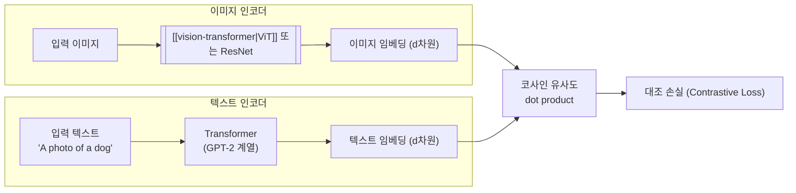

# CLIP (Contrastive Language-Image Pre-training)

## 개요

CLIP은 OpenAI가 2021년 1월 발표한 비전-언어 대조 학습 모델이다. 이미지 인코더와 텍스트 인코더를 쌍으로 학습시켜, 의미적으로 유사한 이미지-텍스트 쌍이 공유 벡터 공간에서 가까운 표현을 갖도록 정렬한다. 4억 개의 이미지-캡션 쌍(WebImageText, WIT)으로 학습되었으며, 별도의 태스크별 학습 없이 zero-shot으로 이미지를 분류하거나 텍스트-이미지 검색을 수행하는 능력이 핵심이다.

CLIP의 텍스트 인코더는 Stable Diffusion, DALL-E 2 등 주요 [[ai-image-generation|AI 이미지 생성]] 시스템의 프롬프트 이해 모듈로 채택되었으며, [[dense-retrieval|밀집 검색]] 분야에서 교차 모달 검색의 기초 아키텍처로 자리잡았다. MIT 라이선스로 공개되어 학계와 산업 전반에 광범위한 영향을 미쳤다.

## 핵심 동기

전통적 이미지 분류 모델은 고정된 레이블 집합(ImageNet의 1,000 클래스 등)에 대해 학습되므로, 새로운 카테고리에 대응하려면 데이터 수집과 재학습이 필수였다. CLIP은 "자연어 자체가 곧 분류 체계"라는 관점에서 출발한다. 이미지를 고정 클래스 인덱스가 아닌 자유 형식의 텍스트와 연결함으로써, 학습 시 본 적 없는 개념에 대해서도 분류와 검색을 수행할 수 있다.

## 아키텍처 구조

### 이중 인코더 (Dual Encoder)

CLIP은 이미지와 텍스트를 각각 독립된 인코더로 처리한 뒤, 동일 차원의 임베딩 공간으로 투영하는 이중 인코더 구조다.

CLIP의 이중 인코더 구조는 이미지와 텍스트를 공유 벡터 공간에 정렬하며, 추론 시 유사도 계산만으로 분류와 검색을 수행한다.

**이미지 인코더**: [[vision-transformer|ViT]](Vision Transformer) 또는 ResNet을 사용한다. ViT 변형이 더 높은 성능을 보였으며, 패치 크기와 모델 규모에 따라 ViT-B/32, ViT-B/16, ViT-L/14 등의 변형이 있다. "ViT-L/14"는 Large 크기 Transformer에 14x14 픽셀 패치를 의미한다.

**텍스트 인코더**: GPT-2 계열의 디코더 전용 [[transformer-architecture|Transformer]]를 사용한다. 12층, 512 너비, 8개 어텐션 헤드의 63M 파라미터 모델이며, 49,152 어휘의 BPE(Byte Pair Encoding) 토크나이저를 사용한다. 컨텍스트 길이는 77토큰이고, [SOS]와 [EOS] 특수 토큰으로 시퀀스를 감싼다.

### 모델 변형

| 모델 | 총 파라미터 | 비전 파라미터 | 텍스트 파라미터 | 임베딩 차원 |
|------|-----------|-------------|-------------|-----------|
| RN50 | 102M | 38.3M | 63.1M | 1,024 |
| ViT-B/32 | 151M | 87.8M | 63.1M | 512 |
| ViT-L/14 | 428M | 304M | 123M | 768 |

ViT-L/14는 FixRes 기법으로 336x336 해상도로 추가 학습되어 최고 성능을 달성했다.

## 대조 학습 (Contrastive Learning)

CLIP의 학습 방법은 개념적으로 단순하다. 배치에 N개의 이미지-텍스트 쌍이 있을 때:

1. N개의 이미지와 N개의 텍스트를 각각 인코딩하여 N x N 유사도 행렬을 생성
2. 대각선(올바른 쌍)의 유사도를 최대화하고, 비대각선(잘못된 쌍)의 유사도를 최소화
3. 학습 가능한 온도 파라미터 T = e^(-tau)로 유사도 스케일을 조절
4. 대칭 교차 엔트로피 손실(symmetric cross-entropy loss)을 최적화

이 대조 목표는 동일한 이미지넷 zero-shot 분류에서 예측형(predictive) 목표 대비 4~10배 효율적이었다. OpenAI는 5개 ResNet과 3개 ViT 모델을 각 32 에포크씩 학습했으며, 가장 큰 ViT-L/14는 256대의 V100 GPU에서 12일이 소요되었다.

### 학습 데이터: WebImageText (WIT)

WIT는 인터넷에서 수집한 4억 개의 이미지-캡션 쌍으로, GPT-2 학습에 사용된 WebText(~40GB)에 상응하는 텍스트 규모다. 500,000개의 텍스트 쿼리(영어 위키피디아 단어, 고빈도 바이그램, WordNet 동의어 집합)를 사용해 쿼리당 최대 20,000쌍을 수집했다. 이 데이터셋은 공개되지 않았으며, 후속 프로젝트인 LAION이 공개 대안으로 등장했다.

## Zero-Shot 분류

CLIP의 가장 혁신적인 능력은 태스크별 학습 없이 이미지를 분류하는 것이다.

**방법**: 분류할 클래스마다 "A photo of a {클래스명}." 형식의 텍스트를 생성하고, 이를 텍스트 인코더로 임베딩한다. 입력 이미지의 임베딩과 각 클래스 텍스트 임베딩의 코사인 유사도를 비교하여, 가장 높은 유사도를 가진 클래스를 선택한다.

**성능**: ViT-L/14@336px 모델이 ImageNet zero-shot에서 약 76.2%의 top-1 정확도를 달성했다. 이는 ImageNet에서 직접 학습한 ResNet-50의 76.1%에 필적하는 수치로, 학습 시 ImageNet 이미지를 한 장도 보지 않고 달성한 것이다. 다만 위성 사진, 의료 영상, 세밀한 차종 분류 등 전문 도메인에서는 성능이 크게 하락했다.

## 핵심 응용

### 이미지 생성 시스템의 텍스트 이해

CLIP의 가장 광범위한 영향은 [[ai-image-generation|AI 이미지 생성]] 분야다:

- **Stable Diffusion 1.x/2.x**: CLIP의 텍스트 인코더(ViT-L/14)가 프롬프트를 임베딩으로 변환하고, [[u-net|U-Net]]의 cross-attention 레이어에 주입된다
- **DALL-E 2**: CLIP 이미지 임베딩을 조건으로 받는 [[diffusion-models|확산 모델]]로, CLIP의 잠재 공간에서 이미지를 생성한다
- **Stable Diffusion 3/Flux**: CLIP-L과 CLIP-G 두 개의 CLIP 텍스트 인코더를 T5-XXL과 함께 사용하여, [[diffusion-transformer|MMDiT]] 아키텍처에 다양한 수준의 텍스트 이해를 결합한다

### 교차 모달 검색

CLIP의 공유 벡터 공간은 텍스트로 이미지를 검색하거나(text-to-image), 이미지로 텍스트를 검색하는(image-to-text) [[dense-retrieval|밀집 검색]]을 가능하게 한다. 멀티미디어 검색 엔진, 콘텐츠 추천, 데이터셋 큐레이션 등에 활용된다.

### 미적 품질 평가

CLIP 임베딩 기반의 미적 품질 점수화(aesthetic scoring)는 [[diffusion-models|확산 모델]] 학습 데이터 필터링에 핵심적으로 사용된다. LAION-Aesthetics 서브셋이 대표적 사례다.

## 후속 발전

| 모델 | 개발사 | 핵심 차이 |
|------|-------|----------|
| OpenCLIP | LAION | 공개 데이터(LAION-2B, DataComp-1B)로 학습한 CLIP 재현 |
| ALIGN | Google | 10억+ 이미지-텍스트 쌍, EfficientNet 이미지 인코더 |
| SigLIP | Google | 교차 엔트로피 대신 시그모이드 기반 손실 함수. 배치 크기 제약 완화 |
| EVA-CLIP | BAAI | 10억 파라미터 규모로 확장, ImageNet zero-shot 82.0% |
| MetaCLIP | Meta | 메타데이터 큐레이션으로 WIT 수준 데이터 품질을 공개 데이터에서 재현 |

## 한계

- **77토큰 컨텍스트**: 텍스트 인코더의 컨텍스트 길이가 짧아, 긴 프롬프트나 복잡한 구성을 정확히 인코딩하기 어렵다
- **구성적 이해 부족**: "빨간 차 위의 파란 새"와 "파란 차 위의 빨간 새"를 구별하는 능력이 제한적이다. 속성 바인딩(attribute binding) 문제로 알려져 있다
- **편향**: 학습 데이터의 서양/영어 중심 편향이 zero-shot 성능에 반영된다
- **전문 도메인**: 위성, 의료, 산업 검사 등 특수 시각 도메인에서 성능이 크게 하락한다

## 참고 자료

- Radford, A. et al. (2021). [Learning Transferable Visual Models From Natural Language Supervision](https://arxiv.org/abs/2103.00020). ICML 2021
- [Contrastive Language-Image Pre-training - Wikipedia](https://en.wikipedia.org/wiki/Contrastive_Language-Image_Pre-training)
- [OpenAI CLIP GitHub Repository](https://github.com/openai/CLIP)

## 관련 문서
- [[vi-cd-visual-circuit-discovery-paper]] -- Vi-CD: 비전 트랜스포머의 충실한 기계적 해석가능성
- [[multimodal-alignment]] -- 멀티모달 정렬 (Multimodal Alignment)
- [[midjourney]] -- Midjourney
- [[gpt-4o]] -- GPT-4o

- [[vision-transformer]] -- CLIP의 이미지 인코더 아키텍처
- [[dense-retrieval]] -- CLIP 임베딩 기반 교차 모달 검색
- [[diffusion-transformer]] -- CLIP 텍스트 인코더를 활용하는 MMDiT
- [[u-net]] -- Stable Diffusion에서 CLIP과 결합되는 노이즈 예측 네트워크
