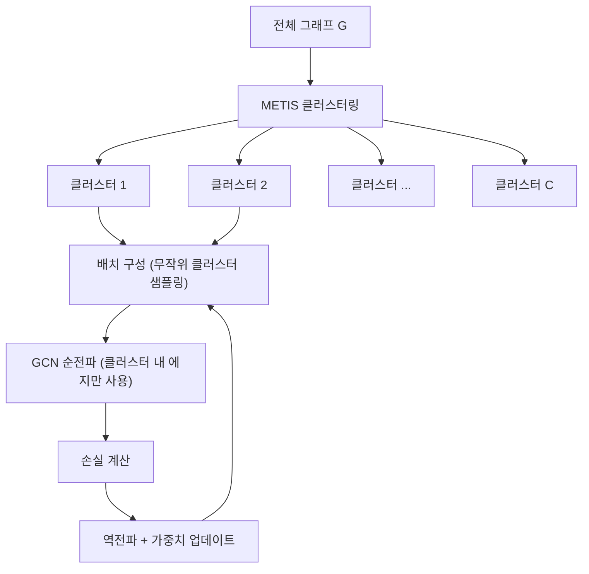

# ClusterGCN 서브샘플링 학습

## 동기와 배경

대규모 그래프에서 GCN(Graph Convolutional Network) 학습은 메모리 폭발 문제를 야기한다. 기존 전체 배치 GCN은 레이어가 깊어질수록 이웃 확장(neighborhood expansion) 문제가 발생한다.

$L$ 레이어 GCN에서 노드 $v$의 표현을 계산하려면 $L$-hop 이웃 전체가 필요하다. 실제로 노드 수 $N$, 평균 차수 $d$인 그래프에서 2-hop 이웃은 $O(d^2)$개, 3-hop은 $O(d^3)$개로 폭발적으로 증가한다. Amazon 상품 그래프나 Reddit 소셜 네트워크처럼 수백만 노드를 가진 그래프에서는 GPU 메모리에 전체 인접 행렬과 특징을 올릴 수 없다.

ClusterGCN(2019, Google Research)은 **METIS 그래프 클러스터링**과 **미니배치 학습**을 결합해 이 문제를 해결한다.

## 핵심 메커니즘

### 문제 정식화

전통적 GCN 레이어 업데이트:

$$H^{(l+1)} = \sigma\!\left(\tilde{A} H^{(l)} W^{(l)}\right)$$

여기서 $\tilde{A} = D^{-1/2} A D^{-1/2}$는 정규화된 인접 행렬이다. 전체 $N \times N$ 행렬 연산이 필요해 대규모 그래프에 적용 불가능하다.

### 그래프 클러스터링

ClusterGCN의 핵심 아이디어: **학습 전 그래프를 $C$개의 클러스터로 분할**하고, 클러스터 단위로 미니배치를 구성한다.

1. METIS 알고리즘으로 그래프를 $C$개 클러스터로 분할 (클러스터 내 에지 최대화, 클러스터 간 에지 최소화)
2. 각 미니배치: 하나 또는 여러 클러스터의 노드 집합 $\mathcal{V}_c$
3. 배치 내 에지만 사용해 전파 계산

위 다이어그램은 ClusterGCN의 전체 학습 파이프라인이다.

### 인접 행렬 분할

클러스터 $c$의 서브그래프 인접 행렬 $A_{c,c}$만 사용해 GCN 계산:

$$H_c^{(l+1)} = \sigma\!\left(\tilde{A}_{c,c} H_c^{(l)} W^{(l)}\right)$$

클러스터 간 에지($A_{c,c'}$, $c \neq c'$)는 배치 계산에서 제외된다. 이는 근사 오차를 유발하지만 메모리를 획기적으로 줄인다.

### 다중 클러스터 배치 (Stochastic Multiple Partition)

단일 클러스터 배치는 클러스터 간 에지를 완전히 무시해 근사 오차가 크다. 이를 완화하기 위해 여러 클러스터를 랜덤하게 합쳐 하나의 배치로 구성한다:

- $q$개 클러스터를 랜덤 샘플링
- 합집합 노드 $\mathcal{V}_q = \bigcup_{i=1}^q \mathcal{V}_{c_i}$
- 해당 노드들 간의 모든 에지 사용 ($A_{c_i, c_j}$ 포함)

$q$를 늘릴수록 근사 오차는 줄지만 배치 크기와 메모리가 증가한다.

## 메모리 효율성 분석

| 방법 | 레이어 $L$, 노드 $N$ 기준 메모리 | 특징 |
|------|--------------------------------|------|
| 전체 배치 GCN | $O(LN)$ | 전체 그래프 로드 필요 |
| GraphSAGE 샘플링 | $O(L \cdot b \cdot d^L)$ | $b$ = 배치 크기, $d^L$ 이웃 폭발 |
| ClusterGCN | $O(L \cdot |\mathcal{V}_c|)$ | 클러스터 내부만 |

클러스터 크기 $|\mathcal{V}_c| \ll N$이므로, ClusterGCN은 메모리 사용량을 상수 수준으로 유지한다.

## 학습 디테일

### METIS 클러스터링 사전 처리

- 학습 시작 전 1회만 실행 (오프라인 전처리)
- 클러스터 수 $C$는 하이퍼파라미터: 보통 1,000-10,000
- METIS는 최소 컷(minimum cut) 기반 분할 - 클러스터 간 에지를 최소화하므로 배치 내 이웃 정보 손실이 적음

### 에폭 구성

한 에폭 = 모든 클러스터를 랜덤 순서로 한 번씩 순회. 매 에폭마다 새로운 랜덤 순서로 배치를 구성한다.

### 노드 특징 캐시

자주 등장하는 노드 특징을 GPU 메모리에 캐시하면 데이터 이동 비용을 줄일 수 있다. ClusterGCN 논문은 역사적 임베딩(historical embeddings)을 클러스터 간 에지의 근사값으로 사용하는 방법도 제안한다.

## 성능

Reddit (230K 노드, 11.6M 에지) 기준:

| 방법 | F1 점수 | 에폭당 시간 |
|------|---------|-----------|
| 전체 배치 GCN | 0.953 | ~200s |
| GraphSAGE | 0.950 | ~8s |
| ClusterGCN | 0.954 | ~5s |

Amazon (1.6M 노드) 같은 더 큰 그래프에서 전체 배치 방법이 메모리 부족으로 불가능한 상황에서도 ClusterGCN은 학습이 가능하다.

## 후속 영향

- **GraphSAINT**: 클러스터 대신 무작위 서브그래프 샘플링으로 편향 없는 미니배치 구성
- **ShaDow-GNN**: 로컬 구조 보존 서브그래프 샘플링
- **GAS (Graph Adaptive Sampling)**: 클러스터링과 중요도 샘플링 결합
- **대규모 그래프 학습 표준**: 산업 그래프(소셜/커머스/지식 그래프)에서 ClusterGCN은 핵심 베이스라인이 됨

## 한계

- **클러스터 간 에지 근사 오차**: 클러스터 경계를 넘는 장거리 의존성을 학습하기 어려움
- **METIS 전처리 비용**: 분할 자체가 수십~수백 GB 그래프에서 시간이 소요됨
- **클러스터 수 민감도**: $C$가 너무 적으면 배치 크기 폭발, 너무 많으면 에지 손실 심화

## 관련 문서

- [[graph-neural-networks]]
- [[graphsage-inductive-gnn]]
- [[gin-graph-isomorphism]]
- [[pna-aggregation]]
- [[graph-attention-network]]
