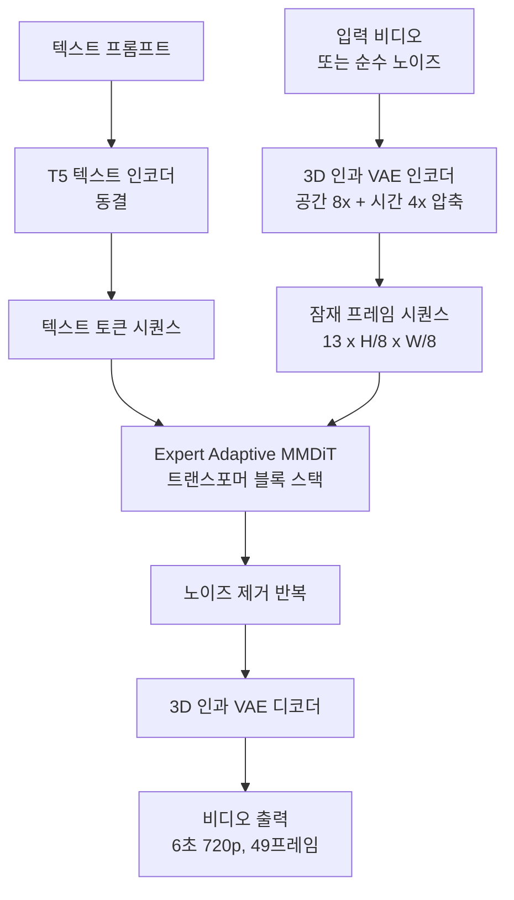
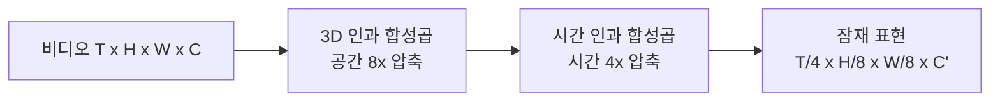
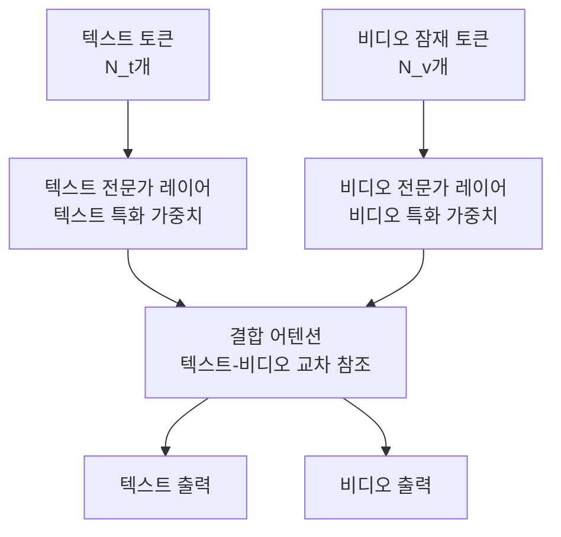

# CogVideoX - 3D 인과 VAE와 Expert MMDiT 비디오 생성

## 개요

CogVideoX는 Tsinghua THUDM(智谱AI)이 2024년 발표한 오픈소스 텍스트-비디오 생성 모델이다. **3D 인과 VAE(3D Causal VAE)**와 **전문가 적응 MMDiT(Expert Adaptive MMDiT)**를 핵심 기여로 제안하며, 비공개 모델([[sora-architecture|Sora]], [[veo-google-video|Veo]])과 달리 가중치와 코드를 공개해 연구 커뮤니티에서 중요한 기준점이 됐다.

6초 720p 비디오(49프레임)를 8B 파라미터 모델로 생성하며, HuggingFace `diffusers`와 통합되어 실용적 접근성도 높다.

## 핵심 기여

CogVideoX는 두 가지 독창적 구성요소를 제안한다:

1. **3D 인과 VAE**: 시공간 압축을 단일 VAE로 처리하는 동시에 인과적 시간 구조 유지
2. **Expert Adaptive MMDiT**: 텍스트와 비디오 토큰을 전문화된 방식으로 처리

## 아키텍처

### 전체 파이프라인



### 3D 인과 VAE (3D Causal VAE)

기존 비디오 생성 모델들은 공간 압축(2D VAE)과 시간 압축을 별도 단계로 처리하거나, 프레임별로 독립적으로 인코딩한다. CogVideoX는 이를 **단일 3D VAE**로 통합한다.



**인과성(causality)**이 핵심이다. 시간 $t$의 잠재 변수를 계산할 때 미래 프레임($t+1, t+2, ...$)을 참조하지 않는다. 이렇게 하면:

- 첫 프레임을 독립적으로 처리 가능 (이미지와 호환)
- 스트리밍 생성 또는 점진적 디코딩 지원 가능
- 이미지-비디오 공동 훈련 시 아키텍처 통일 가능

압축률: 공간 8x + 시간 4x → 전체 압축 계수 **256x**.

### Expert Adaptive MMDiT

[[dit-diffusion-transformer|MMDiT(Multi-Modal DiT)]]는 Stable Diffusion 3에서 텍스트와 이미지를 동등하게 처리하는 양방향 어텐션 구조로 제안됐다. CogVideoX는 이를 비디오로 확장하면서 "전문가 적응(expert adaptive)" 메커니즘을 추가한다.



핵심: 텍스트 토큰과 비디오 토큰이 **어텐션은 공유**하지만 **FFN(피드포워드 레이어)은 전문화**된다. 이로써 각 모달리티의 고유 특성을 학습하면서도 크로스모달 상호작용을 유지한다.

수식으로 표현하면:

$$\text{Attn}([z_\text{text}, z_\text{video}]) \to [z'_\text{text}, z'_\text{video}]$$

$$z''_\text{text} = \text{FFN}_\text{text}(z'_\text{text}), \quad z''_\text{video} = \text{FFN}_\text{video}(z'_\text{video})$$

### 3D 풀 어텐션 vs. 분리 어텐션

CogVideoX는 시간·공간 어텐션을 분리하지 않고 **3D 풀 어텐션**을 사용한다. 모든 시공간 토큰이 서로 어텐션을 계산하므로 표현력이 높지만 메모리 비용도 크다.

$O(N^2)$ 복잡도 관리를 위해 FlashAttention을 적용하고, 49프레임 × (720p를 8배 축소한 해상도)의 토큰 수를 관리한다.

## 훈련 세부사항

| 항목 | 값 |
|------|-----|
| 모델 크기 | 5B / 8B 파라미터 (두 버전) |
| 텍스트 인코더 | T5-XXL (4.7B) |
| 훈련 데이터 | 비공개 내부 데이터 + 공개 데이터셋 |
| 생성 길이 | 49프레임 (약 6초, 8fps) |
| 해상도 | 720p (480p도 지원) |
| 훈련 기법 | 흐름 매칭([[flow-matching]]) |

### 진행적 훈련 (Progressive Training)

1. 단계 1: 이미지 데이터로 VAE + DiT 사전훈련 (공간 이해)
2. 단계 2: 저해상도 비디오로 시간 모델링 학습
3. 단계 3: 고해상도 비디오로 파인튜닝

## CogVideoX-I2V (이미지→비디오)

참조 이미지를 첫 프레임으로 제공해 일관된 비디오를 생성하는 변형. 3D 인과 VAE의 인과성이 이 기능을 자연스럽게 지원한다 — 첫 프레임만 실제 이미지로 채우고 나머지를 생성하면 됨.

## LoRA 파인튜닝

CogVideoX는 LoRA 파인튜닝을 공식 지원한다. 소량의 비디오 데이터(10-50개 클립)로 특정 스타일·캐릭터·도메인에 특화된 비디오 생성 모델을 만들 수 있다.

```python
# diffusers 라이브러리 활용 (공식 지원)
from diffusers import CogVideoXPipeline

pipe = CogVideoXPipeline.from_pretrained(
    "THUDM/CogVideoX-5b",
    torch_dtype=torch.bfloat16
)
pipe.load_lora_weights("path/to/lora_weights")

video = pipe(
    prompt="A cat playing piano in a jazz club",
    num_frames=49,
    guidance_scale=6.0,
).frames[0]
```

## Sora/Veo와의 차별점

| 속성 | CogVideoX | [[sora-architecture\|Sora]] | [[veo-google-video\|Veo]] |
|------|----------|------|-----|
| 공개 여부 | 가중치·코드 공개 | 비공개 | 비공개 |
| 최대 길이 | 6초 (49프레임) | 60초 | 60초+ |
| 최대 해상도 | 720p | 1080p | 1080p |
| 아키텍처 | 논문·코드 공개 | 기술보고서 일부 | 없음 |
| 접근 방법 | HuggingFace 오픈소스 | ChatGPT API | Vertex AI |

## 한계

- 6초 한계: 장편 비디오 생성 불가
- 움직임 다양성: 빠르고 복잡한 동작에서 품질 저하
- 긴 시퀀스에서 3D 풀 어텐션의 메모리 부담
- 영어 텍스트 조건 기준으로 훈련, 다국어 제한

## 관련 문서

- [[dit-diffusion-transformer]] - CogVideoX의 기반 아키텍처
- [[flow-matching]] - 훈련에 사용하는 기법
- [[vae]] - 3D 인과 VAE의 기반 개념
- [[sora-architecture]] - 비공개 경쟁 모델
- [[veo-google-video]] - Google의 경쟁 비디오 모델
- [[animatediff-motion-modules]] - 확산 기반 비디오 생성 대안
- [[video-generation-architecture]] - 비디오 생성 모델 전반
