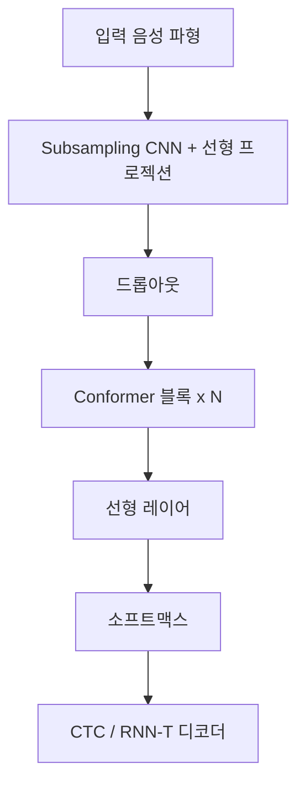
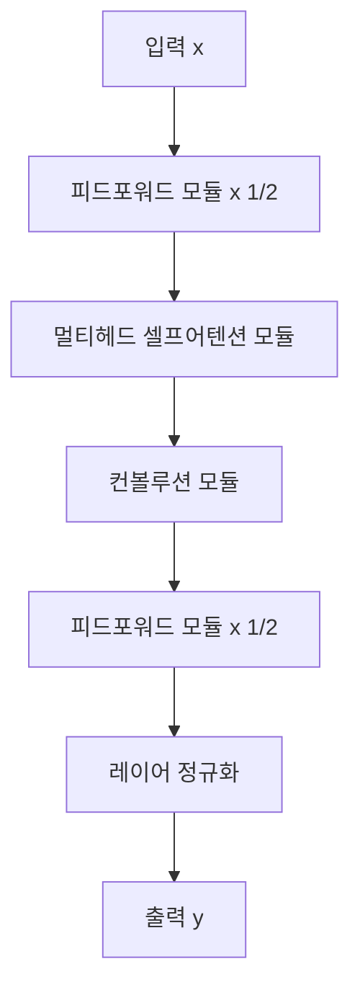

# Conformer - 컨볼루션 증강 트랜스포머 음성 인식

## 배경

자동 음성 인식(ASR, Automatic Speech Recognition) 분야에서 [[transformer-architecture|트랜스포머]]는 장거리 의존성 포착에 탁월하지만, 음성 신호의 국소 패턴(발음 세부 정보, 음소 경계)을 포착하는 데는 한계가 있었다. 반면 CNN은 지역 특징을 잘 추출하지만 전역 문맥 이해가 부족하다.

**Conformer**(Gulati et al., Google Brain, 2020)는 컨볼루션과 셀프 어텐션(self-attention)을 단일 블록 내에서 결합하여, 지역(local) 특징과 전역(global) 문맥을 동시에 포착하는 아키텍처다. 발표 이후 LibriSpeech 벤치마크에서 SOTA를 달성하며 ASR의 새로운 표준이 됐다.

## 아키텍처 구조

### 전체 파이프라인

입력 파형은 먼저 멜 스펙트로그램(mel-spectrogram)으로 변환된 뒤, 서브샘플링(subsampling) CNN을 통해 시퀀스 길이를 줄인다. 이후 N개의 Conformer 블록을 통과한다.

### Conformer 블록 내부

Conformer 블록은 **샌드위치 구조**로 설계됐다. 피드포워드 레이어가 블록 앞뒤를 감싸고, 중간에 어텐션과 컨볼루션 모듈이 위치한다.

수식으로 표현하면:

$$\tilde{x} = x + \frac{1}{2} \text{FFN}(x)$$

$$x' = \tilde{x} + \text{MHSA}(\tilde{x})$$

$$x'' = x' + \text{Conv}(x')$$

$$y = \text{LayerNorm}(x'' + \frac{1}{2} \text{FFN}(x''))$$

### 멀티헤드 셀프어텐션 모듈

- 사전 정규화(pre-norm) 방식으로 레이어 정규화 후 어텐션 적용
- **상대적 위치 인코딩(relative positional encoding)**: 절대 위치 대신 토큰 간 상대 거리 기반. Transformer-XL의 방식을 차용
- 드롭아웃 후 잔차 연결

### 컨볼루션 모듈

컨볼루션 모듈은 채널 방향 혼합과 시간 방향 혼합을 분리한 구조다:

- **GLU(Gated Linear Unit)**: 게이팅 메커니즘으로 정보 선택
- **뎁스와이즈 컨볼루션(Depthwise Convolution)**: 각 채널을 독립적으로 처리. 커널 크기 $k$ (보통 31 또는 15)
- **Swish 활성화**: $f(x) = x \cdot \sigma(x)$

### 피드포워드 모듈

반크기(half-step) 잔차 연결이 특징이다. 가중치를 1/2로 스케일링하는 것이 전통 트랜스포머와의 차이점:

$$\text{FFN}(x) = \text{Linear}(\text{Swish}(\text{Linear}(x)))$$

## 학습 및 추론

### 학습 설정

- **디코더**: CTC(Connectionist Temporal Classification) 또는 RNN-T(Recurrent Neural Network Transducer)
- **외부 언어 모델**: 트랜스포머 기반 언어 모델을 shallow fusion으로 결합
- **옵티마이저**: Adam + 워밍업 스케줄 (트랜스포머 표준)
- **스펙 증강(SpecAugment)**: 시간/주파수 마스킹으로 데이터 증강. ASR 과적합 방지에 필수

### 모델 크기 변형

| 모델 | 파라미터 | 인코더 차원 | 블록 수 | 헤드 수 |
|------|---------|------------|--------|--------|
| Conformer-S | 10.3M | 144 | 16 | 4 |
| Conformer-M | 30.7M | 256 | 16 | 4 |
| Conformer-L | 118.8M | 512 | 17 | 8 |

### 추론

- 스트리밍 추론: 청크 단위 처리 + 제한된 어텐션 윈도우 (Streaming Conformer)
- 비스트리밍: 양방향 어텐션으로 전체 발화 처리

## 성능 및 벤치마크

### LibriSpeech 결과 (WER, Word Error Rate)

| 모델 | test-clean | test-other |
|------|-----------|-----------|
| Conformer-L (CTC) | 2.1% | 4.3% |
| Conformer-L (CTC + LM) | 1.9% | 3.9% |
| 기존 트랜스포머 | 2.4% | 5.6% |

Conformer-L은 ContextNet, Transformer ASR 등 이전 SOTA 모델을 모두 능가했다.

### 핵심 기여 분석

- 컨볼루션 모듈 추가만으로 Transformer 대비 WER 약 15% 감소
- 샌드위치 구조(FFN-MHSA-Conv-FFN)가 일반 순서(MHSA-Conv)보다 우수
- 상대적 위치 인코딩이 절대 인코딩 대비 긴 발화에서 더 강건

## 파생 모델 및 영향

| 모델 | 특징 |
|------|------|
| **Wav2Vec 2.0** | Conformer 인코더 기반 자기지도 음성 학습 |
| **HuBERT** | Conformer + 클러스터링 의사 레이블 |
| **WavLM** | Conformer + 마스킹 디노이징 |
| **Whisper** | Conformer 인코더 + 트랜스포머 디코더, 680K 시간 데이터 |
| **Emformer** | 메모리 효율 스트리밍 Conformer |
| **Squeezeformer** | U-Net 구조 Conformer, 파라미터 효율 |

## 실무 활용

- **음성 인식 서비스**: Google Cloud Speech-to-Text, NVIDIA NeMo, ESPnet 기반 서비스
- **온디바이스 ASR**: Conformer-S로 스마트폰 실시간 인식
- **다국어 ASR**: 단일 Conformer 모델로 다국어 동시 학습 가능
- **화자 분리**: Conformer 인코더 + 화자 임베딩 결합

## 관련 문서

- [[transformer-architecture]]
- [[whisper]]
- [[wav2vec-2-speech]]
- [[hubert-speech-representation]]
- [[wavlm-speech-processing]]
- [[audiolm-framework]]
- [[valle-zero-shot-tts]]
- [[cross-attention]]
