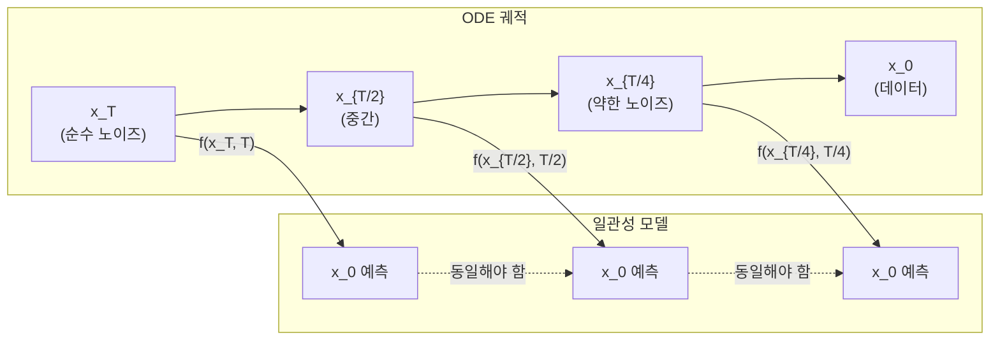

# 일관성 모델 (Consistency Models)

일관성 모델(Consistency Models)은 Song et al. (OpenAI, 2023)이 제안한 생성 모델로, 확산 모델의 샘플링 속도 문제를 근본적으로 해결한다. **1-2 샘플링 스텝**만으로 고품질 이미지를 생성할 수 있어 실시간 응용이 가능해졌다. 핵심은 ODE 궤적 위의 어느 점에서 시작해도 동일한 원점(데이터)으로 매핑되는 **자기일관성 속성(self-consistency property)**이다.

## 자기일관성 속성 (Self-Consistency Property)

확산 ODE를 통해 데이터 $x_0$에서 노이즈 $x_T$로 이어지는 궤적이 존재한다. 일관성 모델 $f_\theta$는 이 궤적의 **임의의 점**을 원점 $x_0$으로 매핑한다.

$$f_\theta(x_t, t) = x_0, \quad \forall t \in [0, T]$$

이를 통해 단 한 번의 함수 호출로 깨끗한 이미지를 복원할 수 있다.

## ODE 궤적과 일관성 매핑

## 학습 방법

### Consistency Distillation (CD)
사전학습된 확산 모델로부터 지식 증류(distillation)를 수행한다. ODE 솔버로 $x_{t+\Delta t}$에서 $x_t$로 한 스텝 이동한 뒤, 두 점의 일관성 모델 출력이 동일해지도록 강제한다.

$$\mathcal{L}_{CD} = d(f_\theta(x_{t+\Delta t}, t+\Delta t), f_{\theta^-}(x_t, t))$$

$\theta^-$는 EMA로 업데이트되는 타깃 네트워크다.

### Consistency Training (CT)
사전학습된 확산 모델 없이 **데이터에서 직접** 학습하는 방법이다. 더 단순하지만 품질이 다소 낮다. CT는 확산 모델의 의존성을 완전히 제거해 독립적인 생성 모델로 학습 가능하다.

## LCM (Latent Consistency Model)

LCM(Luo et al., 2023)은 일관성 증류를 LDM의 잠재 공간에 적용했다. Stable Diffusion 계열에 직접 적용 가능하며, **4스텝 이하**의 추론으로 실시간(30fps급) 이미지 생성을 달성했다.

## 품질-속도 트레이드오프

| 방법 | NFE (함수 호출 수) | FID (ImageNet) | 비고 |
|------|-----------------|---------------|------|
| DDPM | 1000 | 3.17 | 기준 |
| DDIM | 50 | 4.67 | 결정론적 샘플링 |
| CD (1 step) | 1 | 6.20 | 단일 스텝 최고 수준 |
| CD (2 steps) | 2 | 3.55 | DDIM 50스텝에 근접 |
| CT (2 steps) | 2 | 5.83 | 증류 없이 학습 |

단 1-2 스텝으로 기존 50스텝 DDIM 수준에 근접하는 것이 핵심 성과다.

## 다중 스텝 샘플링으로 품질 개선

일관성 모델은 1스텝 생성도 가능하지만, 여러 스텝을 사용하면 품질이 향상된다. 각 스텝에서 노이즈를 다시 추가하고 다음 포인트로 이동하는 방식으로 반복 정제가 가능하다.

## 관련 문서
- [[latent-diffusion-model|잠재 확산 모델]]
- [[flow-matching|플로우 매칭]]
- [[diffusion-transformer|Diffusion Transformer]]
- [[u-net|U-Net]]
