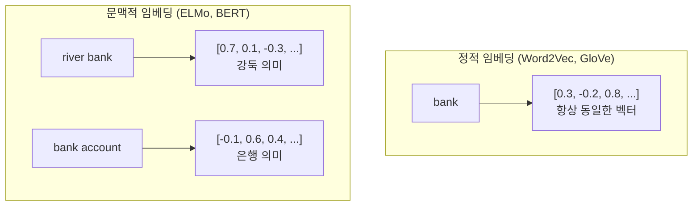
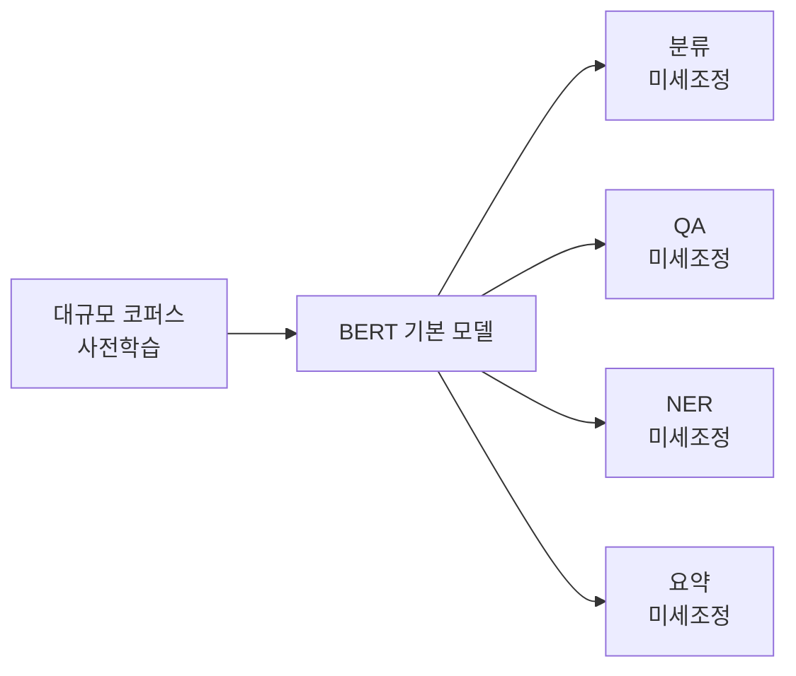

# 문맥적 임베딩 (Contextual Embeddings)

## 개요

문맥적 임베딩(Contextual Embeddings)은 동일한 단어라도 **주변 문맥에 따라 다른 벡터 표현**을 생성하는 기술이다. [[word2vec-pretrained-embeddings|Word2Vec/GloVe]]가 "bank"에 대해 항상 같은 벡터를 반환하는 정적 임베딩인 반면, 문맥적 임베딩에서는 "river bank"의 bank와 "bank account"의 bank가 서로 다른 벡터를 갖는다. ELMo(2018)가 이 패러다임을 개척했고, BERT(2018)가 Transformer 기반으로 완성하여 NLP의 **사전학습-미세조정(pretrain-finetune) 패러다임**을 확립했다.

## 정적 임베딩에서 문맥적 임베딩으로

**핵심 전환:** 단어의 의미는 고정된 것이 아니라 문맥에 의해 결정된다. 문맥적 임베딩은 전체 입력 시퀀스를 처리한 **후** 각 토큰의 표현을 생성하므로, 자연스럽게 다의어, 동음이의어, 문법적 역할 변화를 반영한다.

## ELMo (Embeddings from Language Models)

Peters et al. (2018, Allen AI)이 제안한 모델로, 문맥적 임베딩의 **선구자**다.

### 아키텍처

- **2층 양방향 LSTM (biLM)** 기반
- 대규모 코퍼스에서 **언어 모델 목적함수**(다음 단어 예측)로 사전학습
- 순방향 LSTM: 왼쪽 -> 오른쪽 문맥 포착
- 역방향 LSTM: 오른쪽 -> 왼쪽 문맥 포착

### 표현 생성

ELMo의 핵심 혁신은 LSTM의 **모든 레이어 출력을 가중합**하여 최종 표현을 만드는 것이다:

- **레이어 0** (문자 CNN): 형태소/문자 수준 정보
- **레이어 1** (첫 번째 LSTM): 구문(syntax) 정보 -- 품사 태깅에 유용
- **레이어 2** (두 번째 LSTM): 의미(semantics) 정보 -- 감성 분석에 유용

각 레이어의 가중치는 태스크에 따라 학습된다. 태스크마다 필요한 언어 정보의 수준이 다르기 때문이다.

### 활용 방식

ELMo는 기존 모델에 **추가적인 입력 특징(feature)**으로 사용되었다:
1. ELMo 사전학습 (동결)
2. 입력 텍스트를 ELMo에 통과시켜 문맥 벡터 생성
3. 기존 모델의 입력에 문맥 벡터를 연결(concatenation)
4. 하위 태스크 학습

## BERT (Bidirectional Encoder Representations from Transformers)

Devlin et al. (2018, Google)이 제안한 모델로, 문맥적 임베딩을 **Transformer 인코더**로 구현하여 NLP의 기준점을 재설정했다.

### ELMo와 BERT의 차이

| 속성 | ELMo | BERT |
|---|---|---|
| 기반 아키텍처 | 양방향 LSTM | **Transformer 인코더** |
| 양방향성 | 순방향 + 역방향 결합 (독립) | **진정한 양방향** (모든 위치 동시 참조) |
| 사전학습 목적 | 언어 모델 (다음 단어 예측) | **MLM + NSP** |
| 적용 방식 | 특징 추출 (feature-based) | **미세조정 (fine-tuning)** |
| 병렬화 | 제한적 (LSTM 순차 특성) | **완전 병렬** |

### 사전학습 목적함수

**Masked Language Model (MLM):**
- 입력 토큰의 15%를 [MASK]로 치환
- 모델이 주변 문맥(양방향)으로부터 마스킹된 토큰을 예측
- 양방향 문맥을 동시에 활용하는 핵심 메커니즘

**Next Sentence Prediction (NSP):**
- 두 문장이 연속된 문장인지 판별
- 문장 간 관계 이해 학습 (후속 연구에서 효과에 대한 논쟁이 있었음)

### 미세조정 패러다임

BERT가 확립한 **사전학습-미세조정** 패러다임은 현대 LLM의 기반이 되었다:

1. **사전학습**: 대규모 비지도 코퍼스에서 일반적 언어 이해 학습
2. **미세조정**: 소규모 레이블 데이터로 특정 태스크에 적응
3. 사전학습의 비용은 한 번만, 미세조정은 태스크마다 저렴하게

이 패턴은 GPT 계열의 자기회귀 사전학습, T5의 텍스트-투-텍스트 프레임워크 등으로 확장되었고, 현대 LLM의 사전학습-SFT-RLHF 파이프라인의 원형이다.

## 장거리 의존성 처리

ELMo의 LSTM은 이론적으로 장거리 의존성을 포착할 수 있지만, 실제로는 수백 토큰을 넘어가면 정보 손실이 발생한다. BERT의 Transformer 셀프 어텐션은 시퀀스 내 모든 위치 간 직접 연결을 제공하여 이 문제를 근본적으로 해결했다. 이후 [[sparse-attention-patterns|sparse attention]], [[flash-attention-fundamentals|FlashAttention]] 등의 기법이 이 직접 연결의 효율성을 높이는 방향으로 발전했다.

## 현대 LLM에서의 위치

현대 LLM(GPT-4, Claude, Llama 등)에서 "문맥적 임베딩"은 별도 모듈이 아니라 모델 자체의 동작 방식이다. [[embedding-layers|임베딩 레이어]]가 정적 토큰 벡터를 제공하고, Transformer 레이어들이 문맥을 반영하여 각 위치의 표현을 동적으로 변환한다. ELMo와 BERT는 이 구조의 역사적 기원이자 개념적 기초다.

## 관련 문서

- [[word2vec-pretrained-embeddings]] -- 문맥적 임베딩 이전의 정적 임베딩
- [[embedding-layers]] -- Transformer 입력의 정적 토큰 벡터
- [[tokenization-bpe-sentencepiece]] -- 임베딩 입력을 결정하는 토크나이저
- [[sparse-attention-patterns]] -- 효율적 어텐션으로의 발전
- [[flash-attention-fundamentals]] -- 어텐션 연산의 하드웨어 최적화

## 참고 자료

- [The Illustrated BERT, ELMo, and co. (Jay Alammar)](https://jalammar.github.io/illustrated-bert/)
- [Embeddings from Language Models (ELMo) (Spot Intelligence)](https://spotintelligence.com/2023/12/26/embeddings-from-language-models-elmo/)
- [How Contextual are Contextualized Word Representations? (arXiv)](https://arxiv.org/abs/1909.00512)
