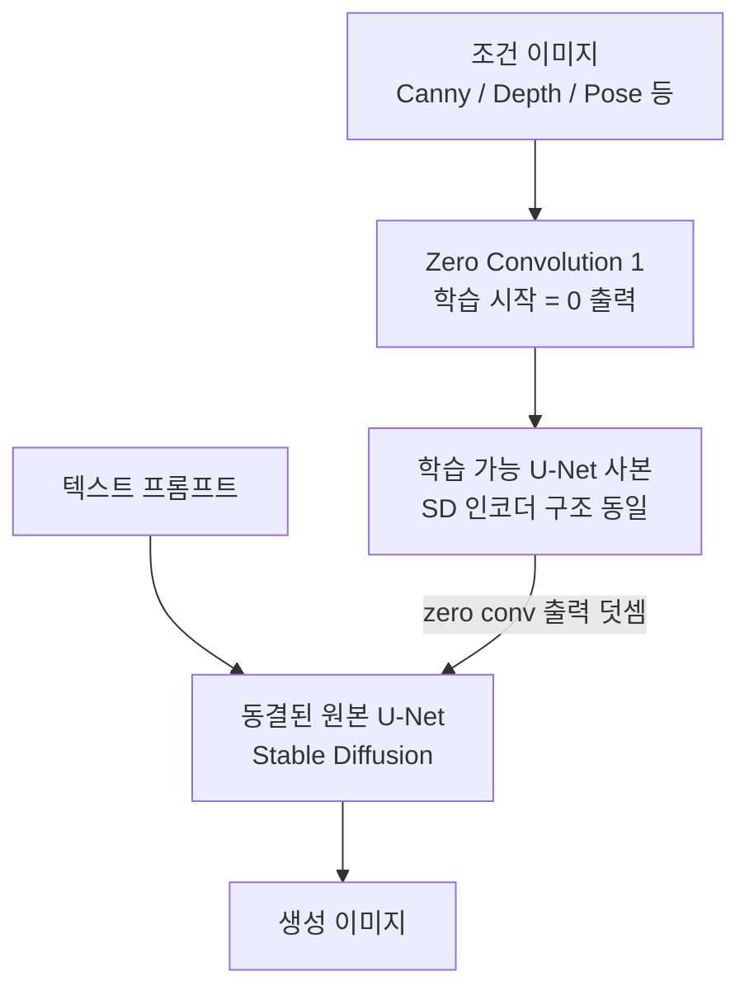

# ControlNet - 조건부 확산 모델 제어

## 개요

ControlNet은 사전 훈련된 [[diffusion-models|확산 모델]]에 공간적 조건 신호(spatial conditioning signal)를 주입하여 이미지 생성을 정밀하게 제어하는 아키텍처다. Zhang et al.(2023)이 제안했으며, 기존 텍스트 프롬프트만으로 불가능했던 구도·자세·윤곽선 수준의 세밀한 제어를 가능하게 한다.

핵심 아이디어는 단순하다. 사전 훈련된 가중치는 **동결(freeze)**하고, 그 가중치를 **정확히 복사한 학습 가능 사본(trainable copy)**을 별도로 생성한다. 조건 신호는 이 사본에만 입력되며, 사본의 출력이 원본 네트워크의 스킵 연결(skip connection)에 더해진다.

## 왜 중요한가

텍스트-이미지 생성([[latent-diffusion-model]])에서 텍스트 프롬프트는 내용을 지정할 수 있지만 공간적 배치까지 제어하기는 어렵다. ControlNet은 다음 신호를 조건으로 활용한다:

- **Canny 엣지**: 윤곽선 기반 구도 복제
- **깊이 맵(depth map)**: 원근감·3D 구조 유지
- **사람 자세(pose)**: OpenPose 골격 키포인트
- **법선 맵(normal map)**: 표면 기하 정보
- **시맨틱 세그멘테이션**: 영역별 클래스 경계
- **스케치·선화**: 사용자 드로잉 입력
- **타일(tile)**: 고해상도 업스케일링 가이드

이 다양성 덕분에 ControlNet은 사실상 모든 구조적 조건을 [[latent-diffusion-model|Stable Diffusion]] 계열 모델에 장착할 수 있는 범용 어댑터가 됐다.

## 아키텍처

### 전체 구조

위 다이어그램에서 핵심은 두 가지다. 첫째, 동결된 원본 U-Net은 손상 없이 사전 학습된 능력을 보존한다. 둘째, 학습 가능 사본과 원본 사이의 연결은 "zero convolution"을 통해 이루어져 훈련 초기에 간섭이 없다.

### Zero Convolution

Zero Convolution은 가중치와 편향이 모두 0으로 초기화된 $1 \times 1$ 합성곱이다.

$$\mathcal{Z}(x; \{W, b\}) = W \cdot x + b$$

초기 상태: $W=0, b=0$ → 출력 $= 0$

학습 초기에 ControlNet 사본의 출력이 0이므로, 원본 네트워크는 조건 없이 정상 동작한다. 학습이 진행되면서 점진적으로 조건 신호가 반영된다. 이 덕분에 잘못된 초기 신호가 사전 훈련된 능력을 망가뜨리지 않는다.

### 스킵 연결 주입 위치

ControlNet은 [[u-net|U-Net]] 인코더의 각 해상도 레벨에서 출력을 추출해 원본 U-Net 디코더의 스킵 연결에 더한다. 구체적으로 SD의 경우 12개의 인코더 블록 출력과 미드 블록 1개, 총 13개 지점에서 주입된다.

## 훈련 절차

1. 사전 훈련된 SD 가중치를 불러와 동결
2. 인코더 부분만 복사해 학습 가능 사본 생성
3. 조건 이미지($c$)와 텍스트($t$)를 모두 입력받는 노이즈 예측 손실로 훈련:

$$\mathcal{L} = \mathbb{E}_{z, t, c, \epsilon, \tau} \left[ \| \epsilon - \epsilon_\theta(z_\tau, \tau, t, c) \|_2^2 \right]$$

4. 50k ~ 수백만 이미지 단위 소규모 데이터로 수렴 가능 (전체 SD 훈련에 비해 극히 적음)

## 다중 조건 결합

여러 ControlNet을 동시에 사용할 수 있다. 각 네트워크의 zero conv 출력을 가중합(weighted sum)해 원본 U-Net에 주입한다.

$$\text{skip}_\text{combined} = \sum_i w_i \cdot \mathcal{Z}_i(\text{output}_i)$$

예: Canny(0.5) + Depth(0.8)를 동시에 적용해 윤곽선과 깊이 정보를 함께 제어.

## 확장과 변형

| 변형 | 설명 |
|------|------|
| ControlNet 1.1 | 셔플·세그멘테이션·타일 조건 추가, 더 정교한 훈련 |
| ControlNet-XL | SDXL 백본 적용 |
| T2I-Adapter | 더 가벼운 대안 어댑터 구조 (동결 + 병렬 경로) |
| [[ip-adapter-image-prompting\|IP-Adapter]] | 이미지 자체를 프롬프트로 활용하는 별도 어댑터 |
| ControlNet++ | 조건 일관성 명시 손실로 정밀도 향상 |

## 실무 활용

- **캐릭터 자세 재현**: OpenPose 키포인트 + 텍스트 → 동일 포즈 다른 스타일
- **건축 시각화**: 선화/평면도 → 포토리얼 렌더링
- **고해상도 업스케일**: 타일 ControlNet + Img2Img로 4x upscale
- **영상 일관성**: 각 프레임의 Canny 엣지를 ControlNet 조건으로 활용해 [[animatediff-motion-modules|AnimateDiff]]와 결합
- **[[ip-adapter-image-prompting|IP-Adapter]]와 병렬 사용**: 스타일(IP-Adapter) + 구도(ControlNet) 동시 제어

## 한계

- 조건 이미지 품질에 민감: 잘못된 Canny 엣지나 부정확한 포즈 맵이 들어오면 결과도 어긋남
- 동결된 SD 능력에 종속: 백본 모델 버전별로 별도 훈련 필요
- 추론 시간 증가: 사본 네트워크 연산이 추가되어 약 1.3-1.5x 느려짐

## 관련 문서

- [[latent-diffusion-model]] - ControlNet이 기반하는 잠재 확산 모델
- [[u-net]] - ControlNet이 확장하는 인코더-디코더 구조
- [[ip-adapter-image-prompting]] - 이미지 조건 병행 어댑터
- [[animatediff-motion-modules]] - 비디오 생성으로의 확장
- [[dit-diffusion-transformer]] - DiT 기반 최신 확산 아키텍처
- [[cross-attention]] - 텍스트 조건 주입의 기반 메커니즘
