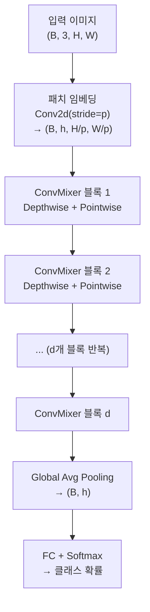

# ConvMixer - 패치 임베딩과 분리 합성곱

## 개요

ConvMixer는 2022년 등장한 경량 이미지 분류 아키텍처로, [[vision-transformer-vit]](ViT)의 핵심 아이디어인 **패치 임베딩(patch embedding)**을 순수 합성곱(convolution) 연산만으로 구현한다. 어텐션(attention) 메커니즘 없이도 경쟁력 있는 성능을 달성하면서, 구조가 극도로 단순하다는 점이 특징이다.

논문 제목 "Patches Are All You Need?"는 ViT의 성공 원인이 트랜스포머 자체가 아니라 패치 기반 입력 표현에 있을 수 있다는 가설을 검증하는 실험이다.

## 핵심 아이디어

### 패치 임베딩을 합성곱으로

[[vision-transformer-vit]]에서 패치 분할은 선형 투영(linear projection)으로 구현되지만, ConvMixer는 **스트라이드(stride) = 패치 크기(p)**인 합성곱 레이어 하나로 동일 효과를 낸다.

```python
# 패치 임베딩 레이어 (채널 h, 패치 크기 p)
patch_embedding = nn.Sequential(
    nn.Conv2d(3, h, kernel_size=p, stride=p),
    nn.GELU(),
    nn.BatchNorm2d(h)
)
```

입력 이미지 `(B, 3, H, W)`가 `(B, h, H/p, W/p)` 형태의 패치 토큰 텐서로 변환된다. 이후 공간 해상도는 유지된 채로 `d`개의 ConvMixer 레이어를 통과한다.

### 분리 합성곱 (Depthwise-Pointwise)

각 ConvMixer 블록은 두 단계로 구성된다:

1. **Depthwise Conv**: 채널별로 독립적인 큰 커널(large kernel) 합성곱. 공간적 혼합(spatial mixing) 담당
2. **Pointwise Conv**: 1x1 합성곱으로 채널 간 혼합(channel mixing) 담당

이는 [[cnn]]의 전통적인 분리 합성곱(depthwise separable convolution)을 재해석한 것으로, 트랜스포머의 self-attention(공간 혼합) + FFN(채널 혼합) 구조와 기능적으로 대응된다.

```python
class ConvMixerBlock(nn.Module):
    def __init__(self, h, kernel_size):
        super().__init__()
        self.depthwise = nn.Sequential(
            nn.Conv2d(h, h, kernel_size, groups=h, padding="same"),
            nn.GELU(),
            nn.BatchNorm2d(h)
        )
        self.pointwise = nn.Sequential(
            nn.Conv2d(h, h, 1),
            nn.GELU(),
            nn.BatchNorm2d(h)
        )

    def forward(self, x):
        x = x + self.depthwise(x)  # residual + depthwise
        x = self.pointwise(x)
        return x
```

## 아키텍처 전체 흐름



패치 임베딩 이후 공간 해상도(H/p, W/p)가 마지막 풀링 전까지 고정된다. ViT처럼 CLS 토큰이나 위치 임베딩이 없다.

## 하이퍼파라미터

| 파라미터 | 의미 | 일반적 값 |
|---------|------|----------|
| `h` | 은닉 채널 수 (모델 폭) | 256, 512, 1024 |
| `d` | ConvMixer 블록 수 (모델 깊이) | 8, 20, 32 |
| `p` | 패치 크기 | 7, 14 |
| `k` | Depthwise 커널 크기 | 5, 7, 9 |

표기: `ConvMixer-h/d` (예: `ConvMixer-1536/20`)

## ViT vs ConvMixer 비교

| 항목 | ViT | ConvMixer |
|------|-----|-----------|
| 공간 혼합 | Multi-head Self-Attention | Depthwise Conv (large kernel) |
| 채널 혼합 | MLP (FFN) | Pointwise Conv (1x1) |
| 위치 정보 | 위치 임베딩 | 암묵적 (conv의 locality) |
| 패치 임베딩 | 선형 투영 | Strided Conv |
| 글로벌 수용야(receptive field) | 전체 (attention) | 누적 합성곱 |
| 파라미터 효율 | 낮음 (소규모) | 높음 |

## 성능과 한계

**장점**
- 구현이 극도로 단순 (100줄 이내 PyTorch)
- 사전학습 없이 중간 규모 데이터셋(CIFAR-10/100, ImageNet)에서 ViT-Small 수준 달성
- 큰 depthwise 커널로 글로벌 컨텍스트 일부 포착 가능

**한계**
- 매우 큰 규모(ViT-Large 이상)에서는 어텐션 기반 모델에 뒤처짐
- 큰 커널 conv는 메모리 접근 패턴이 비효율적일 수 있음
- 위치 정보 인코딩이 암묵적이므로 해상도 변화에 취약

## 왜 중요한가

ConvMixer는 "트랜스포머의 어텐션이 핵심인가, 패치 분할이 핵심인가"라는 질문에 실험적 증거를 제공한다. 단순 [[cnn]] 연산만으로도 패치 기반 처리를 구현할 수 있음을 보이면서, 아키텍처 설계 공간에 대한 이해를 넓혔다. 또한 추론 최적화나 엣지 배포 시 어텐션 없는 대안으로 실용적 가치가 있다.

## 관련 문서

- [[cnn]] - 합성곱 신경망 기초
- [[vision-transformer-vit]] - 패치 임베딩의 원조 아키텍처
- [[data-augmentation-advanced]] - ConvMixer 학습 시 자주 사용되는 증강 기법
