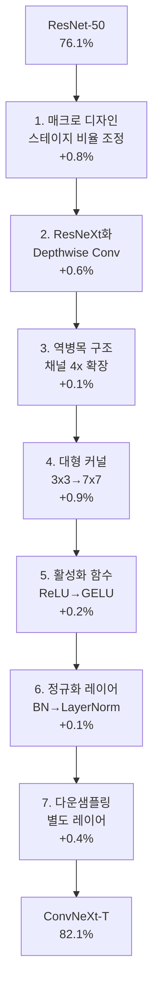

# ConvNeXt (순수 CNN의 현대화)

ConvNeXt는 Meta AI가 2022년 발표한 순수 합성곱(CNN) 기반 모델로, ResNet-50/200에서 출발해 **Vision Transformer(Swin)의 설계 결정을 CNN에 점진적으로 적용**하는 실험을 통해 탄생했다. "A ConvNet for the 2020s"라는 논문 제목처럼, CNN이 여전히 Transformer에 필적한다는 것을 증명했다.

## 7단계 현대화 로드맵

ResNet-50(76.1% ImageNet top-1)에서 ConvNeXt-T(82.1%)까지, 각 단계별 성능 향상을 추적했다.

## 단계별 핵심 변경

### 1. 매크로 디자인 (Macro Design)
Swin의 스테이지별 블록 비율 `(1:1:3:1)`을 `(3:3:9:3)`으로 변경. 더 많은 연산을 후반 스테이지에 집중.

### 2. ResNeXt화 (Depthwise Separable Conv)
채널별 독립 합성곱(depthwise convolution)을 self-attention의 채널 혼합과 유사한 역할로 도입. 효율성 향상.

### 3. 역병목 구조 (Inverted Bottleneck)
기존 병목(차원 축소→연산→차원 복원)과 반대로, MLP 확장 비율 4x를 depthwise 레이어 앞뒤에 적용.

### 4. 대형 커널 (Large Kernel Conv)
3×3 → **7×7** 커널로 수용 영역(receptive field) 확대. Swin의 7×7 윈도우와 직접 대응.

### 5-7. 정규화/활성화 현대화
- ReLU → GELU, 활성화 레이어 수 최소화
- BatchNorm → LayerNorm (Transformer와 동일)
- 스테이지 간 별도 다운샘플링 레이어

## Swin Transformer와 성능 비교

| 모델 | 파라미터 | ImageNet top-1 | 비고 |
|------|---------|---------------|------|
| Swin-T | 28M | 81.3% | |
| ConvNeXt-T | 28M | 82.1% | +0.8%p |
| Swin-S | 50M | 83.0% | |
| ConvNeXt-S | 50M | 83.1% | +0.1%p |
| Swin-B | 88M | 83.5% | |
| ConvNeXt-B | 89M | 83.8% | +0.3%p |

## ConvNeXt V2

2023년 발표된 V2는 **FCMAE(Fully Convolutional Masked Autoencoder)**를 적용해 자기지도 사전학습을 가능하게 했다. MAE의 마스킹 전략을 순수 CNN에 적용하기 위해 Global Response Normalization(GRN) 레이어를 추가했다.

## "CNN은 죽지 않았다"

ConvNeXt의 핵심 메시지는 Vision Transformer의 성공이 어텐션 자체보다 **현대적 학습 레시피(데이터 증강, LR 스케줄, 대형 커널, 정규화 선택)** 덕분일 수 있다는 것이다. 적절히 현대화된 CNN은 Transformer와 동등하거나 그 이상의 성능을 낸다.

## 관련 문서
- [[poolformer-metaformer]] -- PoolFormer와 MetaFormer 가설
- [[vision-transformer|Vision Transformer]]
- [[swin-transformer|Swin Transformer]]
- [[masked-autoencoder-mae|MAE]]
- [[residual-connection|잔차 연결]]
