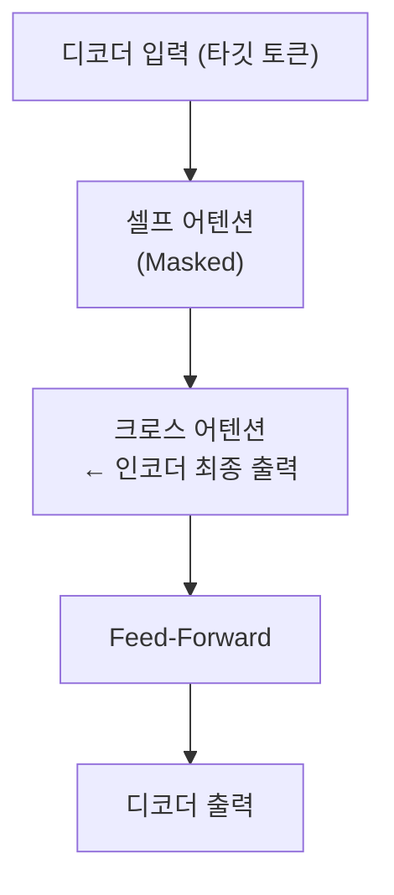

# 크로스 어텐션 (Cross-Attention)

크로스 어텐션(Cross-Attention)은 어텐션의 쿼리(Query), 키(Key), 값(Value)이 **서로 다른 두 시퀀스**에서 오는 어텐션 변형이다. 셀프 어텐션(Self-Attention)이 동일 시퀀스 내 관계를 포착한다면, 크로스 어텐션은 두 표현 공간을 연결한다. Transformer 원본의 인코더-디코더 어텐션, 확산 모델의 텍스트 조건화, VLM의 시각-언어 정합 등 다양한 곳에 사용된다.

## 수식과 구조

셀프 어텐션과 크로스 어텐션의 유일한 차이는 **K와 V의 출처**다.

### 셀프 어텐션
$$Q = XW_Q, \quad K = XW_K, \quad V = XW_V$$
Q, K, V 모두 동일한 입력 $X$에서 파생.

### 크로스 어텐션
$$Q = X_{dec}W_Q, \quad K = X_{enc}W_K, \quad V = X_{enc}W_V$$
Q는 디코더/타깃 시퀀스 $X_{dec}$에서, K와 V는 인코더/소스 시퀀스 $X_{enc}$에서 파생.

출력 계산은 동일:
$$\text{CrossAttn}(Q, K, V) = \text{softmax}\left(\frac{QK^T}{\sqrt{d_k}}\right)V$$

## 데이터 흐름

```mermaid
flowchart LR
    subgraph 소스 시퀀스 "소스 시퀀스 (텍스트/인코더 출력)"
        ENC["X_enc\n(토큰 임베딩)"]
    end
    subgraph 타깃 시퀀스 "타깃 시퀀스 (디코더/이미지 특징)"
        DEC["X_dec\n(쿼리 소스)"]
    end
    ENC --> WK["W_K"] --> K["K"]
    ENC --> WV["W_V"] --> V["V"]
    DEC --> WQ["W_Q"] --> Q["Q"]
    Q --> ATT["어텐션\nscaled dot-product"]
    K --> ATT
    V --> ATT
    ATT --> OUT["출력\n(타깃 형상 유지)"]
```

출력의 시퀀스 길이는 Q의 길이(타깃)와 동일하고, K/V 길이(소스)에 무관하다. 이것이 크로스 어텐션의 핵심 특성이다.

## Transformer 원본에서의 역할

Vaswani et al. (2017) 원본 Transformer에서 디코더의 두 번째 어텐션 레이어가 크로스 어텐션이다.



디코더가 각 타깃 토큰을 생성할 때 소스 시퀀스 **전체**를 참조할 수 있게 한다.

## 확산 모델의 텍스트 조건화

LDM/Stable Diffusion에서 U-Net의 ResNet 블록 사이에 크로스 어텐션이 삽입된다:
- Q: U-Net 공간 특징(이미지 패치)
- K, V: CLIP 텍스트 인코더 출력(텍스트 토큰)

이로써 "특정 단어가 이미지의 특정 영역에 영향을 미치는" 세밀한 조건화가 가능하다.

## VLM의 시각-언어 정합

Flamingo, BLIP-2 등 VLM에서 크로스 어텐션은 텍스트 처리 중 시각 정보를 참조하는 메커니즘이다:
- Q: 언어 모델 토큰
- K, V: 비전 인코더 특징

Flamingo의 Gated Cross-Attention은 초기에 시각 신호를 억제하다 학습이 진행되면서 점진적으로 통합하는 특수 버전이다.

## 셀프 어텐션과의 차이 요약

| 항목 | 셀프 어텐션 | 크로스 어텐션 |
|------|----------|------------|
| Q 출처 | 동일 시퀀스 | 타깃 시퀀스 |
| K, V 출처 | 동일 시퀀스 | 소스 시퀀스 |
| 역할 | 내부 관계 포착 | 두 표현 공간 연결 |
| 출력 길이 | Q와 동일 | Q와 동일 |
| 주요 활용 | 언어 모델, 비전 | 번역, 조건화, VLM |

## 관련 문서
- [[self-attention-mechanism|셀프 어텐션]]
- [[transformer-architecture|Transformer 아키텍처]]
- [[latent-diffusion-model|잠재 확산 모델]]
- [[vision-language-model-architectures|VLM 아키텍처]]
- [[seq2seq-attention-pre-transformer|Seq2Seq + Attention]]
