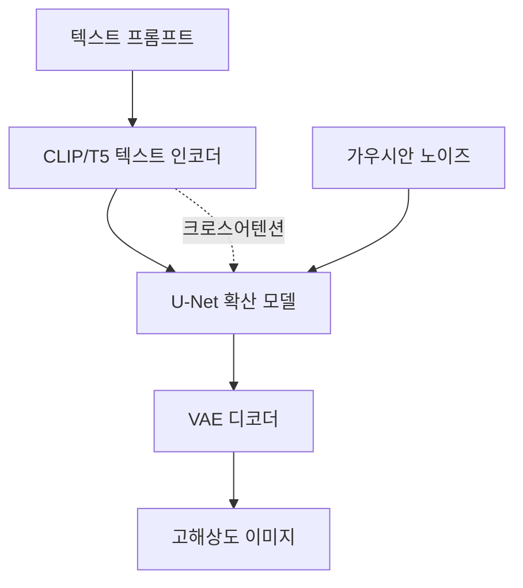
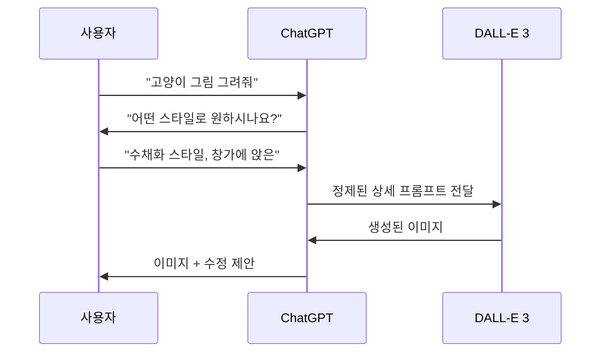

# DALL-E 3 - OpenAI 텍스트-이미지 생성 아키텍처

## 배경

DALL-E 3(Betker et al., OpenAI, 2023)는 OpenAI의 세 번째 텍스트-이미지 생성 모델이다. 이전 DALL-E 2와의 핵심 차별점은 아키텍처 혁신이 아니라 **훈련 데이터의 품질**에 있다. 특히 웹 크롤링으로 수집된 데이터에 동반된 짧고 부정확한 alt-text 캡션을 LLM으로 **자동 재작성**한 상세 캡션을 훈련에 사용하는 기법이 핵심이다.

또한 DALL-E 3는 ChatGPT와 통합되어, 사용자가 대화형으로 이미지 생성 요청을 정제하고 수정할 수 있는 경험을 제공한다. 이미지 내 텍스트 렌더링 품질도 이전 모델 대비 크게 향상됐다.

## 핵심 혁신: 캡션 재작성 (Caption Recaptioning)

### 문제: 짧은 alt-text의 한계

인터넷에서 수집한 이미지-텍스트 쌍의 alt-text는 대부분:
- "사진" / "이미지" 등 무의미한 태그
- 마케팅 문구 (이미지와 무관)
- 짧고 추상적 설명 ("고양이", "도시 풍경")

이런 데이터로 훈련한 모델은 복잡한 프롬프트를 제대로 따르지 못한다.

### 해결: LLM 기반 캡션 재작성

1. **이미지 캡셔닝 모델**(CogVLM 계열)로 이미지마다 상세 캡션 자동 생성
2. 생성된 캡션에는 물체, 위치, 속성, 색상, 수량, 공간 관계 등 상세 정보 포함
3. 이 합성 캡션으로 확산 모델 훈련

예시:
- 원본 alt-text: "아침 커피"
- 재작성 캡션: "나무 테이블 위에 라떼 아트가 그려진 흰색 머그잔, 옆에 계피 스틱과 크루아상이 놓여 있다. 따뜻한 아침 햇살이 창을 통해 비치고 있다."

### 훈련 믹스 전략

짧은 캡션에도 반응하도록 훈련 시 두 종류 캡션을 혼합:
- **합성 상세 캡션** (95%): LLM이 재작성한 캡션
- **원본 짧은 캡션** (5%): 원래 alt-text

이를 통해 간단한 프롬프트에도 동작하면서 복잡한 프롬프트도 이해하는 모델이 된다.

## 아키텍처

### 전체 구조

공개된 정보에 따르면 DALL-E 3는 [[latent-diffusion-model|잠재 확산 모델(LDM)]] 기반:

- **텍스트 인코더**: CLIP 텍스트 인코더 + 대규모 언어 모델 임베딩 결합 (정확한 구조 미공개)
- **확산 백본**: U-Net 기반 (DiT로의 전환 여부 미공개) [교차검증 필요]
- **잠재 공간**: VAE 기반 압축 잠재 표현

### ChatGPT 통합

DALL-E 3의 차별화 요소 중 하나는 **ChatGPT와의 통합**이다:

ChatGPT가 프롬프트를 자동으로 확장/정제하여 DALL-E 3에 전달. 사용자는 대화로 이미지를 점진적으로 수정할 수 있다.

## 텍스트 렌더링 개선

DALL-E 3의 두드러진 개선 중 하나는 **이미지 내 텍스트 생성 정확도**다:

- 표지판, 광고판, 책 제목 등에 영어 텍스트를 정확하게 렌더링
- 이전 모델들(DALL-E 2, Stable Diffusion)이 텍스트를 흐릿하거나 왜곡되게 생성했던 한계 극복
- 합성 캡션에 텍스트 내용이 명시적으로 기술되므로 모델이 텍스트-이미지 관계를 더 잘 학습

이 능력은 캡션 재작성 과정에서 이미지 내 텍스트도 캡션에 포함시킨 결과로 알려져 있다.

## 안전성 및 거절 메커니즘

OpenAI는 DALL-E 3에 여러 안전 장치를 적용했다:

- **유해 콘텐츠 거절**: 폭력, 성인 콘텐츠, 특정 실명 인물 등 생성 거절
- **예술 스타일 존중**: 살아있는 예술가의 특정 스타일 모방 거절 (요청 시)
- **저작권 보호**: ChatGPT가 프롬프트를 조정하여 저작권 민감 내용 완화

## 성능 평가

### T2I-CompBench 및 DrawBench

| 모델 | 텍스트 정렬 | 이미지 품질 | 텍스트 렌더링 |
|------|-----------|-----------|------------|
| DALL-E 3 | 매우 높음 | 높음 | 높음 |
| DALL-E 2 | 중간 | 중간 | 낮음 |
| SD XL | 중간 | 높음 | 낮음 |

- 복잡한 프롬프트 따르기(prompt following)에서 이전 모델 대비 현저한 개선
- 이미지 내 텍스트 렌더링에서 동시대 모델 중 최고 수준

## DALL-E 시리즈 계보

| 버전 | 연도 | 핵심 기술 |
|------|------|---------|
| DALL-E 1 | 2021 | 텍스트+이미지 자기회귀 트랜스포머 |
| DALL-E 2 | 2022 | CLIP 임베딩 역전 + 확산 모델 |
| **DALL-E 3** | **2023** | **캡션 재작성 + 확산 + ChatGPT 통합** |

## 캡션 재작성의 일반 원칙

DALL-E 3의 캡션 재작성 기법은 이후 여러 모델에 영향을 미쳤다:

- **Stable Diffusion 3**: LAION 데이터셋 재캡셔닝에 동일 방식 적용
- **Playground v2.5**: 합성 캡션 혼합 훈련
- **일반 원칙**: 데이터 품질이 모델 아키텍처보다 중요할 수 있음

> "We find that training on highly detailed synthetic captions improves image-text alignment significantly."

## 실무 활용

- **ChatGPT Plus/API**: DALL-E 3 이미지 생성 API 공개
- **Bing Image Creator**: Microsoft Bing에 통합
- **OpenAI API**: `gpt-image-1` (DALL-E 3 후속) API로 접근 가능
- **광고/콘텐츠 제작**: 텍스트 정렬 우수성으로 마케팅 이미지 생성

## 관련 문서

- [[imagen-text-to-image]]
- [[stable-diffusion-3-mmdit]]
- [[parti-autoregressive-image]]
- [[muse-masked-image]]
- [[diffusion-models]]
- [[latent-diffusion-model]]
- [[clip]]
- [[t5-text-to-text]]
- [[cross-attention]]
- [[vq-vae]]
