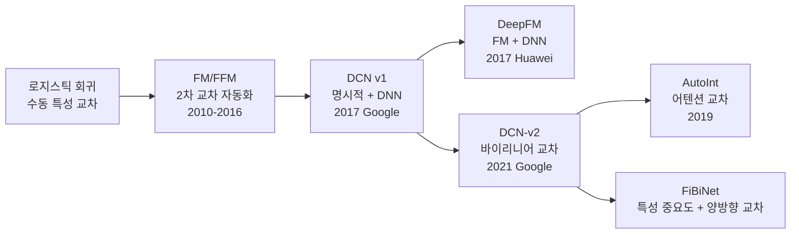
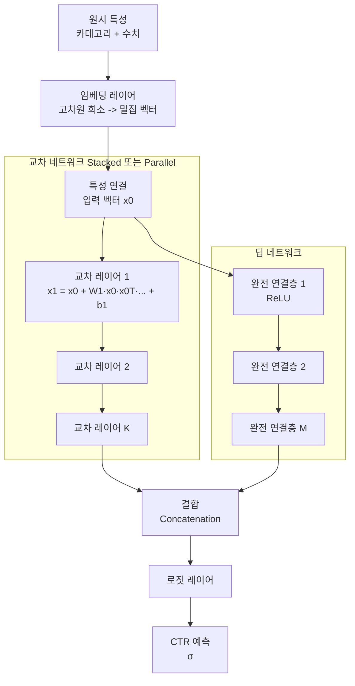
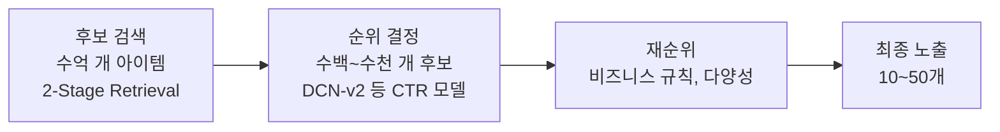

# DCN-v2 - 심층 교차 네트워크

## 문제: 특성 교차의 중요성

산업용 추천 시스템과 광고 CTR(Click-Through Rate) 예측에서 **특성 교차(feature crossing)**는 핵심 성능 요소다. 예를 들어:

- "나이 = 20대" + "관심사 = 게임" -> 게임 광고 클릭률 높음
- "성별 = 여성" + "시간 = 주말" -> 특정 쇼핑 카테고리 선호
- "지역 = 서울" + "날씨 = 비" -> 배달 앱 이용 증가

단일 특성으로는 설명되지 않는 패턴이 **조합에서 나타난다**. 수백~수천 개의 원-핫 인코딩 특성에서 유의미한 교차를 자동으로 학습하는 것이 목표다.

## DCN의 발전 과정

## DCN-v2 아키텍처

**Deep & Cross Network v2(Wang et al., WWW 2021)**는 Google이 발표한 CTR 예측 모델로, DCN v1의 교차 네트워크를 **바이리니어(bilinear)** 형태로 강화했다.

### 두 가지 구조 변형

1. **Stacked(직렬)**: 교차 네트워크 출력이 DNN 입력으로 들어감
2. **Parallel(병렬)**: 교차 네트워크와 DNN이 같은 입력을 받아 출력을 concat

실험적으로 **Parallel이 Stacked보다 약간 우수**.

## 교차 레이어: DCN v1 vs v2

### DCN v1 (벡터 교차)

$$\mathbf{x}_{l+1} = \mathbf{x}_0 \mathbf{x}_l^T \mathbf{w}_l + \mathbf{b}_l + \mathbf{x}_l$$

$\mathbf{x}_0 \mathbf{x}_l^T \mathbf{w}_l$이 스칼라이므로 표현력이 제한적이다.

### DCN v2 (바이리니어 교차)

$$\mathbf{x}_{l+1} = \mathbf{x}_0 \odot (\mathbf{U}_l \mathbf{V}_l^T \mathbf{x}_l) + \mathbf{b}_l + \mathbf{x}_l$$

- $\mathbf{U}_l \in \mathbb{R}^{d \times r}$, $\mathbf{V}_l \in \mathbb{R}^{d \times r}$: 저랭크(low-rank) 행렬 분해
- $\odot$: 아다마르 곱(원소별 곱)
- $\mathbf{U}_l \mathbf{V}_l^T \approx \mathbf{W}_l$: 완전 행렬 $\mathbf{W}_l \in \mathbb{R}^{d \times d}$의 저랭크 근사

핵심 개선:
- **바이리니어 형태**로 $\mathbf{x}_0$와 변환된 $\mathbf{x}_l$ 사이의 곱을 계산 -> 더 풍부한 교차
- **저랭크 분해** $r \ll d$로 파라미터 수와 계산량 절감
- 특성 차원 $d$가 수천일 때 $\mathbf{W}$는 $d^2$ 파라미터 -> Low-rank로 $O(dr)$로 압축

## 다른 CTR 모델과 비교

| 모델 | 교차 방식 | 특징 |
|------|---------|------|
| LR | 수동 1차 | 피처 엔지니어링 의존 |
| FM | 2차 자동 | 임베딩 내적 |
| DeepFM | FM + DNN 병렬 | FM과 DNN 결합 |
| DCN v1 | 명시적 고차 + DNN | 스칼라 교차 |
| AutoInt | 어텐션 기반 교차 | 멀티헤드 어텐션 |
| **DCN v2** | 바이리니어 + DNN | 저랭크 효율화 |
| FiBiNet | 중요도 가중 교차 | SENET 특성 선택 |

## 실무 적용: Google 광고 시스템

DCN-v2는 Google 광고 클릭률 예측 시스템에 실제 배포되었다:

- **온라인 A/B 테스트**에서 DCN v1 및 기존 모델 대비 CTR/RPM 개선
- 수억 개의 학습 샘플, 수백만 개의 특성 차원에서 효율적으로 작동
- 서빙 레이턴시 제약 내에서 DCN v2가 최적 성능/효율 균형 달성

## CTR 예측 파이프라인에서의 위치

DCN-v2는 **순위 결정(Ranking) 단계**에 사용된다. 이 단계는:
- 수백~수천 개 후보를 CTR로 정밀 스코어링
- 특성 교차 품질이 직접 매출에 영향
- 정확도와 레이턴시 모두 중요

## 한계

1. **정적 교차**: 고정된 교차 레이어로 동적 특성 간 관계 표현 한계
2. **희소 특성 처리**: 임베딩 레이어에서 인기도 편향(popularity bias) 발생 가능
3. **교차 차수 제한**: 이론상 고차 교차 가능하지만 실제로 유효 차수 낮음
4. **도메인 의존성**: 최적 교차 구조가 데이터셋마다 다름

## 관련 문서

- [[deepfm-factorization|factorization-machines]] - FM: 특성 교차의 기반 방법
- [[embedding-table]] - 고차원 범주 특성의 밀집 표현
- [[ai-recommendation-systems|recommendation-systems]] - 추천 시스템 전반 구조
- [[ctr-prediction]] - CTR 예측 평가 지표 및 벤치마크
