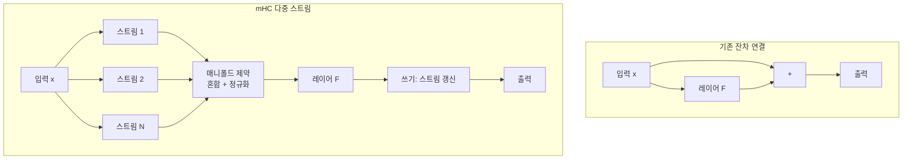

## 개요

DeepSeek mHC(Manifold-Constrained Hyper-Connections)는 DeepSeek이 발표한 신경망 아키텍처 혁신으로, 기존 잔차 연결(Residual Connection)의 한계를 극복하기 위해 다중 정보 스트림과 매니폴드 제약을 결합한 새로운 연결 구조다. 기존 하이퍼-연결(Hyper-Connection)이 다중 경로를 통해 표현력을 높이되 학습 불안정을 초래했던 문제를, "정보 총량 보존" 원칙의 매니폴드 제약으로 해결한다. 약 6-7%의 훈련 시간 오버헤드만으로 대규모 모델 스케일링의 안정성을 크게 개선한다.

논문의 핵심 기여는 mHC가 **잔차 연결 공간의 하이퍼-연결을 특정 매니폴드에 투영하여 항등 사상(identity mapping) 속성을 복원하는 일반 프레임워크**라는 점이다(arXiv:2512.24880).

## 핵심 개념

### 잔차 연결의 한계

기존 잔차 연결은 입력을 그대로 통과시키고 학습된 업데이트만 추가하는 방식(`y = x + F(x)`)으로 심층 모델의 학습을 안정화한다. 이 항등 사상 속성 덕분에 그래디언트가 깊은 층까지 효과적으로 전파된다. 그러나 층 간 정보 공유가 단일 경로로 제한되어, 모델 규모가 커질수록 정보 재사용 능력이 구조적으로 제약된다. 수백 개 층을 쌓아도 각 층은 오직 직전 층의 출력만 직접 접근할 수 있다.

### 하이퍼-연결의 문제

하이퍼-연결(HC)은 다중 정보 흐름 경로를 추가하여 표현력을 높이려는 시도였으나, **잔차 연결 고유의 항등 사상 속성을 훼손**하여 심각한 학습 불안정과 확장성 제한을 초래했다. 구체적으로, 제약 없는 혼합(unconstrained mixing)이 반복되면서:

- 여러 스트림의 신호가 비례 없이 결합되어 신호 폭발/소멸 발생
- [[lora-qlora-finetuning|역전파]] 기울기가 불안정해지고 갑작스러운 손실 급증(loss spike) 관찰
- 이론적으로 기대되는 성능 향상이 실제 대규모 훈련에서 실현 불가

### mHC의 해법: 다중 스트림 + 매니폴드 제약

mHC의 핵심 아이디어는 "여러 개의 병렬 정보 스트림을 유지하되, 정보 재배치 시 전체 정보량이 반드시 보존되도록 하는 매니폴드 제약"이다. 다차선 고속도로에 교차로가 있어 유연한 정보 라우팅이 가능하지만, 각 교차로에서 차량 총수(정보 총량)는 변하지 않는 원리와 유사하다. 이를 통해 다중 경로의 표현력을 유지하면서도 항등 사상 속성을 복원한다.

## 기술 상세

### 아키텍처 구조

### 매니폴드 제약의 작동 원리

물을 여러 잔에 나눠 담되 총량은 변하지 않는 것처럼, 각 스트림의 기여도가 비례적으로 유지된다. 학습 과정에서 **혼합 가중치를 반복 조정하여 완벽한 균형이 유지**되도록 정규화한다:

1. **정규화 프로세스**: 각 스트림이 정보 교환에 비례적으로 참여하도록 혼합 가중치를 제약. 단순 L2 정규화가 아닌 매니폴드 투영(projection onto manifold)을 통해 정보 보존 공간 위에서만 가중치가 탐색됨
2. **깊이별 안정성**: 수백 층 이후에도 순방향 신호 크기와 그래디언트 범위가 제한된 범위 내에 유지됨. 제약 없는 HC에서 관찰되는 신호 발산이 원천 차단
3. **항등성 복원**: 깊은 레이어에서도 "안전한 항등 유사 행동(safe identity-like behavior across depth)"을 보장하여, 잔차 연결의 핵심 장점을 다중 스트림 환경에서 복원

### 각 층의 처리 과정

| 단계 | 동작 | 제약 |
|------|------|------|
| 읽기(Read) | 여러 스트림에서 정보 수집 | 가중합 계수 정규화 |
| 혼합(Mix) | 스트림 간 정보 교환 | 매니폴드 제약으로 총량 보존 |
| 처리(Process) | 레이어 함수 F 적용 | 표준 연산 |
| 쓰기(Write) | 결과를 스트림에 분배 | 비례적 분배 |

### 효율성 최적화

mHC는 다중 스트림이라는 추가 연산에도 불구하고 오버헤드를 최소화하기 위해 세 가지 최적화를 적용한다:

- **연산 퓨전(Operation Fusion)**: 읽기/혼합/쓰기 단계의 행렬 연산을 단일 커널로 통합
- **메모리 트래픽 감소**: 스트림 간 데이터 이동을 최소화하는 메모리 레이아웃 설계
- **계산-통신 오버랩**: 분산 훈련 시 통신과 계산을 병렬 수행

### 성능 결과

- **계산 오버헤드**: 약 6-7% 훈련 시간 증가 (대규모 모델에서 무시 가능한 수준)
- **안정성**: 제약 없는 하이퍼-연결 대비 현저히 안정적인 훈련 -- 손실 급증이 관찰되지 않음
- **성능**: 낮은 손실값 및 추론/언어 태스크에서 일관된 성능 향상
- **확장성**: 소규모부터 대규모 모델까지 일관된 효과 -- 모델이 커질수록 잔차 연결 대비 이점이 확대

### 의의와 전망

mHC는 어텐션 메커니즘이나 데이터 개선이 아닌, **아키텍처 설계 수준의 근본적 혁신**이다. 향후 LLM 확장이 계산량만큼이나 구조적 안정성에 의존함을 시사한다. DeepSeek이 2026년 더 큰 모델을 훈련하기 위한 기반 기술로 활용될 전망이며, SCMP에 따르면 DeepSeek은 이 논문을 2026년 초 발표하며 더 큰 모델 훈련을 향한 의지를 시사했다.

mHC는 [[multi-head-latent-attention|Multi-Head Latent Attention([[multi-head-latent-attention|MLA]])]]과 함께 DeepSeek의 아키텍처 혁신 양대 축을 구성한다. MLA가 KV 캐시 압축으로 추론 효율을 개선한다면, mHC는 훈련 안정성을 개선하여 더 큰 모델의 스케일링을 가능하게 한다.

## 관련 문서

- [[multi-head-latent-attention]] - DeepSeek의 KV 캐시 압축 어텐션
- [[ai-reasoning-models]] - 추론 모델 패러다임 (DeepSeek R1)
- [[mamba-3]] - 대안적 시퀀스 모델링 아키텍처
- [[test-time-compute-scaling]] - 추론 시 계산 확장
