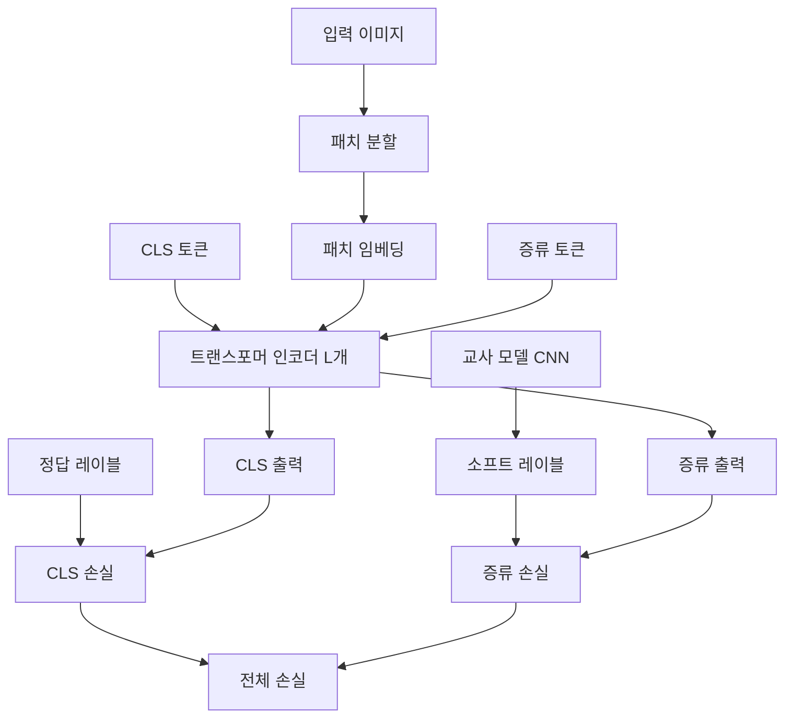

# DeiT - 데이터 효율적 이미지 트랜스포머 (Data-efficient Image Transformers)

## 개요

DeiT(Data-efficient Image Transformers)는 Facebook AI Research(FAIR)가 2020년 발표한 비전 트랜스포머 학습 방법론이다. [[vision-transformer]]가 JFT-300M 같은 대규모 데이터셋 없이는 성능이 떨어진다는 한계를 극복하기 위해 설계되었다. DeiT의 핵심 기여는 **ImageNet-1k만으로도 경쟁력 있는 ViT 모델을 학습**할 수 있음을 보인 것이다.

## 배경: ViT의 데이터 의존성 문제

원래 ViT는 1억 장 이상의 대규모 이미지로 사전학습해야 했다. ImageNet-1k(약 130만 장)만으로 처음부터 학습하면 CNN 기반 모델 대비 크게 부족한 성능을 보였다. 이는 트랜스포머 아키텍처가 CNN이 기본적으로 가진 귀납적 편향(국소성, 이동 불변성)이 없기 때문이다.

## 핵심 기여: 지식 증류 토큰

DeiT의 가장 중요한 혁신은 **증류 토큰(distillation token)**이다.

위 다이어그램에서 CLS 토큰과 증류 토큰이 트랜스포머 인코더에 동시에 입력되고, 각각 독립적인 헤드를 통해 서로 다른 손실로 학습된다.

### 증류 토큰의 동작 원리

- CLS 토큰: 정답 레이블(hard label)에 대한 분류 손실
- 증류 토큰(distillation token): 교사 모델의 출력(soft label 또는 hard label)에 대한 증류 손실
- 두 토큰은 서로 어텐션을 주고받으며, 증류 정보가 전체 표현에 영향을 미침

### 하드 증류 vs 소프트 증류

| 방식 | 교사 타겟 | 손실 함수 | 특징 |
|------|----------|----------|------|
| 소프트 증류 | 교사의 소프트맥스 출력 | KL-divergence | 원래 지식 증류 방식 |
| 하드 증류 | 교사의 argmax 예측 | Cross-entropy | DeiT에서 더 잘 동작 |

실험 결과 하드 증류가 소프트 증류보다 더 나은 성능을 보였으며, 이는 강력한 교사 모델(RegNet 등 CNN)의 예측을 hard label로 사용해도 충분한 신호가 된다는 것을 의미한다.

## 학습 기법

데이터 효율을 높이기 위해 다양한 데이터 증강 기법을 적극 활용한다:

- **Rand-Augment**: 랜덤 자동 증강
- **Mixup / CutMix**: 두 이미지를 섞거나 패치를 교체하는 증강
- **Random Erasing**: 이미지 일부를 랜덤하게 지우기
- **Repeated Augmentation**: 같은 이미지를 여러 번 다르게 증강해서 배치 구성

이런 강한 정규화 기법들이 결합되어야 소규모 데이터셋에서도 트랜스포머가 과적합 없이 학습된다.

## 모델 변형

| 모델 | 파라미터 | Top-1 Acc (ImageNet) | 특징 |
|------|---------|---------------------|------|
| DeiT-S | 22M | ~79.8% | Small, ViT-S와 유사 |
| DeiT-B | 86M | ~81.8% | Base, ViT-B와 동일 구조 |
| DeiT-B↑384 | 86M | ~83.1% | 384x384 파인튜닝 |

`⚗` 기호는 증류 토큰을 사용한 변형임을 나타낸다(예: DeiT-B⚗).

## [[knowledge-distillation]]과의 관계

DeiT는 [[knowledge-distillation]] 개념을 비전 트랜스포머에 구조적으로 내재화한 첫 사례다. 기존 지식 증류는 학습 후 별도 단계에서 적용되는 경우가 많았지만, DeiT는 **증류 토큰을 아키텍처의 일부로 통합**함으로써 학습 과정 전체에서 교사의 지식을 흡수할 수 있게 했다.

교사 모델로는 CNN 계열(RegNetY-16GF 등)이 효과적이며, 이는 CNN과 ViT가 서로 다른 특징을 학습한다는 것을 시사한다.

## 의의와 영향

DeiT는 다음 측면에서 중요한 전환점이었다:

1. **ViT의 민주화**: 대규모 내부 데이터셋 없이도 연구 가능
2. **CNN 교사의 재발견**: CNN이 약해진 줄 알았지만, 여전히 강력한 교사 역할
3. **증류 토큰 패턴**: 이후 다양한 멀티모달 모델에서 유사한 특수 토큰 패턴으로 확장

## 한계

- 교사 모델(CNN)을 별도로 학습해야 함
- 증류 토큰의 효과가 교사 품질에 크게 의존
- 여전히 [[masked-autoencoder-mae]] 같은 자기지도 방식에 비해 데이터 효율이 낮음

## 관련 문서

- [[vision-transformer]] - DeiT의 기반 아키텍처
- [[knowledge-distillation]] - 증류 토큰의 이론적 배경
- [[beit-bert-pretraining-images]] - BEiT: 마스크 사전학습으로 다른 방향의 데이터 효율화
- [[masked-autoencoder-mae]] - 자기지도 학습으로 데이터 효율화
- [[hierarchical-vit-design]] - 계층적 ViT 설계 비교
