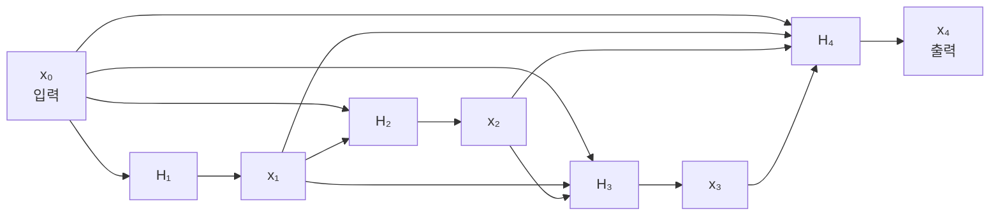
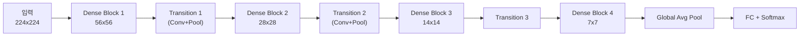

# DenseNet - 밀집 연결 네트워크

## 한 줄 요약

DenseNet (Densely Connected Convolutional Networks)은 각 레이어가 이전 모든 레이어의 출력을 직접 입력으로 받는 밀집 연결(dense connection) 구조로, 그래디언트 흐름 강화와 특징 재사용(feature reuse)을 통해 ResNet보다 적은 파라미터로 경쟁력 있는 성능을 달성한다.

## 핵심 아이디어

[[resnet-skip-connections]] (ResNet)은 레이어 $l$의 출력을 레이어 $l+1$에만 더한다 (단거리 스킵 연결):

$$x_{l+1} = H_l(x_l) + x_l$$

DenseNet은 이를 극단적으로 확장한다 - 레이어 $l$은 **이전 모든 레이어의 출력을 채널 방향으로 연결(concatenation)**하여 입력받는다:

$$x_l = H_l([x_0, x_1, \ldots, x_{l-1}])$$

여기서 $[\cdot]$은 채널 방향 연결(channel-wise concatenation), $H_l$은 BN-ReLU-Conv 연산.



각 레이어는 이전 모든 레이어에 직접 연결된다. $L$개 레이어 블록에서 총 $\frac{L(L+1)}{2}$개의 직접 연결이 존재한다.

## 주요 개념

### 성장률 (Growth Rate) k

각 레이어 $H_l$은 $k$개의 채널(feature map)만 추가로 생성한다. $k$가 작아도 되는 이유: 이미 이전 레이어의 누적 표현을 모두 입력받기 때문.

레이어 $l$의 입력 채널 수: $k_0 + k(l-1)$
- $k_0$: 초기 입력 채널
- 보통 $k = 12, 24, 32$ 등 작은 값 사용

### 밀집 블록 (Dense Block)과 전환 레이어 (Transition Layer)

전체 해상도가 동일한 레이어들을 **밀집 블록**으로 묶고, 해상도 다운샘플링은 **전환 레이어**가 담당한다:



**전환 레이어**: $1\times1$ Conv (채널 수 절반으로 축소) + $2\times2$ Average Pooling.

압축 비율(compression factor) $\theta \in (0, 1]$: 전환 레이어에서 채널을 $\lfloor \theta \cdot m \rfloor$으로 줄임. 보통 $\theta = 0.5$.

### Bottleneck 구조 (DenseNet-B)

계산 효율을 위해 $3\times3$ Conv 앞에 $1\times1$ Conv를 추가:

$$\text{BN} \to \text{ReLU} \to 1\times1\text{Conv}(4k) \to \text{BN} \to \text{ReLU} \to 3\times3\text{Conv}(k)$$

$1\times1$ Conv가 채널 수를 $4k$로 정규화하여 $3\times3$ Conv의 입력 크기를 통제.

## DenseNet 변형 및 모델명

| 모델 | 레이어 수 | 성장률 k | 파라미터 | ImageNet Top-1 |
|------|---------|---------|---------|--------------|
| DenseNet-121 | 121 | 32 | 8M | 74.9% |
| DenseNet-169 | 169 | 32 | 14M | 76.2% |
| DenseNet-201 | 201 | 32 | 20M | 77.4% |
| DenseNet-264 | 264 | 32 | 34M | 77.9% |

비교: ResNet-152 (60M 파라미터)보다 훨씬 적은 파라미터로 유사 성능.

## 왜 잘 되는가? 세 가지 이점

### 1. 그래디언트 흐름 강화

역전파 시 모든 레이어에서 손실까지 직접 경로가 존재한다. 그래디언트 소실 문제가 ResNet보다 더 완화된다.

$l$번째 레이어의 그래디언트는 출력 레이어까지 최대 1-hop 경로로 전달될 수 있다.

### 2. 특징 재사용 (Feature Reuse)

각 레이어는 네트워크의 다른 모든 레이어로부터 특징을 받아 활용한다. 이후 레이어가 이전 레이어의 표현을 재사용하므로, 중복 학습이 감소하고 파라미터 효율이 향상된다.

Huang et al.의 분석에 따르면 DenseNet의 모든 직접 연결이 실제로 활성화(비제로 가중치)되어 있으며, 이는 단순한 잔차 경로 이상의 정보가 전달됨을 의미한다.

### 3. 암묵적 딥 슈퍼비전 (Implicit Deep Supervision)

손실이 모든 레이어에서 직접 그래디언트를 받으므로, 명시적인 보조 손실 없이도 중간 레이어가 충분히 학습된다.

## ResNet vs DenseNet 비교

| 특성 | ResNet | DenseNet |
|------|--------|---------|
| 연결 방식 | 덧셈 (addition) | 연결 (concatenation) |
| 연결 거리 | 직전 레이어만 | 모든 이전 레이어 |
| 파라미터 | 많음 | 적음 (성장률 k 덕분) |
| 메모리 | 중간 | 많음 (활성화 저장 필요) |
| 특징 보존 | 손실 가능 (덧셈) | 완전 보존 (연결) |
| 스케일 | 쉬운 확장 | 채널 축적으로 제한 |

**메모리 트레이드오프**: DenseNet은 모든 이전 활성화를 저장해야 하므로 GPU 메모리 사용량이 증가한다. 역전파 시 체크포인팅으로 완화 가능.

## PyTorch 구현

```python
import torch
import torch.nn as nn

class DenseLayer(nn.Module):
    """단일 밀집 레이어 (Bottleneck 포함)."""

    def __init__(self, in_channels: int, growth_rate: int) -> None:
        super().__init__()
        bn_size = 4  # bottleneck 배율
        self.layer = nn.Sequential(
            nn.BatchNorm2d(in_channels),
            nn.ReLU(inplace=True),
            nn.Conv2d(in_channels, bn_size * growth_rate, kernel_size=1, bias=False),
            nn.BatchNorm2d(bn_size * growth_rate),
            nn.ReLU(inplace=True),
            nn.Conv2d(bn_size * growth_rate, growth_rate, kernel_size=3,
                      padding=1, bias=False),
        )

    def forward(self, x: torch.Tensor) -> torch.Tensor:
        new_features = self.layer(x)
        return torch.cat([x, new_features], dim=1)  # 채널 방향 연결


class DenseBlock(nn.Module):
    """L개의 DenseLayer로 구성된 밀집 블록."""

    def __init__(self, num_layers: int, in_channels: int, growth_rate: int) -> None:
        super().__init__()
        layers = []
        for i in range(num_layers):
            layers.append(DenseLayer(in_channels + i * growth_rate, growth_rate))
        self.block = nn.Sequential(*layers)

    def forward(self, x: torch.Tensor) -> torch.Tensor:
        return self.block(x)


class TransitionLayer(nn.Module):
    """Dense Block 간 해상도 축소 및 채널 압축."""

    def __init__(self, in_channels: int, compression: float = 0.5) -> None:
        super().__init__()
        out_channels = int(in_channels * compression)
        self.layer = nn.Sequential(
            nn.BatchNorm2d(in_channels),
            nn.ReLU(inplace=True),
            nn.Conv2d(in_channels, out_channels, kernel_size=1, bias=False),
            nn.AvgPool2d(kernel_size=2, stride=2),
        )

    def forward(self, x: torch.Tensor) -> torch.Tensor:
        return self.layer(x)
```

## 응용 및 활용 분야

| 분야 | 적용 이유 |
|------|---------|
| 의료 영상 분할 | 특징 재사용으로 세부 구조 보존 |
| 포인트 클라우드 3D 처리 | 밀집 연결의 기하 특징 축적 |
| 밀집 예측 (Dense prediction) | 모든 스케일 특징 활용 |
| 소규모 데이터 학습 | 파라미터 효율과 정규화 효과 |

## 한계와 후속 발전

**한계**:
- 채널 수가 레이어 수에 비례해 증가 → 깊어질수록 메모리 폭발
- 전환 레이어 없으면 확장이 어려움
- 대형 배치와 높은 성장률 조합에서 메모리 부족

**후속 발전**:
- [[convnext]] - DenseNet 개념을 현대화한 순수 Conv 아키텍처
- [[mobilenet-efficientnet]] - 경량화 방향
- Dense connection 개념은 U-Net, FPN 등 분할 모델에 영향을 줌

## 관련 문서

- [[resnet-skip-connections]] - 스킵 연결의 원형, DenseNet의 직접 영감
- [[vgg-deep-nets]] - 깊이 탐구의 선구자
- [[cnn]] - 합성곱 신경망 기초
- [[mobilenet-efficientnet]] - 효율적 CNN 아키텍처
- [[convnext]] - 현대적 순수 CNN 아키텍처
- [[resnext-cardinality]] - 그룹 합성곱으로 다른 방향 확장
