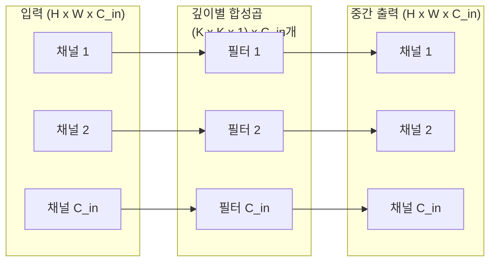
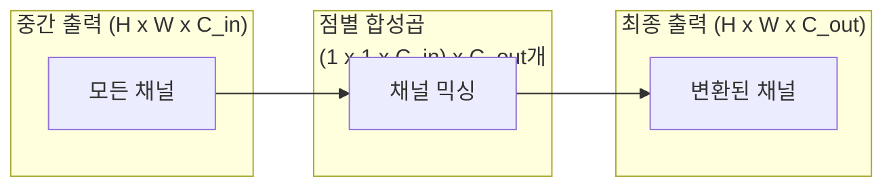
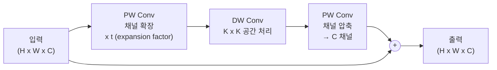
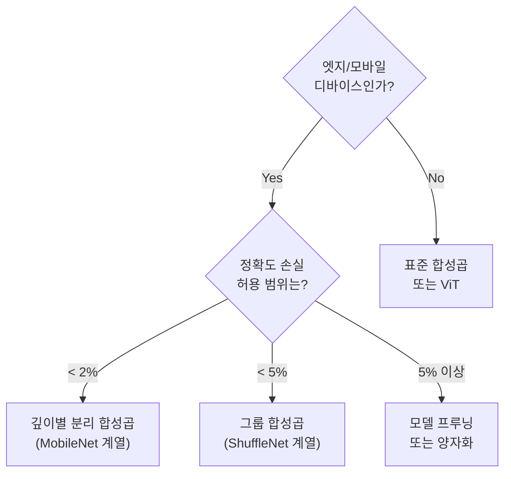

# 깊이별 분리 합성곱 (Depthwise Separable Convolution)

## 개요

깊이별 분리 합성곱(Depthwise Separable Convolution)은 표준 [[cnn]] 합성곱 연산을 **두 단계로 인수분해(factorize)** 하여 연산량을 대폭 줄이는 기법이다. [[mobilenet-efficientnet]]의 핵심 구성 요소이며, Xception(2017, Chollet)에서도 독립적으로 도입됐다. 이론적으로 표준 합성곱 대비 FLOPs를 약 **8-9배** 절감한다.

## 표준 합성곱의 비용

먼저 표준 합성곱의 연산량을 살펴본다.

- 입력: $H \times W \times C_{in}$ (높이 x 너비 x 입력 채널)
- 필터: $K \times K \times C_{in}$ (커널 크기 x 입력 채널) x $C_{out}$개
- 출력: $H \times W \times C_{out}$

FLOPs = $H \times W \times C_{in} \times C_{out} \times K^2$

예: 256x256 이미지, $C_{in}=64$, $C_{out}=128$, K=3이면 약 **12억 FLOPs**.

## 깊이별(Depthwise) 합성곱

첫 번째 단계: 각 입력 채널에 **독립적인** $K \times K$ 필터를 적용한다. 채널 간 정보 결합은 하지 않는다.

FLOPs = $H \times W \times C_{in} \times K^2$

채널 수가 $C_{out}$배 줄어든다. 하지만 이 단계만으로는 채널 간 정보가 섞이지 않는다.

## 점별(Pointwise) 합성곱

두 번째 단계: $1 \times 1$ 합성곱으로 채널 간 정보를 결합하여 $C_{out}$개 채널 출력.

FLOPs = $H \times W \times C_{in} \times C_{out} \times 1^2 = H \times W \times C_{in} \times C_{out}$

## 연산량 절감 계산

전체 깊이별 분리 합성곱의 FLOPs:

$$\text{DSConv FLOPs} = H \cdot W \cdot C_{in} \cdot K^2 + H \cdot W \cdot C_{in} \cdot C_{out}$$

표준 합성곱 대비 비율:

$$\frac{\text{DSConv}}{\text{Standard}} = \frac{K^2 + C_{out}}{K^2 \cdot C_{out}} = \frac{1}{C_{out}} + \frac{1}{K^2}$$

K=3이면 $\frac{1}{9} + \frac{1}{C_{out}}$. $C_{out}$이 충분히 크면 약 **1/9 ≈ 11%** 의 연산량으로 동일한 공간 처리를 달성한다.

| 커널 크기 | 절감율 (이상적) |
|-----------|----------------|
| K=3 | ~8.9배 절감 |
| K=5 | ~24배 절감 |
| K=7 | ~48배 절감 |

## Xception - 극단적 분리

Xception(Inception의 극단적 버전)은 Inception 모듈의 논리를 확장해 모든 합성곱을 깊이별 분리로 대체한다.

- 표현 관점: "공간 피처 추출"과 "채널 믹싱"은 완전히 독립적으로 학습할 수 있다는 가설
- Inception 계열보다 더 적은 파라미터로 ImageNet에서 더 높은 정확도

## MobileNetV2의 역전 잔차와의 조합

[[mobilenet-efficientnet]]의 V2에서는 깊이별 분리 합성곱을 역전 잔차 블록 내에 배치한다.

확장 계수 t=6이면 내부에서 채널이 6배로 늘었다가 다시 줄어든다. 큰 채널에서 공간 연산(DW)을 수행해 표현력을 높이고, 점별로 압축 후 잔차 연결한다.

## 한계와 대안

- **표현력 손실 가능성**: 채널 간 상호작용이 1x1 conv로만 제한됨
- **하드웨어 비효율**: GPU는 큰 행렬 곱에 최적화되어 있어 DWConv의 실제 속도 향상이 FLOPs 절감만큼 크지 않을 수 있음 (메모리 대역폭 병목)
- **대안**: Group Convolution(MobileNet보다 덜 극단적), ShuffleNet(채널 셔플로 그룹 간 정보 교환)

## 실무 선택 기준

## 관련 문서
- [[repvgg]] -- RepVGG / Re-Parameterization 설계

- [[cnn]] - 합성곱 신경망 기반 개념
- [[mobilenet-efficientnet]] - 깊이별 분리 합성곱을 핵심으로 사용하는 아키텍처
- [[vision-transformer]] - 합성곱 없이 어텐션으로 비전 처리하는 대안
- [[convnext]] - 현대적 CNN 설계 원칙
