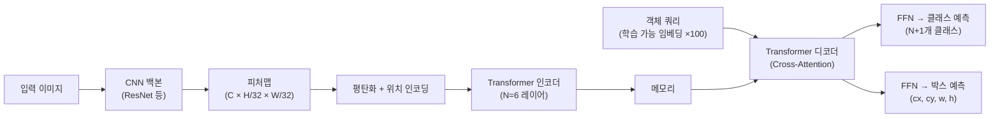
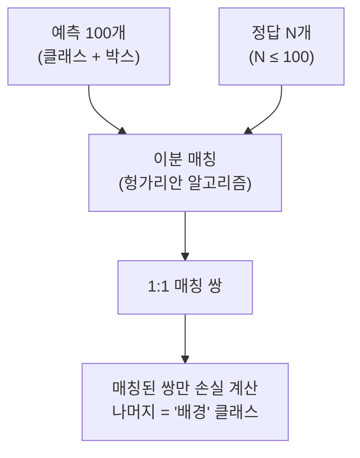

# DETR (Detection Transformer)

DETR(DEtection TRansformer)은 2020년 Facebook AI Research가 발표한 종단간(end-to-end) 객체 검출 모델이다. NMS(Non-Maximum Suppression), 앵커 박스(anchor boxes) 등 손수 설계한 컴포넌트 없이, **[[transformer-architecture]] 인코더-디코더와 이분 매칭(bipartite matching) 손실만으로 객체 검출**을 수행하는 최초의 모델이다.

## 기존 검출기의 한계

YOLO, Faster RCNN 등 전통적인 객체 검출기는 다음 수작업 컴포넌트에 의존했다:

- **앵커 박스**: 다양한 비율/크기의 사전 정의 박스 수백-수천 개
- **NMS**: 중복 박스를 제거하는 후처리 알고리즘
- **RPN**: Region Proposal Network (Faster RCNN)

이는 하이퍼파라미터 튜닝이 복잡하고, 파이프라인이 분절되어 엔드-투-엔드 최적화가 어렵다.

## DETR 아키텍처

주요 구성 요소:

| 요소 | 역할 | 특징 |
|------|------|------|
| CNN 백본 | 피처 추출 | ResNet-50/101, ImageNet 사전학습 |
| Transformer 인코더 | 전역 컨텍스트 통합 | Self-Attention으로 픽셀 간 관계 |
| 객체 쿼리 | 검출 슬롯 | 100개 학습 가능 임베딩 |
| Transformer 디코더 | 쿼리-피처 매핑 | [[cross-attention]]으로 위치 특정 |
| FFN 헤드 | 클래스 + 박스 예측 | 각 쿼리에 독립적으로 적용 |

## 핵심 혁신: 이분 매칭 손실

DETR이 NMS 없이 작동할 수 있는 이유는 **헝가리안 알고리즘(Hungarian algorithm)** 기반 이분 매칭 손실 덕분이다.

손실 함수:

$$\mathcal{L}_{DETR} = \sum_{i} [-\log p_{\hat{\sigma}(i)}(c_i) + \lambda_1 \mathcal{L}_{box}(b_i, \hat{b}_{\hat{\sigma}(i)})]$$

- 각 정답 객체와 예측 박스를 1:1로 매칭
- 매칭 비용: 클래스 확률 + 박스 GIoU + L1 거리
- 매칭되지 않은 예측은 "no object" 클래스로 분류

이 방식으로 **동일 객체에 대한 중복 예측이 원천 차단**된다.

## [[cross-attention]]의 역할

디코더에서 객체 쿼리와 인코더 메모리 간의 [[cross-attention]]은 쿼리가 이미지의 특정 위치에 "집중"하도록 한다. 시각화 결과, 각 쿼리는 이미지의 서로 다른 영역에 어텐션하는 경향을 학습한다. 이를 통해 100개 쿼리가 암묵적으로 이미지의 서로 다른 영역을 담당하게 된다.

## 한계와 개선 모델들

DETR의 단점:

1. **느린 수렴**: 500에폭 훈련 필요 (YOLO는 수십 에폭)
2. **소형 객체 성능 부족**: 단일 해상도 피처맵 사용
3. **긴 훈련 시간**: Self-Attention 계산 비용

이를 개선한 후속 모델들:

| 모델 | 개선점 |
|------|--------|
| Deformable DETR | 변형 가능 어텐션으로 소형 객체 + 빠른 수렴 |
| Conditional DETR | 조건부 Cross-Attention으로 수렴 가속 |
| DAB-DETR | 쿼리를 앵커 박스로 직접 해석 |
| DINO (검출) | 대조 학습 기반 쿼리 초기화 |
| RT-DETR | 실시간 추론 속도 달성 |

## 영향력

DETR은 객체 검출의 패러다임을 바꾼 모델이다. 이후 파노라마 세그먼테이션, 포인트 클라우드 검출, 동영상 객체 추적 등 다양한 분야에서 DETR 스타일의 이분 매칭 + 쿼리 기반 설계가 채택되었다. [[segment-anything]]의 마스크 디코더도 이 설계 철학의 영향을 받았다.

## 관련 문서

- [[transformer-architecture]] - 인코더-디코더 구조의 기반
- [[cross-attention]] - 디코더에서 쿼리-피처 매칭의 핵심
- [[swin-transformer]] - 이후 DETR 계열의 강력한 백본
- [[segment-anything]] - 쿼리 기반 설계를 세그먼테이션에 적용한 모델
- [[vision-transformer]] - ViT 백본을 사용하는 DETR 변형들
