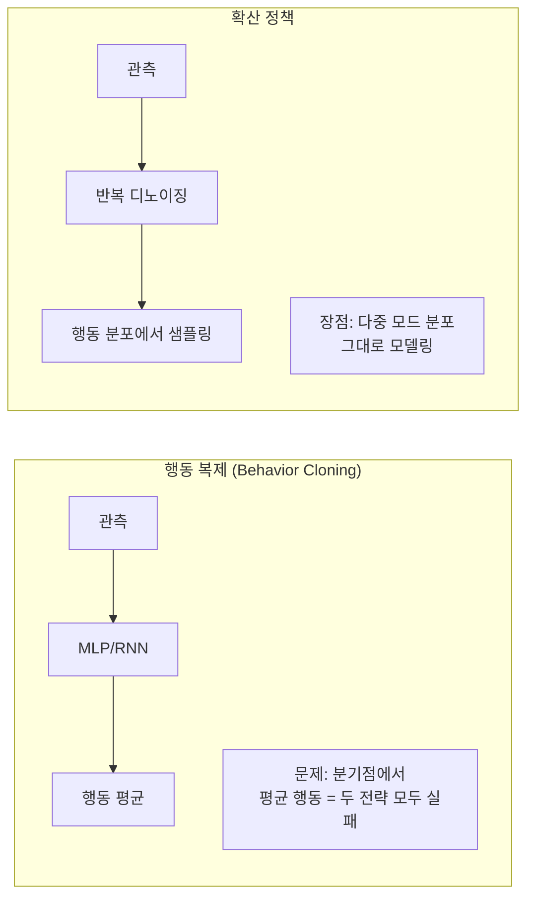
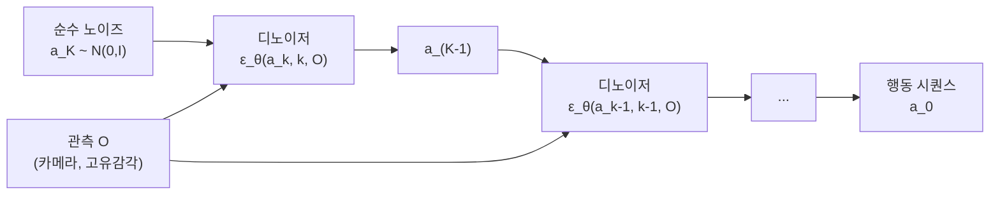

# 확산 정책 (Diffusion Policy) - 로봇 행동 생성

## 개요

확산 정책(Diffusion Policy)은 2023년 Chi et al.이 제안한 로봇 모방 학습(imitation learning) 프레임워크다. 인간 데모에서 로봇 행동을 학습할 때, 행동 시퀀스를 **확산 모델(diffusion model)**로 생성한다. 기존 행동 복제(behavior cloning)의 주요 실패 원인인 **분포 이동(distribution shift)**과 **다중 모드 행동(multimodal behavior)** 문제를 확산 과정의 반복적 정제(iterative denoising)로 해결한다.

## 기존 모방 학습의 한계



**분포 이동 문제**: BC는 데모 데이터의 평균 행동을 학습하지만, 추론 시 작은 오류가 누적되면 데모 분포 밖으로 이탈한다.

**다중 모드 문제**: 같은 상황에서 인간 데모가 여러 다른 행동을 보이면(예: 물건을 왼쪽으로 잡거나 오른쪽으로 잡거나), MSE 손실 기반 BC는 두 행동의 평균을 예측해 어느 쪽도 아닌 실패한 행동을 생성한다.

## 확산 정책의 핵심 원리

확산 정책은 [[diffusion-models]]의 DDPM(Denoising Diffusion Probabilistic Models) 프레임워크를 행동 생성에 적용한다.

### 순방향 과정 (Forward Process)

전문가 행동 시퀀스 $a_0$에 점진적으로 가우시안 노이즈를 추가한다.

$$q(a_k | a_{k-1}) = \mathcal{N}(a_k; \sqrt{1-\beta_k} a_{k-1}, \beta_k I)$$

K 스텝 후 $a_K \sim \mathcal{N}(0, I)$ (순수 노이즈)

### 역방향 과정 (Reverse Process) - 행동 생성



$$p_\theta(a_{k-1} | a_k, O) = \mathcal{N}(a_{k-1}; \mu_\theta(a_k, k, O), \Sigma_k)$$

디노이저 $\epsilon_\theta$는 관측 O를 조건으로 받아 노이즈를 예측하고, 반복적으로 행동을 정제한다.

## 구현 변형

### CNN 기반 확산 정책

시간 차원을 따라 행동 시퀀스에 1D 컨볼루션을 적용하는 U-Net 구조.

```python
# Diffusion Policy - 1D U-Net 디노이저 (개념 코드)
import torch.nn as nn

class DiffusionPolicyUNet(nn.Module):
    def __init__(self, action_dim, obs_dim, diffusion_steps=100):
        super().__init__()
        # 관측 인코더
        self.obs_encoder = nn.Linear(obs_dim, 256)
        # 1D U-Net (시간 차원 처리)
        self.unet = UNet1D(
            input_dim=action_dim,
            cond_dim=256,  # 관측 조건
            diffusion_step_embed_dim=128
        )

    def forward(self, noisy_action, timestep, obs):
        obs_emb = self.obs_encoder(obs)
        noise_pred = self.unet(noisy_action, timestep, obs_emb)
        return noise_pred
```

### Transformer 기반 확산 정책

행동-관측을 토큰으로 처리하는 Transformer 디노이저.

| 항목 | CNN 기반 | Transformer 기반 |
|------|---------|-----------------|
| 추론 속도 | 빠름 | 느림 |
| 긴 행동 시퀀스 | 중간 | 우수 |
| 멀티모달 관측 | 중간 | 우수 |
| 구현 복잡도 | 낮음 | 높음 |

## 핵심 설계 결정

### 행동 청킹 (Action Chunking)

단일 행동 대신 **다수 스텝의 행동 시퀀스(chunk)**를 한 번에 예측한다.

- 예측 지평(prediction horizon): 8-16 스텝
- 실행 지평(execution horizon): 4-8 스텝 (나머지는 버림)
- 효과: 빠른 동작 변화에서 더 일관된 행동 생성

### DDIM 가속 추론

기본 DDPM의 100 디노이징 스텝을 DDIM으로 10-20 스텝으로 줄여 실시간 제어 가능.

## 실험 성과

**시뮬레이션 (RoboMimic 벤치마크):**
- Lift 태스크: 성공률 96.5% (BC-RNN 73.5% 대비)
- Can 태스크: 91.5% (BC-RNN 55.2% 대비)
- Square 태스크: 71.5% (BC-RNN 26.5% 대비)

**실제 로봇 (6-DoF 조작):**
- 식료품 바구니 정렬: 10개 데모로 93% 성공률
- 컵에 음식 담기: 다중 모드 행동 성공적으로 학습

## VLA와의 관계

확산 정책은 단독으로도 강력하지만, [[vla-models]](Vision-Language-Action 모델)과 결합하여 더 강력한 시스템이 등장하고 있다.


- **RoboDiffusion**: 언어 지시를 조건으로 확산 정책 제어
- **Octo**: 확산 행동 헤드를 가진 Transformer 기반 범용 로봇 정책

## 한계

- **느린 추론**: DDPM 기준 100 스텝 디노이징 - 실시간 제어에 DDIM 필수
- **데모 품질 의존**: 다양성이 낮은 데모에서는 과적합 위험
- **다중 로봇 전이**: 특정 로봇/환경에서 학습 후 다른 형태로 전이 어려움
- 고주파수 제어(1kHz 이상)에서는 MPC(Model Predictive Control) 계열에 비해 지연

## 관련 문서

- [[diffusion-models]] - 확산 정책의 기반이 되는 생성 모델 프레임워크
- [[vla-models]] - 확산 정책과 결합하는 Vision-Language-Action 모델
- [[flow-matching]] - 확산 정책 대안으로 등장한 연속 흐름 기반 행동 생성
