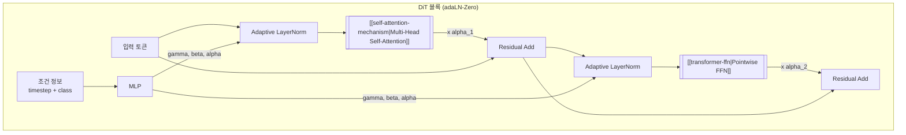

# Diffusion Transformer (DiT)

## 개요

Diffusion Transformer(DiT)는 Peebles & Xie(2023)가 "Scalable Diffusion Models with Transformers"에서 제안한 아키텍처로, 기존 [[diffusion-models|확산 모델]]의 [[u-net|U-Net]] 백본을 [[transformer-architecture|Transformer]]로 대체한다. 잠재 공간(latent space)의 이미지를 패치 단위로 분할하여 토큰 시퀀스로 변환한 뒤, Transformer 블록으로 노이즈를 예측한다. DiT-XL/2 모델은 ImageNet 256x256에서 FID 2.27을 달성하며 당시 모든 확산 모델을 능가했다. 이 아키텍처는 Stable Diffusion 3의 MMDiT, Black Forest Labs의 Flux.1로 이어지며 현재 [[ai-image-generation|AI 이미지 생성]]의 핵심 백본으로 자리잡았다.

## 배경: U-Net에서 Transformer로

[[diffusion-models|확산 모델]]은 전통적으로 [[u-net|U-Net]]을 노이즈 예측 네트워크로 사용했다. U-Net의 인코더-디코더 구조와 skip connection은 공간 정보 보존에 효과적이지만, 몇 가지 구조적 한계가 있었다:

- **스케일링 비효율**: U-Net은 채널 수와 깊이를 늘리는 방식으로 확장하는데, 이는 [[transformer-architecture|Transformer]]처럼 매끄러운 스케일링 법칙을 보이지 않는다
- **글로벌 컨텍스트 부족**: 합성곱 연산은 지역적 수용 영역(receptive field)에 제한되어, 이미지 전체의 장거리 의존성을 포착하기 어렵다
- **멀티모달 통합의 어려움**: 텍스트 조건을 cross-attention으로 주입하지만, 이미지와 텍스트 표현의 깊은 상호작용이 제한적이다

DiT는 NLP와 비전 분야에서 검증된 Transformer의 스케일링 특성을 확산 모델에 가져온다.

## 핵심 아키텍처

### Patchify: 잠재 표현의 토큰화

DiT는 VAE 인코더가 출력한 잠재 표현(latent representation)을 p x p 크기의 패치로 분할하고, 각 패치를 선형 투영(linear projection)하여 토큰으로 변환한다. 이는 [[vision-transformer|ViT]]가 이미지를 패치로 분할하는 방식과 동일하다.

```
입력 이미지 (256x256)
  --> VAE 인코더 --> 잠재 표현 (32x32x4)
  --> Patchify (p=2) --> 256개 토큰 (각 d차원)
  --> + 위치 임베딩(positional embedding)
```

패치 크기 p가 작을수록 토큰 수가 늘어나 Gflops가 증가하지만, 더 세밀한 디테일을 포착할 수 있다. DiT 논문에서는 p=2, 4, 8을 실험했으며, p=2가 가장 높은 성능을 보였다.

### DiT 블록: 조건부 Transformer

각 DiT 블록은 표준 Transformer 블록에 확산 과정의 조건 정보(timestep, class label 등)를 주입하는 메커니즘을 추가한 구조다.



DiT는 조건 정보를 주입하는 네 가지 방식을 비교 실험했다:

| 방식 | 설명 | FID (DiT-XL/2) |
|------|------|-----------------|
| In-context conditioning | 조건을 추가 토큰으로 시퀀스에 연결 | 5.11 |
| Cross-attention | 별도 cross-attention 레이어로 주입 | 3.75 |
| Adaptive LayerNorm (adaLN) | LayerNorm의 gamma, beta를 조건에서 생성 | 3.35 |
| **adaLN-Zero** | adaLN + 잔차 연결 전 스케일링 alpha 추가 | **2.27** |

adaLN-Zero는 각 DiT 블록의 잔차 연결 직전에 학습된 스케일 인자 alpha를 곱하며, 초기화 시 alpha=0으로 설정하여 각 블록이 항등 함수(identity function)에서 출발하도록 한다. 이는 깊은 네트워크의 안정적 학습을 돕는 [[residual-connection|잔차 연결]]의 확장이다.

### 스케일링 법칙

DiT의 핵심 발견은 Gflops(연산량)와 생성 품질 사이의 강한 상관관계다:

- **더 높은 Gflops를 가진 DiT는 일관되게 더 낮은 FID를 달성**한다
- 이 스케일링은 모델 깊이(블록 수), 너비(히든 차원), 입력 토큰 수(패치 크기) 증가 모두에서 관찰된다
- Transformer의 검증된 스케일링 법칙이 확산 모델에도 적용됨을 입증

| 모델 | 깊이 | 히든 차원 | Gflops | FID-50K |
|------|------|-----------|--------|---------|
| DiT-S/2 | 12 | 384 | 6.06 | 68.40 |
| DiT-B/2 | 12 | 768 | 23.01 | 43.47 |
| DiT-L/2 | 24 | 1024 | 80.71 | 9.62 |
| DiT-XL/2 | 28 | 1152 | 118.64 | 2.27 |

## MMDiT: 멀티모달 확장

Stable Diffusion 3(Esser et al., 2024)는 DiT를 멀티모달로 확장한 MMDiT(Multimodal DiT) 아키텍처를 도입했다.

### 핵심 차이점

1. **독립 스트림**: 텍스트 토큰과 이미지 토큰이 각각 독립된 가중치를 가진 어텐션 레이어를 통과하되, joint attention에서 서로의 정보를 참조한다
2. **3중 텍스트 인코더**: CLIP-L, CLIP-G, T5-XXL 세 개의 텍스트 인코더를 사용하여 다양한 수준의 텍스트 이해를 결합한다
3. **Rectified Flow**: 노이즈와 데이터를 직선 경로로 연결하는 flow matching 기법으로, 기존 DDPM 대비 빠르고 안정적인 샘플링을 제공한다

### Flux.1의 발전

Black Forest Labs(Stability AI 창립 멤버 출신)의 Flux.1은 MMDiT를 더 발전시켰다:

- **단일 스트림 + 이중 스트림 하이브리드**: 초기 블록은 텍스트와 이미지를 분리 처리하고, 후기 블록은 단일 시퀀스로 통합하여 깊은 상호작용을 수행
- **Rotary Position Embedding**: 상대적 위치 인코딩으로 다양한 해상도에 유연하게 대응
- **프롬프트 충실도**: 텍스트 지시를 정확하게 반영하는 능력에서 DALL-E 3, Midjourney V6를 능가

## U-Net 대비 장단점

| 측면 | U-Net 기반 확산 | DiT 기반 확산 |
|------|----------------|---------------|
| 스케일링 | 비선형적, 한계 존재 | Transformer 스케일링 법칙 적용 |
| 글로벌 컨텍스트 | 제한적 (합성곱 수용 영역) | 전체 시퀀스 [[self-attention-mechanism\|셀프 어텐션]] |
| 멀티모달 통합 | cross-attention 주입 | 네이티브 멀티모달 처리 (MMDiT) |
| 연산 효율 | 상대적으로 효율적 | 토큰 수 증가 시 O(n^2) 어텐션 비용 |
| 생태계 성숙도 | 풍부한 커뮤니티 도구 | 빠르게 성장 중 |
| 추론 속도 | 일반적으로 더 빠름 | [[flash-attention-fundamentals\|FlashAttention]] 등 최적화 필요 |

## 참고 자료

- Peebles, W. & Xie, S. (2023). [Scalable Diffusion Models with Transformers](https://arxiv.org/abs/2212.09748). ICCV 2023
- Esser, P. et al. (2024). [Scaling Rectified Flow Transformers for High-Resolution Image Synthesis](https://arxiv.org/abs/2403.03206). Stability AI
- [Stable Diffusion 3 & FLUX: MMDiT 아키텍처 완전 분석](https://blog.sotaaz.com/post/sd3-flux-architecture-ko). SOTAAZ Blog
