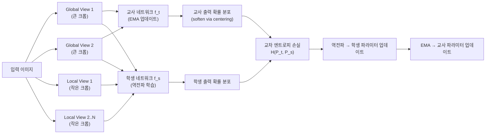

# DINO 자기 증류 비전 (Self-DIstillation with NO labels)

## 동기와 배경

2021년 Facebook AI Research(FAIR)가 발표한 DINO는 **레이블 없이 ViT를 효과적으로 사전학습**하는 자기지도 학습 프레임워크다. 이전 대조 학습 방법(SimCLR, MoCo)과 달리 음수 샘플(negative samples)이나 명시적인 대조 손실이 필요없다.

DINO의 핵심 통찰: **자기 증류(self-distillation)**만으로도 강력한 시각 표현을 학습할 수 있다. 교사와 학생이 동일한 네트워크 구조를 가지며, 교사는 학생의 지수 이동 평균(EMA)으로 유지된다.

더 놀라운 발견은 **창발적 의미 분할(emergent semantic segmentation)**: DINO로 학습된 ViT의 어텐션 맵이 어떠한 분할 레이블 없이도 의미론적으로 일관된 객체 부분을 자동 분리했다.

## 핵심 메커니즘

### 교사-학생 프레임워크

위 다이어그램은 DINO의 전체 학습 루프다.

### 멀티크롭 증강

하나의 이미지에서 여러 크기의 뷰를 생성한다:

- **Global views (2개)**: 이미지의 50% 이상을 포함하는 큰 크롭 - 교사/학생 모두에게 입력
- **Local views (6-8개)**: 이미지의 20-50% 크기의 작은 크롭 - 학생에게만 입력

목표: 학생이 **작은 부분(local)을 보고도 큰 문맥(global)의 표현을 예측**하도록 강제.

### 출력 분포 매핑

두 네트워크 출력 $z$를 소프트맥스 함수로 확률 분포 $P$로 변환:

$$P^{(t)}(x) = \text{softmax}\!\left(\frac{z^{(t)}(x) - c}{\tau_t}\right)$$

$$P^{(s)}(x) = \text{softmax}\!\left(\frac{z^{(s)}(x)}{\tau_s}\right)$$

- $\tau_t = 0.04$ (교사 온도): 낮은 온도 → 날카로운 분포
- $\tau_s = 0.1$ (학생 온도): 더 부드러운 분포
- $c$는 중심화(centering) 벡터

### 손실 함수

$$\mathcal{L} = \sum_{x \in \{x_1^g, x_2^g\}} \sum_{\substack{x' \in V \\ x' \neq x}} H\!\left(P^{(t)}(x),\, P^{(s)}(x')\right)$$

단순한 교차 엔트로피 최소화. 음수 샘플 없이도 표현이 붕괴하지 않는 이유가 두 가지 안정화 기법에 있다.

### 모드 붕괴 방지 메커니즘

**EMA 교사(Momentum Teacher)**:
$$\theta_t \leftarrow m \cdot \theta_t + (1-m) \cdot \theta_s, \quad m \in [0.996, 1]$$

교사가 지나치게 빨리 학생을 따라가면 두 네트워크가 동일한 출력으로 수렴(모드 붕괴)한다. EMA는 교사를 안정적으로 유지한다.

**중심화(Centering)**:
$$c \leftarrow m_c \cdot c + (1 - m_c) \cdot \frac{1}{B} \sum_{i=1}^B z^{(t)}(x_i)$$

교사 출력의 지수 이동 평균을 차감해, 특정 차원이 항상 우세해지는 붕괴를 방지한다. 중심화가 없으면 교사가 모든 입력에 대해 동일한 차원만 활성화하는 trivial solution으로 수렴할 수 있다.

## 창발적 의미 분할

DINO의 가장 놀라운 특성: ViT 학생의 `[CLS]` 토큰과 패치 토큰 사이의 셀프 어텐션 맵이 **의미론적 경계**를 자연스럽게 포착한다.

어텐션 헤드마다 다른 의미론적 부분에 집중하며, 어느 레이블도 제공하지 않았음에도 배경/전경 분리가 가능하다. 이 현상은 ResNet으로 학습하면 나타나지 않아, **ViT 구조 자체의 특성**과 자기 증류 목표 함수의 결합이 원인으로 분석된다.

## 성능

ImageNet 선형 프로빙 (레이블 없는 사전학습 후 선형 분류기만 추가 학습):

| 방법 | Top-1 정확도 |
|------|------------|
| MoCo v2 (ResNet-50) | 71.1% |
| SimCLR (ResNet-50) | 69.3% |
| DINO (ResNet-50) | 75.3% |
| DINO (ViT-S/16) | 77.0% |
| DINO (ViT-B/8) | 80.1% |

## 후속 영향

- **DINOv2**: 대규모 큐레이션 데이터셋(LVD-142M)으로 DINO 확장, ImageNet 86%+, 세분화/깊이 추정 범용 특징 추출기
- **iBot**: 마스크 이미지 예측 + DINO 결합
- **EsViT**: 지역 특징 학습을 DINO에 결합
- **Video DINO**: 시간축으로 DINO 자기 증류 확장

## 한계

- **훈련 비용**: ViT-B/16 기준 16 A100으로 수일 필요
- **작은 모델에서 효과 제한**: 작은 CNN에서는 창발적 분할이 잘 나타나지 않음
- **중심화 하이퍼파라미터 민감도**: $m_c$, $\tau_t$ 등 안정화 파라미터 튜닝이 필요

## 관련 문서

- [[self-supervised-learning]]
- [[byol-bootstrap]]
- [[moco-momentum-contrast]]
- [[simclr-augmentation]]
- [[vision-transformer]]
- [[representation-learning-theory]]
