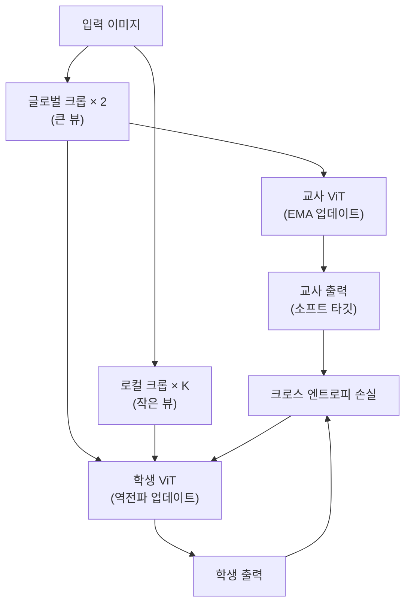

# DINOv2 (자기증류 비전 표현학습)

DINOv2는 Meta AI가 2023년 발표한 자기지도(self-supervised) 비전 파운데이션 모델이다. 레이블 없는 대규모 이미지로 ViT를 학습해 **범용 시각 표현(universal visual features)**을 만든다. 분류·세그멘테이션·깊이 추정·이미지 매칭 등 다양한 태스크에서 파인튜닝 없이 또는 최소한의 헤드만으로 강력한 성능을 발휘한다.

## DINO v1에서 v2로

### DINO v1 (2021)
- 교사-학생(teacher-student) 자기증류(self-distillation) 학습
- 교사 모델은 학생의 EMA(Exponential Moving Average)로 업데이트
- 학생은 다양한 크롭(crop)을 입력받아 교사의 출력을 예측
- [CLS] 토큰이 시맨틱 세그멘테이션 유사 특성을 자연스럽게 학습

### DINOv2 (2023) 주요 개선

| 항목 | 변경 사항 |
|------|---------|
| 데이터 | LVD-142M (큐레이션된 1.42억 장) |
| 백본 | ViT-g/14 (1.1B 파라미터) |
| 학습 목표 | DINO + iBOT (마스크드 이미지 모델링) 결합 |
| 레지스터 토큰 | 아티팩트 제거를 위한 추가 토큰 |
| 학습 안정화 | SwiGLU FFN, Flash Attention |

## 자기증류 구조

## LVD-142M 데이터 큐레이션

DINOv2 성능의 핵심은 데이터 품질이다. 웹 크롤 이미지에서 단순히 많이 모으는 대신:
1. **중복 제거**: 해시 기반 + 임베딩 유사도 기반 중복 제거
2. **자기지도 선별**: 기존 ViT로 임베딩 후 선별한 큐레이션 소스와 유사한 이미지만 선택
3. **분포 균형**: 도메인 균형을 위한 K-Means 클러스터링

결과적으로 인터넷 이미지에서 1.42억 장의 고품질 부분집합을 자동 구성했다.

## 레지스터 토큰 (Register Tokens)

ViT의 [CLS]가 아닌 중간 패치 토큰들이 배경 영역에서 비정상적으로 높은 활성화(artifact)를 보이는 문제가 있었다. DINOv2는 **추가 레지스터 토큰** 4개를 입력에 부착해 모델이 중간 연산용 "메모장"으로 활용하도록 하여 이 아티팩트를 제거했다.

## CLIP과의 차이

| 항목 | CLIP | DINOv2 |
|------|------|--------|
| 학습 방식 | 텍스트-이미지 대조 | 순수 비전 자기증류 |
| 필요 데이터 | 이미지-텍스트 쌍 | 이미지만 |
| 제로샷 분류 | 강함 | 약함(텍스트 없음) |
| 밀집 예측 | 약함 | 강함 |
| 표현 범용성 | 의미론적 | 기하/구조적 포함 |

## 다운스트림 성능 (선형 프로빙)

- ImageNet 분류: 86.5% (ViT-g)
- 깊이 추정(NYUd): 최신 지도학습 수준
- 세맨틱 세그멘테이션(ADE20k): 선형 헤드만으로 경쟁력 있는 성능

## 관련 문서
- [[vision-transformer|Vision Transformer]]
- [[clip|CLIP]]
- [[masked-autoencoder-mae|MAE]]
- [[swin-transformer|Swin Transformer]]
