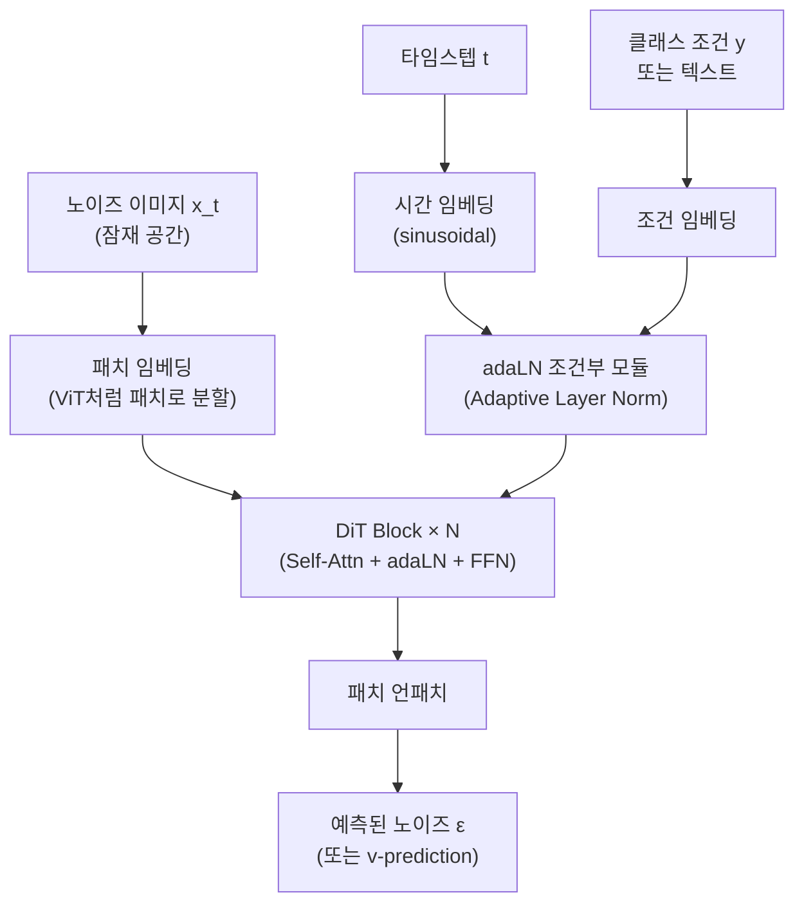
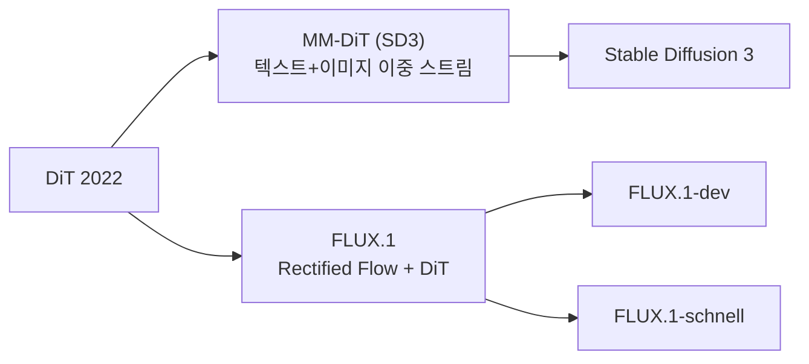

# Diffusion Transformer (DiT)

Diffusion Transformer(DiT)는 2022년 William Peebles와 Saining Xie가 제안한 이미지 생성 모델로, 기존 [[diffusion-models]] 아키텍처에서 U-Net 백본을 **Transformer**로 교체한다. "Scalable Diffusion Models with Transformers"라는 논문 제목처럼, DiT는 확산 모델의 스케일링 법칙을 활성화하는 아키텍처다.

## U-Net에서 Transformer로

기존 확산 모델([[latent-diffusion-model]], Stable Diffusion 등)은 U-Net을 디노이징 네트워크로 사용했다. U-Net은 컨볼루션 인코더-디코더 구조에 스킵 커넥션을 결합하며, 이미지 생성에서 경험적으로 검증되었다.

그러나 U-Net에는 한계가 있다:

- Transformer에 비해 스케일링 효율이 낮음
- 파라미터 수 증가 대비 성능 향상이 비선형적
- 텍스트-이미지 조건부 생성에서 Cross-Attention 통합이 복잡

DiT는 U-Net을 완전한 Transformer로 대체함으로써 **확산 모델에서도 "더 크게 = 더 좋게(scaling laws)"를 적용**한다.

## DiT 아키텍처

핵심 설계 선택:

| 설계 요소 | 선택 | 이유 |
|-----------|------|------|
| 백본 | Transformer (ViT-like) | 스케일링 용이 |
| 조건부 방법 | adaLN-Zero | 안정적 수렴 |
| 입력 표현 | 잠재 공간 패치 | 고해상도 효율 |
| 위치 인코딩 | 학습 가능 | 유연성 |

## Adaptive Layer Norm (adaLN)

DiT의 핵심 혁신은 **adaLN(Adaptive Layer Normalization)** 이다. 타임스텝과 클래스 조건을 네트워크에 주입하는 방법으로, 다음 두 스케일 파라미터를 조건부로 예측한다:

$$y = \gamma(c) \cdot \frac{x - \mu}{\sigma} + \beta(c)$$

- $\gamma(c), \beta(c)$: 조건 벡터 $c$로부터 MLP가 예측하는 스케일/시프트
- adaLN-Zero: 초기화 시 $\gamma=0, \beta=0$으로 설정해 학습 초기 항등 변환

이 방식은 기존 "조건을 덧셈으로 주입"하는 방식보다 훨씬 효과적으로 조건 정보를 전달한다.

## 스케일링과 성능

DiT 논문은 모델 크기와 패치 크기에 따른 체계적 스케일링 실험을 수행했다:

| 모델 | 파라미터 | 패치 크기 | ImageNet FID-50K |
|------|----------|-----------|------------------|
| DiT-S/8 | 33M | 8×8 | 43.5 |
| DiT-B/4 | 130M | 4×4 | 22.8 |
| DiT-L/4 | 458M | 4×4 | 7.4 |
| DiT-XL/2 | 675M | 2×2 | **2.27** |

패치 크기가 작을수록(더 많은 토큰), 모델이 클수록 성능 향상 - Transformer의 전형적인 스케일링 패턴이다.

## SD3과 FLUX로의 진화

DiT 아키텍처는 Stability AI의 Stable Diffusion 3(SD3)와 Black Forest Labs의 FLUX 모델에서 상용 이미지 생성에 채택되었다:

**MM-DiT (Multi-Modal DiT, SD3)**:
- 텍스트와 이미지 토큰을 별도 스트림으로 처리
- 두 스트림이 Self-Attention에서 교차 상호작용
- CLIP + T5 텍스트 인코더 조합

**FLUX.1**:
- Rectified Flow + DiT 결합
- 텍스트 정합성과 이미지 품질에서 SD3 개선

## 비디오 생성으로의 확장

DiT는 OpenAI Sora의 기반 아키텍처이기도 하다. 비디오 프레임을 시공간 패치(spacetime patches)로 분할하여 Transformer에 입력함으로써, 이미지 DiT의 설계를 비디오로 자연스럽게 확장한다.

## 관련 문서
- [[video-generation-architecture]] -- 비디오 생성 아키텍처

- [[diffusion-models]] - DDPM 등 확산 모델의 기초 원리
- [[latent-diffusion-model]] - U-Net 기반 확산 모델 (DiT의 전임자)
- [[transformer-architecture]] - DiT 백본의 기원
- [[vision-transformer]] - DiT와 공유하는 패치 임베딩 설계
- [[flow-matching]] - FLUX에서 DiT와 결합된 훈련 목표
