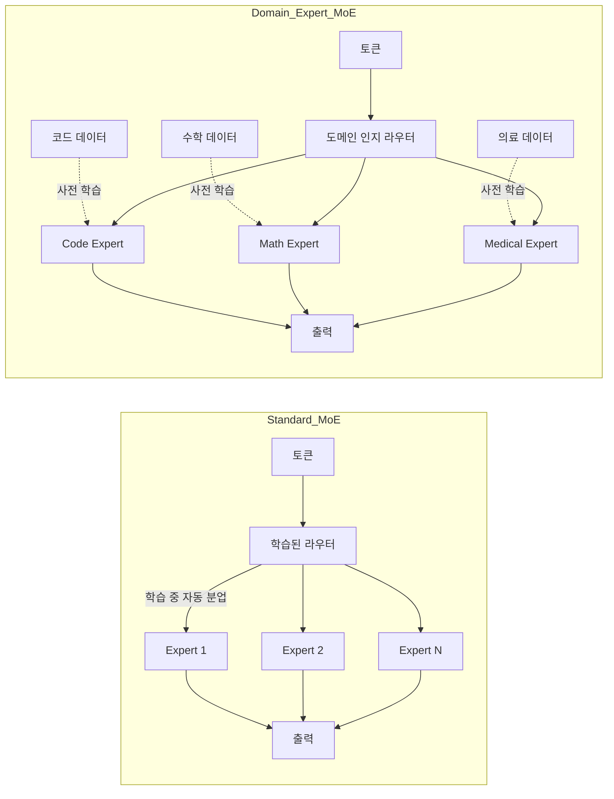
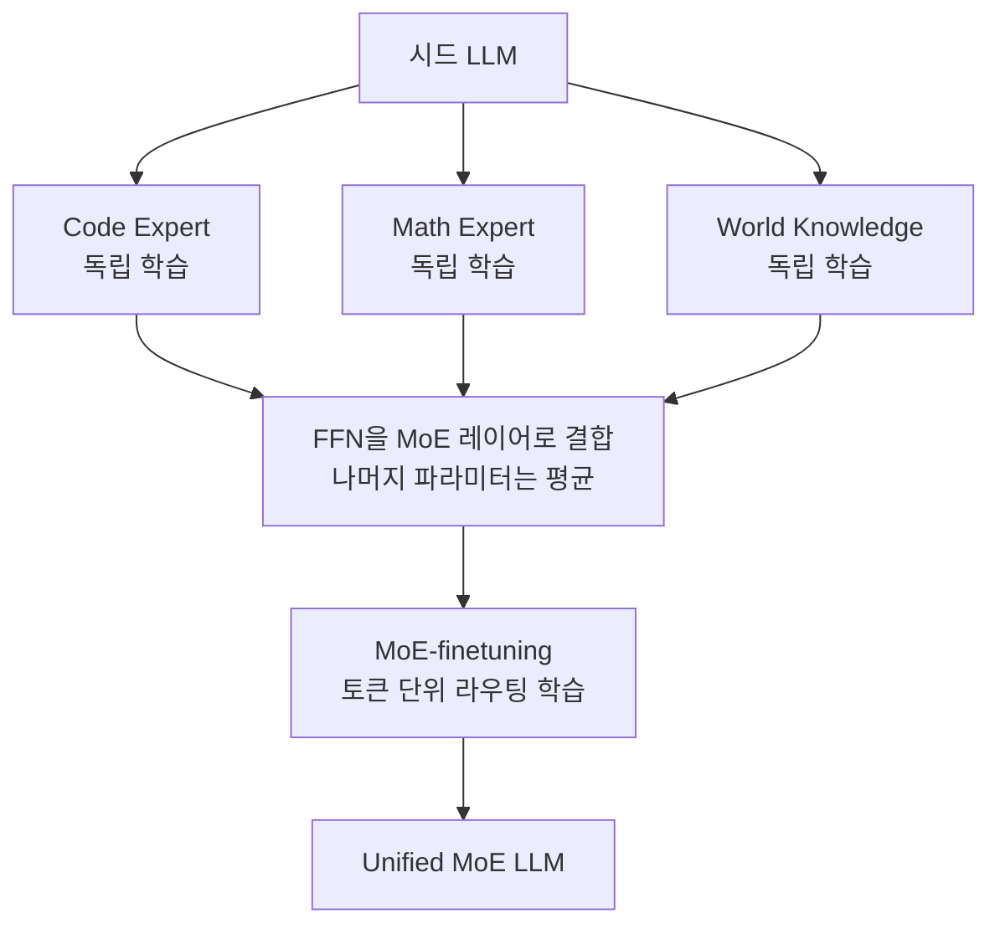

# 도메인 전문가 MoE (Domain Expert MoE)

도메인 전문가 MoE(Domain Expert Mixture of Experts)는 일반 MoE의 변형으로, 각 expert를 **특정 도메인**(코딩, 수학, 의료, 법률, 다국어 등)에 명시적으로 specialize시키는 접근이다. 일반 MoE([[mixture-of-experts-moe-llms]], [[moe]])가 학습 중 token-level routing을 자동으로 학습하면서 expert가 어떤 의미적 분업을 갖는지가 사후 분석 대상인 데 비해, 도메인 전문가 MoE는 **사전에 도메인을 정의하고** 각 expert를 그 도메인 데이터로 학습한다.

## 일반 MoE와의 차이

| 항목 | 일반 MoE (Mixtral, Switch) | 도메인 전문가 MoE (BTM, BTX) |
|------|------------------------------|------------------------------|
| 학습 시점 | end-to-end 공동 학습 | 도메인별 독립 학습 후 결합 |
| Expert 의미 | 사후 해석 (창발적 분업) | 사전 정의 (도메인 명시) |
| Routing 학습 | load balancing loss로 자동 | 도메인 라벨 기반 supervised 또는 후학습 |
| 통신 비용 | 큼 (allreduce) | 작음 (embarrassingly parallel) |
| Expert 추가/제거 | 어려움 (재학습 필요) | 쉬움 (모듈식 추가) |

핵심 동기는 **모듈성**과 **계산 효율성**이다. 64개 도메인 expert를 동시에 학습하려면 각 expert만 개별 노드에서 학습하면 되므로 멀티노드 동기화가 거의 사라진다.

## 대표 방법: Branch-Train-Merge (BTM)

Li, Gururangan et al. (2022) "Branch-Train-Merge: Embarrassingly Parallel Training of Expert Language Models" (arXiv:2208.03306).

### 알고리즘

1. **Branch**: 시드 모델에서 분기. 현재 expert 집합의 (혼합 가중치 평균을) 시작점으로 새 expert 초기화
2. **Train**: 새 도메인 데이터로 독립 학습 — 다른 노드와 통신 없음
3. **Merge**: 학습된 expert를 집합에 합류 — 추론 시 도메인별 우도(또는 분류기)로 expert 선택

### 핵심 결과

> "These ELMs can be added and removed to update data coverage, ensembled to generalize to new domains, or averaged to collapse back to a single LM for efficient inference."
> — Li et al. 2022

- 64개 도메인 (총 192B whitespace tokens)으로 22.4B 파라미터 ELM 집합 구성
- 동일 GPU-hour 예산으로 학습한 표준 Transformer LM 대비 동등 또는 우수 perplexity
- "2.5배 더 많은 컴퓨트로 학습한 표준 Transformer LM과 같은 성능"을 달성

### 한계

추론 시 토큰별 라우팅이 아닌 **시퀀스/도메인 단위 라우팅**이라 토큰 단위 fine-grained 분업은 불가. 이 한계가 BTX의 동기가 된다.

## 발전형: Branch-Train-MiX (BTX)

Sukhbaatar et al. (2024) "Branch-Train-MiX: Mixing Expert LLMs into a Mixture-of-Experts LLM" (arXiv:2403.07816, COLM 2024).

### 단계

1. **Branch**: BTM처럼 시드 모델에서 도메인별 expert 학습 (코드/수학/지식)
2. **Train**: 임베딩 병렬로 독립 학습
3. **MiX**: 학습된 expert들의 **FFN 파라미터를 MoE 레이어의 expert로 묶고**, attention/임베딩 등 나머지 파라미터는 평균
4. **MoE-finetune**: 작은 추가 학습으로 token-level router를 학습

### 핵심 기여

> "BTX generalizes two special cases: Branch-Train-Merge (no MoE finetuning stage) and sparse upcycling (no expert training stage)."
> — Sukhbaatar et al. 2024

BTX는 BTM(라우팅 학습 없음)과 sparse upcycling(expert 학습 없음)의 일반화. 학습 효율과 token-level 라우팅의 장점을 결합한다.

## 관련 변형

### 모듈식 LoRA Experts

각 도메인을 LoRA([[lora]])나 [[adalora-adaptive-rank]] 어댑터로 학습하고 추론 시 라우팅. Full FFN expert보다 가볍지만 표현력은 제한.

### Mixture of LoRAs (MoLM)

여러 LoRA 어댑터를 expert로 두고 routing을 학습. fine-tuning 단계에서 도메인별 LoRA를 학습하고 사용 시 동적 결합.

### Cross-lingual Expert LMs

언어별 expert를 학습하고 추론 시 언어 라우터로 결합. 다국어 LLM에서 "curse of multilinguality"를 완화하는 시도 [교차검증 필요: 정확한 방법론은 논문별로 상이].

### BTS / MergeME 등 후속 연구

전문화된 expert를 일반화 가능한 단일 모델로 다시 압축하는 distillation/merging 연구가 활발 (예: BTS "Harmonizing Specialized Experts into a Generalist LLM").

## 라우팅 전략

도메인 expert MoE의 라우터는 일반 MoE보다 더 다양한 신호를 활용할 수 있다.

| 라우팅 신호 | 예시 |
|------------|------|
| 명시적 도메인 라벨 | 사용자 메타데이터 ("이 쿼리는 의료") |
| 분류기 기반 | 별도 도메인 분류 모델로 사전 결정 |
| Posterior 가중 | $p(\text{domain} \mid \text{prefix})$로 expert 가중 |
| Token-level (BTX) | 학습된 라우터로 토큰마다 top-k expert |
| 검색 기반 | RAG로 도메인 식별 후 라우팅 |

## 장점

- **임베딩 병렬성(embarrassingly parallel)**: 멀티노드 동기 통신 거의 없음
- **모듈성**: expert 추가/제거가 재학습 없이 가능
- **데이터 거버넌스**: 의료/법률처럼 격리가 필요한 도메인을 분리 학습
- **Catastrophic forgetting 방지**: 다른 도메인 학습이 기존 expert를 망가뜨리지 않음

## 한계

- **Expert 정의의 어려움**: 도메인을 어떻게 자르느냐가 성능에 큰 영향
- **Negative interference vs synergy**: 도메인 분리가 항상 성능 향상으로 이어지진 않음 — domain간 상호 학습 효과가 사라질 수 있음
- **추론 시 expert 선택 비용**: 동시 활성 expert 수가 많으면 메모리 부담
- **일반 MoE와의 우열은 케이스별**: Mixtral 류 일반 MoE가 더 효과적인 경우도 많음 [교차검증 필요: 벤치마크별로 결과 상이]

## 사례 정리

| 모델/방법 | 핵심 아이디어 | 출처 |
|-----------|--------------|------|
| BTM (2022) | 도메인별 독립 학습 + 시퀀스 단위 결합 | Li et al. 2208.03306 |
| BTX (2024) | BTM + token-level MoE finetuning | Sukhbaatar et al. 2403.07816 |
| Sparse Upcycling | dense LLM → MoE 변환 (BTX의 한 극단) | Komatsuzaki et al. 2022 [교차검증 필요] |
| MoLM | LoRA 어댑터를 expert로 | 후속 연구 일반 |

## 관련 문서

- [[mixture-of-experts-moe-llms]] - LLM 일반 MoE 개요 (Mixtral 등)
- [[mixture-of-experts]] - MoE 일반 개념
- [[moe]] - MoE 단축 페이지
- [[moe-routing-advances]] - 라우팅 알고리즘 진화
- [[lora]] / [[lora-qlora-finetuning]] - LoRA 기반 모듈 expert
- [[fine-tuning-overview]] - 도메인별 fine-tuning 전반
- [[mixture-of-recursions]] - 또 다른 conditional computation 접근
- [[domain-adaptation]] - 도메인 적응 일반
