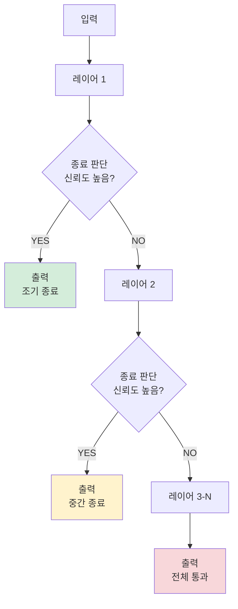
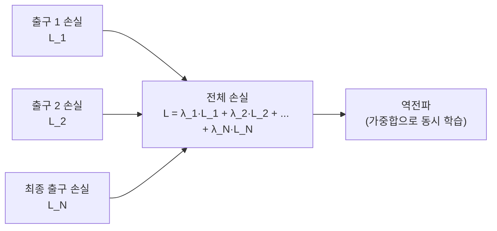

# 조기 종료 네트워크 (Early Exit Networks)

## 개요

조기 종료 네트워크(Early Exit Networks)는 **입력의 난이도에 따라 계산량을 동적으로 조절**하는 적응형 추론 아키텍처다. 쉬운 입력은 네트워크의 앞쪽 레이어에서 일찍 종료하고, 어려운 입력만 전체 레이어를 통과시킨다. 동일한 모델로 평균 추론 비용을 크게 낮추면서도 어려운 케이스에 대한 정확도는 유지한다.

## 핵심 직관

모든 입력이 동일한 계산량을 필요로 하지 않는다. "고양이 사진"과 "두 종이 뒤섞인 모호한 사진"은 분류 난이도가 다르다. 균일한 깊이(fixed-depth) 모델은 쉬운 입력에 낭비적으로 계산하고, 어려운 입력에는 충분히 계산할 수 없는 딜레마가 있다.

쉬운 입력(초록)은 앞에서 종료, 어려운 입력(빨강)만 전체 레이어를 통과한다.

## 주요 설계 요소

### 1. 출구(Exit Head) 배치

네트워크 중간중간에 분류/회귀 헤드를 추가한다. 각 출구는 해당 시점까지의 표현으로 예측을 수행한다.

- **BranchyNet(2016)**: CNN에 중간 브랜치 분류기 삽입한 최초 체계적 연구
- **MSDNet**: 다중 스케일 DenseNet으로 각 깊이에서 특징을 집약

### 2. 종료 기준 (Exit Criterion)

언제 조기 종료할지 결정하는 방법:

| 방법 | 설명 | 장단점 |
|------|------|--------|
| 최대 소프트맥스 확률 | 최고 클래스 확률이 임계값 초과 | 단순, 보정 필요 |
| 엔트로피 기반 | 출력 분포의 불확실성이 낮으면 종료 | 더 안정적 |
| 학습된 게이팅 | 작은 신경망으로 종료 여부 예측 | 추가 파라미터 필요 |

### 3. 학습 전략

중간 출구가 있으면 역전파가 복잡해진다.

각 출구의 손실을 가중합으로 합산해 전체 네트워크를 엔드투엔드로 학습한다.

## PonderNet - 폰더링 기반 조기 종료

PonderNet(Banino et al., 2021, DeepMind)은 조기 종료를 **확률론적 폰더링(pondering)** 관점으로 재해석한다. 각 스텝에서 네트워크가 "이제 충분히 생각했는가?"를 확률적으로 결정한다.

### 핵심 메커니즘

각 스텝 $n$에서 두 가지를 동시에 예측한다.
- $\hat{y}_n$: 현재 스텝의 출력 예측
- $\lambda_n$: 이 스텝에서 종료할 확률 (할트 확률, halt probability)

최종 출력은 각 스텝의 예측을 종료 확률로 가중 평균한다.

$$\hat{y} = \sum_{n=1}^{N} p_n \hat{y}_n, \quad p_n = \lambda_n \prod_{j=1}^{n-1}(1-\lambda_j)$$

**정규화 항**: 너무 오래 폰더링하지 않도록 기하 분포를 기준으로 KL 발산 패널티를 추가한다.

$$\mathcal{L} = \mathcal{L}_{\text{task}} + \beta \cdot \text{KL}(p_n \| \text{Geom}(\lambda_p))$$

## [[mixture-of-depths]]와의 관계

[[mixture-of-depths]](MoD)는 레이어 단위가 아닌 **토큰 단위**로 조기 종료를 적용한다. 시퀀스 내 일부 토큰은 특정 레이어를 건너뛰고(skip), 중요한 토큰만 전체 연산을 수행한다. 개념적으로 조기 종료 네트워크의 토큰 수준 확장이라고 볼 수 있다.

## [[speculative-decoding]]과의 연결

[[speculative-decoding]]은 작은 드래프트 모델이 여러 토큰을 먼저 생성하고 큰 검증 모델이 이를 한 번에 검증하는 방식이다. 조기 종료 네트워크의 직관(쉬운 경우 적은 계산)과 목표가 일치하지만 적용 단위가 다르다 - 조기 종료는 단일 모델 내 레이어, 스펙울레이티브 디코딩은 별도 두 모델 사이다.

## 실무 적용

- **서버리스 추론**: SLA(응답 시간 보장) 환경에서 평균 처리량 향상
- **스트리밍 분류**: 실시간 비디오/오디오 처리에서 간단한 프레임 빠른 처리
- **언어 모델 적용**: LLM에서 쉬운 토큰 예측에 전체 레이어가 낭비됨을 줄이는 연구 진행 중 (예: DejaVu)
- 배치 처리에서 조기 종료 후 **남은 예산을 어려운 샘플에 재배분** 가능

## 성능 트레이드오프

일반적으로 조기 종료 네트워크는 다음 트레이드오프를 보인다.

- 쉬운 입력 50-70% 조기 종료 시 평균 FLOPs 40-60% 절감
- 어려운 입력의 정확도는 전체 레이어 통과로 보존
- 엣지 케이스: 조기 종료 임계값 설정이 도메인마다 다름 (교정 필요)

## 관련 문서
- [[mixture-of-recursions]] -- 재귀 혼합 (Mixture of Recursions)

- [[mixture-of-depths]] - 토큰 단위 조기 종료와 레이어 스킵
- [[speculative-decoding]] - 다중 모델 기반 적응형 추론
- [[transformer-architecture]] - 조기 종료를 적용하는 기반 구조
- [[mobilenet-efficientnet]] - 고정 경량화 vs 동적 경량화 비교
