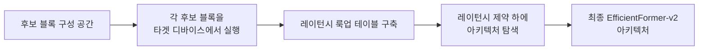
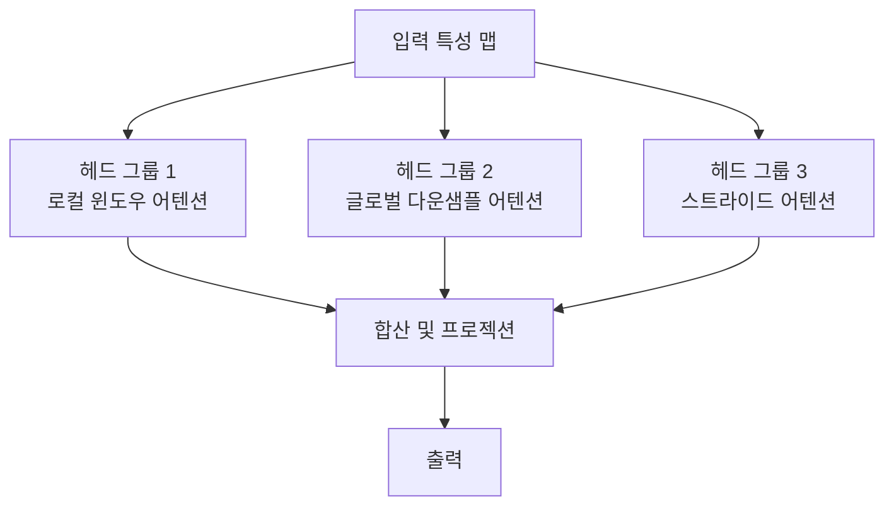

# EfficientFormer-v2

## 개요

EfficientFormer-v2는 모바일 디바이스에서의 실시간 추론을 목표로 설계된 레이턴시 최적화 비전 트랜스포머(Vision Transformer)다. [[vision-transformer]]의 강력한 표현력을 유지하면서도 [[mobilevit-efficient-vit]]와 같은 경량화 모델들이 추구하는 낮은 지연 시간과 적은 메모리 사용량을 달성하기 위해, 연산 병목 분석과 구조적 재설계를 결합한다.

핵심 철학은 "이론적 FLOPs가 아닌 실제 하드웨어 레이턴시를 최적화 목표로 삼는 것"이다. FLOPs가 낮다고 레이턴시가 낮은 것이 아님을 출발점으로, 실제 iPhone이나 Android 기기에서의 실행 시간을 직접 측정하여 아키텍처를 설계한다.

## 설계 원칙

### 1. 하드웨어 인지 탐색 (Hardware-Aware Search)

EfficientFormer-v2는 Neural Architecture Search(NAS)를 레이턴시 제약 하에 수행한다. 단순히 FLOPs를 줄이는 대신, 타겟 디바이스(모바일 CPU/GPU)에서 실제로 측정한 레이턴시를 목적 함수로 사용한다.

### 2. 하이브리드 스테이지 구조

완전한 Self-Attention 대신 스테이지별로 CNN 연산과 Attention 연산을 혼합하는 하이브리드 구조를 채택한다.

| 스테이지 | 해상도 | 주요 연산 | 특성 |
|---------|--------|-----------|------|
| Stage 1 | H/4 x W/4 | Depth-wise Conv | 저수준 특성, CNN 효율 |
| Stage 2 | H/8 x W/8 | Depth-wise Conv | 중간 특성 |
| Stage 3 | H/16 x W/16 | 경량 Attention | 의미적 특성 시작 |
| Stage 4 | H/32 x W/32 | 전체 Self-Attention | 고수준 의미 특성 |

고해상도 스테이지에서는 Conv가 효율적이고, 저해상도 스테이지에서는 Attention의 글로벌 수용 야를 활용하는 전략이다.

### 3. MSHA (Multi-Scale Head Self-Attention)

EfficientFormer-v2에서 도입된 핵심 모듈로, 서로 다른 스케일의 어텐션 헤드를 결합한다.

전역 어텐션은 다운샘플된 키-밸류 쌍에 대해 계산하여 $O(n^2)$ 복잡도를 $O(n \cdot m)$으로 줄인다($m \ll n$).

### 4. 경량 MLP 블록

Transformer의 FFN(Feed-Forward Network) 부분도 최적화한다:
- **Depth-wise Conv 통합**: 채널 혼합을 위한 1x1 Conv와 공간 혼합을 위한 3x3 Depth-wise Conv 조합
- **세분화된 활성화**: GELU 대신 연산 비용이 낮은 활성화 함수 선택적 사용

## 모델 변형

| 모델 | 파라미터 | ImageNet Top-1 | 모바일 레이턴시 |
|------|----------|---------------|--------------|
| EfficientFormer-V2-S0 | 3.5M | 75.7% | 매우 빠름 |
| EfficientFormer-V2-S1 | 6.2M | 79.0% | 빠름 |
| EfficientFormer-V2-S2 | 12.7M | 81.6% | 중간 |
| EfficientFormer-V2-L | 26.3M | 83.3% | 비교적 느림 |

[교차검증 필요] 위 수치는 공식 논문 기준이나, 실제 디바이스별 레이턴시는 환경에 따라 차이가 있을 수 있다.

## 경쟁 모델과의 비교

[[mobilevit-efficient-vit]] 계열과 비교 시 EfficientFormer-v2의 차별점:

- **MobileViT**: 메모리 효율적인 로컬-글로벌 처리를 통해 경량화했으나, 레이턴시 측정이 FLOPs 중심
- **EfficientViT**: 선형 어텐션으로 복잡도를 줄이는 방향
- **EfficientFormer-v2**: 실제 하드웨어 레이턴시를 직접 최적화 목표로 삼는 점이 가장 뚜렷한 차별화

## 실용적 배포 고려사항

모바일 배포 시 추가로 고려할 사항:
- **INT8 양자화**: EfficientFormer-v2 구조는 포스트 트레이닝 양자화(PTQ)와 궁합이 좋음. 모바일 가속기(Neural Engine, DSP)에서 추가 속도 향상 가능
- **TFLite / ONNX 내보내기**: 커스텀 MSHA 블록은 일부 런타임에서 지원되지 않을 수 있어 변환 테스트 필요
- **배치 크기 1**: 모바일 추론은 배치 크기 1이 일반적. 이 설정에서의 레이턴시로 평가해야 함

## 관련 문서

- [[mobilevit-efficient-vit]] - 유사한 모바일 비전 트랜스포머 경량화 접근
- [[vision-transformer]] - EfficientFormer-v2가 기반하는 ViT 아키텍처 원론
- [[vit-patch-embedding]] - 패치 임베딩과 스테이지별 해상도 설계
- [[vit-distillation-techniques]] - EfficientFormer-v2와 함께 사용 가능한 경량화 전략
