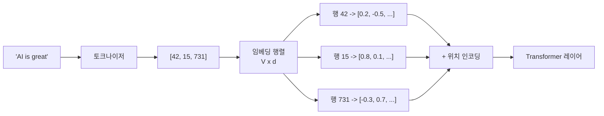

# 임베딩 레이어 (Embedding Layers)

## 개요

임베딩 레이어는 이산적인 토큰 ID를 연속적인 실수 벡터로 변환하는 신경망 구성 요소다. 본질적으로 **(vocab_size x embedding_dim)** 크기의 **학습 가능한 룩업 테이블**이며, 입력 토큰 ID에 해당하는 행(row)을 조회하여 해당 벡터를 반환한다. [[tokenization-bpe-sentencepiece|토크나이저]]가 텍스트를 토큰 ID 시퀀스로 변환하면, 임베딩 레이어가 이를 신경망이 처리할 수 있는 밀집 벡터(dense vector) 시퀀스로 바꾸는 역할을 한다.

## 동작 원리

1. 토큰 ID 입력 (예: [42, 15, 731])
2. 임베딩 행렬에서 해당 ID의 행을 조회 (인덱싱, 행렬 곱이 아님)
3. 각 토큰에 대해 d차원 벡터 반환
4. 위치 인코딩과 결합하여 Transformer 입력 형성

### 수학적 표현

입력 토큰 ID를 원-핫 벡터 $e_i \in \mathbb{R}^V$로 표현하면, 임베딩은 행렬 곱 $x_i = W_e \cdot e_i$와 동치다. 그러나 실제 구현에서는 행렬 곱 대신 **인덱싱**(lookup)으로 처리하여 연산 효율을 높인다.

## 원-핫 인코딩과의 비교

| 특성 | 원-핫 인코딩 | 임베딩 레이어 |
|---|---|---|
| 차원 | V (어휘 크기, 수만~수십만) | d (임베딩 차원, 수백~수천) |
| 밀도 | 희소 (하나만 1) | 밀집 (모든 차원 실수값) |
| 유사도 | 모든 토큰 간 직교 | 의미 유사 토큰이 가까운 벡터 |
| 학습 | 고정 | **역전파로 학습** |

임베딩 레이어의 핵심 가치는 **차원 축소**와 **의미적 관계 학습**이다. 학습이 진행되면 의미적으로 유사한 토큰의 벡터가 벡터 공간에서 가까워진다.

## Transformer에서의 임베딩 구성

현대 Transformer 모델의 입력은 두 종류의 임베딩을 결합한다:

### 토큰 임베딩

어휘의 각 토큰에 대한 벡터 표현이다. 모델의 첫 번째 파라미터 행렬이며, 어휘 크기가 128K이고 임베딩 차원이 4096이면 약 5억 개의 파라미터를 차지한다.

### 위치 인코딩

토큰의 시퀀스 내 위치 정보를 제공한다. Transformer는 순환 구조가 없어 위치 정보를 별도로 주입해야 한다:
- **절대 위치 인코딩**: 원본 Transformer의 사인/코사인 함수 또는 학습 가능한 위치 벡터
- **상대 위치 인코딩**: ALiBi, RoPE 등 -- 토큰 간 상대적 거리만 인코딩
- **RoPE**(Rotary Position Embedding): 현재 LLM에서 가장 널리 사용되며, 벡터를 위치에 따라 회전시킴

### 출력 레이어와의 가중치 공유

많은 모델이 입력 임베딩 행렬과 출력 프로젝션(logit) 행렬의 가중치를 **공유(weight tying)**한다. 이를 통해 파라미터 수를 줄이면서 입력-출력 공간의 일관성을 유지한다. GPT 계열, T5, BERT 등이 이 기법을 사용한다.

## 임베딩 차원의 설계

| 모델 | 어휘 크기 (V) | 임베딩 차원 (d) | 임베딩 파라미터 수 |
|---|---|---|---|
| BERT-base | 30,522 | 768 | ~23M |
| GPT-2 | 50,257 | 768 | ~39M |
| Llama 3 8B | 128,256 | 4,096 | ~525M |
| GPT-4 급 | ~100K+ | 12,288+ | ~1.2B+ |

모델 규모가 커질수록 임베딩 차원도 증가한다. 임베딩 차원은 모델 전체의 hidden size를 결정하며, 어텐션 헤드 수와 FFN 차원에 직접 영향을 준다.

## 사전학습 임베딩과의 관계

초기 NLP에서는 [[word2vec-pretrained-embeddings|Word2Vec]], GloVe 같은 사전학습 벡터로 임베딩 레이어를 **초기화**하는 방식이 일반적이었다. 현재의 LLM은 대규모 사전학습 과정에서 임베딩을 처음부터 학습하므로 외부 사전학습 벡터를 사용하지 않지만, [[contextual-embeddings|문맥적 임베딩]]의 출발점이 되는 정적 토큰 벡터라는 역할은 동일하다.

## 관련 문서

- [[tokenization-bpe-sentencepiece]] -- 임베딩의 입력 공간을 정의하는 토크나이저
- [[word2vec-pretrained-embeddings]] -- 정적 사전학습 임베딩의 역사
- [[contextual-embeddings]] -- 임베딩 레이어를 넘어선 문맥 의존적 표현
- [[multi-head-latent-attention]] -- 어텐션 내부에서의 벡터 변환

## 참고 자료

- [Embedding - PyTorch Documentation](https://docs.pytorch.org/docs/stable/generated/torch.nn.Embedding.html)
- [The Secret to Improved NLP: An In-Depth Look at the nn.Embedding Layer (Towards Data Science)](https://towardsdatascience.com/the-secret-to-improved-nlp-an-in-depth-look-at-the-nn-embedding-layer-in-pytorch-6e901e193e16/)
- [Input Embedding Layer in Transformers](https://apxml.com/courses/introduction-to-transformer-models/chapter-3-transformer-encoder-decoder-architecture/input-embedding-layer)
