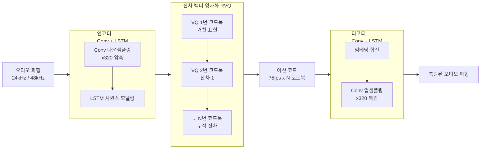

# EnCodec 오디오 토크나이저

## 개요

EnCodec은 Meta AI Research가 2022년 발표한 신경 오디오 코덱(neural audio codec)이다. [[rvq-residual-vector-quantization]] 기반으로 오디오를 이산 토큰으로 압축하고 고품질로 복원한다. VALL-E([[valle-zero-shot-tts]]), AudioLM([[audiolm-framework]]) 등 현대 오디오 언어 모델의 사실상 표준 토크나이저로 자리잡았다.

## 핵심 구조

EnCodec의 전체 파이프라인은 인코더-양자화기-디코더 세 부분으로 구성된다.

## [[rvq-residual-vector-quantization]] 적용

EnCodec이 [[vq-vae]] 기본 VQ와 다른 핵심은 **잔차(residual) 방식 다중 코드북**을 사용한다는 점이다.

1. 인코더가 연속 잠재 벡터 **z** 생성
2. 1번 코드북이 **z**에 가장 가까운 코드를 찾아 **z_1** 할당
3. 잔차 **r_1 = z - z_1** 계산
4. 2번 코드북이 **r_1**에 가장 가까운 코드를 찾아 **z_2** 할당
5. 잔차 **r_2 = r_1 - z_2** 계산
6. N번 코드북까지 반복

사용하는 코드북 수를 조절하면 비트레이트를 유연하게 조절할 수 있다.

| 설정 | 코드북 수 | 비트레이트 | 용도 |
|------|-----------|-----------|------|
| 24kHz 저품질 | 2 | 1.5 kbps | 음성 통신 |
| 24kHz 중품질 | 4 | 3.0 kbps | 일반 음성 |
| 24kHz 고품질 | 8 | 6.0 kbps | 고품질 음성/음악 |
| 48kHz 음악 | 12 | 12.0 kbps | 음악 스트리밍 |

## [[soundstream-neural-codec]]과의 비교

EnCodec과 Google의 [[soundstream-neural-codec]]은 거의 같은 시기에 독립적으로 개발된 유사한 모델이다.

| 비교 항목 | EnCodec | SoundStream |
|----------|---------|-------------|
| 개발사 | Meta AI | Google Research |
| 공개 여부 | 오픈소스 (MIT) | 비공개 |
| 특징 | LSTM + Transformer 판별자 | LSTM + 다중 해상도 판별자 |
| 비트레이트 범위 | 1.5-12 kbps | 3-18 kbps |
| 실시간 처리 | 지원 | 지원 |

EnCodec이 오픈소스로 공개된 덕분에 이후 연구에서 사실상 표준 코덱으로 채택되었다.

## 손실 함수: 다중 판별자 훈련

EnCodec은 세 가지 손실을 조합해 훈련된다.

1. **재구성 손실**: L1 손실 (시간 영역)과 STFT 기반 멜 스펙트로그램 손실
2. **판별자 손실**: 다중 해상도 STFT 판별자 + 다중 주기 파형 판별자 (GAN 방식)
3. **Commitment loss**: 양자화기의 코드북 업데이트를 안정화하는 손실 ([[vq-vae]] 방식)

## 언어 모델 친화적 설계

EnCodec이 오디오 언어 모델에서 선호되는 이유:

- **정수 인덱스 출력**: 각 코드북 항목이 정수 토큰으로 표현되어 LLM의 vocab과 호환
- **계층적 구조**: Coarse(1번) → Fine(N번) 순서로 정보 중요도가 명확히 분리
- **프레임 단위 정렬**: 고정 프레임률(75fps)로 텍스트 정렬이 용이
- **복원 품질**: 사람이 구분하기 어려운 수준의 투명 코딩 가능

## 실무 관점

EnCodec은 단순한 오디오 압축 코덱이 아니라 **오디오와 LLM을 연결하는 인터페이스**로서 가치를 가진다. EnCodec 코드를 LLM의 토큰으로 직접 사용하면 오디오 생성을 텍스트 생성과 동일한 방식으로 다룰 수 있다. 이 특성이 [[valle-zero-shot-tts]], [[audiolm-framework]] 등이 EnCodec을 채택한 핵심 이유다.

## 관련 문서

- [[rvq-residual-vector-quantization]] - EnCodec의 핵심 양자화 기법
- [[vq-vae]] - RVQ의 기반이 된 벡터 양자화 VAE
- [[soundstream-neural-codec]] - Google의 동일 계열 신경 코덱
- [[audiolm-framework]] - EnCodec을 음향 토크나이저로 활용하는 프레임워크
- [[valle-zero-shot-tts]] - EnCodec을 TTS 토크나이저로 사용하는 모델
