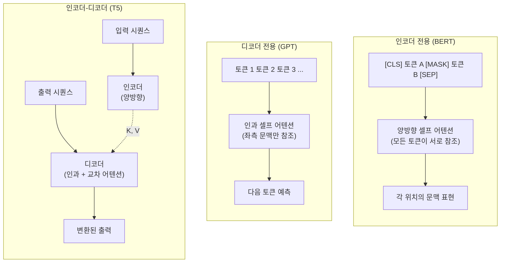
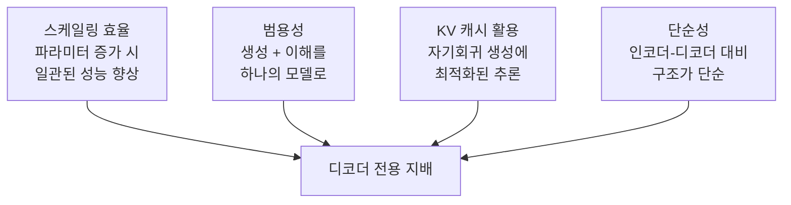

## 개요

원본 [[transformer-architecture]]는 인코더-디코더(encoder-decoder) 구조로 설계되었지만, 이후 과제 특성에 따라 인코더 전용(encoder-only), 디코더 전용(decoder-only), 인코더-디코더의 세 가지 변형으로 분화했다. BERT(2018)가 인코더 전용, GPT(2018)가 디코더 전용, T5(2019)가 인코더-디코더의 대표 모델이다. 2024-2026년 현재 대규모 언어모델(LLM) 분야에서는 GPT, LLaMA, Claude 등 디코더 전용 아키텍처가 지배적이며, 인코더 전용은 임베딩/분류, 인코더-디코더는 번역/요약의 특화 과제에서 활용된다.

## 세 가지 아키텍처 비교

### 상세 비교

| 항목 | 인코더 전용 | 디코더 전용 | 인코더-디코더 |
|------|-----------|-----------|-------------|
| 대표 모델 | BERT, RoBERTa, DeBERTa | GPT, LLaMA, Claude, Mistral | T5, BART, mBART |
| 어텐션 방향 | 양방향 (bidirectional) | 단방향/인과 (causal) | 인코더: 양방향, 디코더: 인과 |
| 사전학습 목적 | MLM (마스크 언어 모델링) | CLM (인과 언어 모델링) | span corruption / MLM + CLM |
| 주요 과제 | 분류, NER, QA, 임베딩 | 텍스트 생성, 대화, 코드 | 번역, 요약, 변환 |
| 생성 능력 | 제한적 | 자연스러운 자기회귀 생성 | 조건부 생성 |
| KV 캐시 | 불필요 | 필수 (추론 효율) | 디코더에서 필요 |

## 인코더 전용: BERT

### 핵심 설계

BERT(Devlin et al., 2018)는 양방향 셀프 어텐션을 통해 각 토큰이 좌우 문맥을 모두 참조한다. Masked Language Modeling(MLM)으로 사전학습한다: 입력 토큰의 15%를 [MASK]로 치환하고 원래 토큰을 예측한다.

### 강점과 한계

양방향 문맥 이해에서 우수하여 분류, NER, 추출형 QA, 문장 임베딩 등에 적합하다. 그러나 자기회귀 생성에 적합하지 않아 텍스트 생성 과제에서는 디코더 전용에 밀린다.

### 현재 위치

BERT 자체의 사전학습 규모는 현대 LLM 대비 작지만(110M-340M), 경량 임베딩 모델의 기반으로 여전히 활발하다. E5, GTE, BGE 등 검색/임베딩 모델은 인코더 전용 구조를 기반으로 한다.

## 디코더 전용: GPT

### 핵심 설계

GPT(Radford et al., 2018)는 인과 [[self-attention-mechanism|셀프 어텐션]]을 통해 각 토큰이 좌측 문맥만 참조한다. Causal Language Modeling(CLM)으로 사전학습한다: 이전 토큰들로 다음 토큰을 예측한다.

### 왜 디코더 전용이 지배적인가

1. **스케일링 효율**: 파라미터를 늘릴 때 인코더-디코더는 인코더/디코더 간 배분 결정이 필요하지만, 디코더 전용은 단순히 층을 쌓으면 된다
2. **범용성**: In-context learning으로 분류, 요약, 번역 등 다양한 과제를 프롬프트만으로 처리
3. **추론 효율**: KV 캐시로 자기회귀 생성이 효율적
4. **단순성**: 하나의 어텐션 타입만 사용하여 구현/최적화가 간단

현대 LLM(GPT-4, Claude, LLaMA, Mistral, Qwen, Gemma)은 모두 디코더 전용이다.

## 인코더-디코더: T5

### 핵심 설계

T5(Raffel et al., 2019)는 모든 NLP 과제를 "텍스트-투-텍스트" 형식으로 통합했다. 인코더가 입력을 양방향으로 이해하고, 디코더가 교차 어텐션으로 인코더 출력을 참조하며 출력을 생성한다.

사전학습 목적함수는 span corruption이다: 입력 텍스트에서 연속된 토큰 범위(span)를 마스킹하고, 디코더가 해당 범위를 생성한다.

### 현재 위치

순수 인코더-디코더의 새 LLM은 드물지만, 이 구조는 [[diffusion-models]]의 텍스트 조건부 생성(교차 어텐션), 음성 인식(Whisper), 번역 전용 모델 등에서 여전히 활용된다. 또한 [[multi-head-latent-attention|MLA]]나 [[mamba-3|SSM]] 같은 효율적 어텐션 변형이 적용되면 인코더-디코더의 효율성 단점이 줄어들 수 있다.

## 하이브리드 접근

최근 연구는 세 가지 구조의 장점을 결합하는 시도를 한다:

- **Prefix LM**: 디코더 전용 모델에서 입력 부분은 양방향, 생성 부분은 인과 어텐션 적용
- **UL2 (2022)**: MLM, CLM, Prefix LM을 혼합한 사전학습
- **비전-언어 모델**: 이미지 인코더 + 텍스트 디코더 (사실상 인코더-디코더 변형)

## 대표 자료

- [Devlin et al., "BERT: Pre-training of Deep Bidirectional Transformers" (arXiv:1810.04805)](https://arxiv.org/abs/1810.04805)
- [Radford et al., "Improving Language Understanding by Generative Pre-Training (GPT)" (2018)](https://cdn.openai.com/research-covers/language-unsupervised/language_understanding_paper.pdf)
- [Raffel et al., "Exploring the Limits of Transfer Learning with a Unified Text-to-Text Transformer (T5)" (arXiv:1910.10683)](https://arxiv.org/abs/1910.10683)

## 관련 문서
- [[perceiver-io]] -- Perceiver IO - 범용 멀티모달 아키텍처

- [[transformer-architecture]] -- 세 가지 변형의 기반 아키텍처
- [[bert]] -- 인코더 전용의 대표 모델, 전이 학습 패러다임 확립
- [[self-attention-mechanism]] -- 양방향/인과 어텐션의 차이
- [[multi-head-attention]] -- 인코더-디코더의 교차 어텐션에서 MHA 활용
- [[transformer-ffn]] -- 세 가지 변형 모두에서 동일하게 사용
- [[pre-ln-vs-post-ln]] -- 모델별 정규화 배치 차이
- [[positional-encoding]] -- 모델별 위치 인코딩 선택
- [[multi-head-latent-attention]] -- 디코더 전용 모델의 KV 캐시 효율화
- [[diffusion-models]] -- 교차 어텐션을 활용하는 생성 모델
