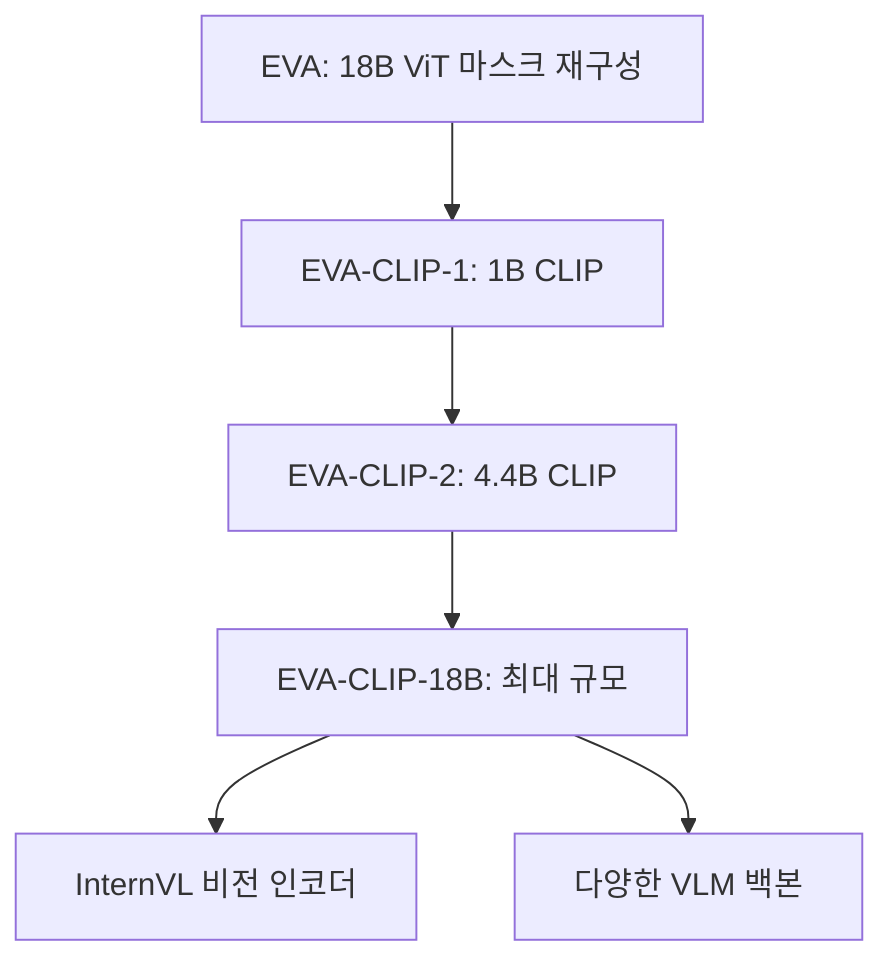
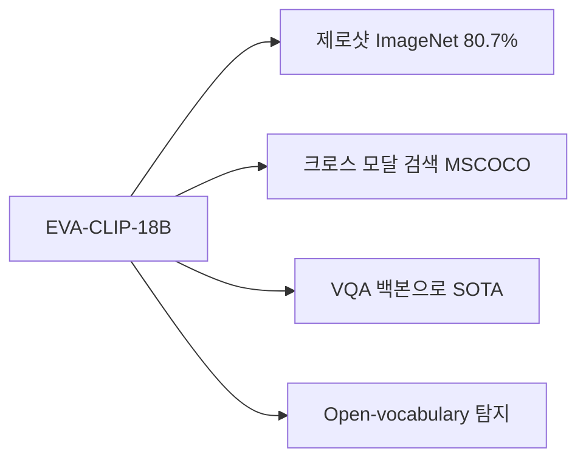
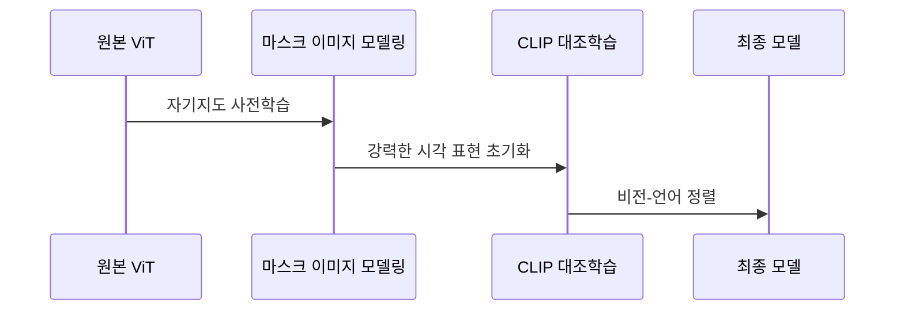

# EVA-CLIP - 18B 파라미터 CLIP 스케일링

## 개요

EVA-CLIP은 Beijing Academy of Artificial Intelligence(BAAI)가 발표한 대규모 [[clip|CLIP]] 스케일링 연구 시리즈다. EVA-CLIP-18B는 18억(18B) 파라미터를 가진 비전-언어 대조학습 모델로, **오픈소스 CLIP 모델 중 최대 규모**이며 다양한 다운스트림 태스크에서 기존 CLIP 모델들을 크게 능가한다.

EVA-CLIP은 단순히 규모를 키운 것이 아니라, 스케일링 과정에서 발생하는 학습 불안정성을 해결하는 기법들을 제안한다.

## EVA 계보

EVA 계보는 처음에 대규모 [[vision-transformer]] 자기지도 사전학습에서 시작해 점차 CLIP 스케일링으로 발전했다.

## 핵심 기술: 스케일링 안정화

### 학습 불안정성 문제

CLIP을 단순히 수십억 파라미터로 키우면 학습이 불안정해지거나 발산하는 현상이 발생한다. EVA-CLIP은 이를 해결하기 위한 여러 기법을 도입한다.

### 안정화 기법

**1. CLIP 대조 손실의 수치 안정성 개선**
- 대규모 배치에서 소프트맥스 분모가 너무 커지는 문제
- 온도 파라미터(temperature) 스케줄링으로 학습 초반 안정화

**2. 그래디언트 클리핑과 혼합 정밀도**
- bf16 혼합 정밀도 학습
- 그래디언트 클리핑으로 폭발 방지

**3. 단계적 스케일업 (Progressive Scaling)**
- 소형 모델로 시작 후 점진적으로 규모 증가
- 이전 단계 가중치를 초기화에 활용

## EVA-CLIP-18B 아키텍처

| 구성 요소 | 세부 사항 |
|----------|----------|
| 비전 인코더 | ViT-E/14+ (18B 파라미터) |
| 텍스트 인코더 | Transformer 기반 (표준 CLIP 텍스트 인코더) |
| 입력 해상도 | 224x224 → 336x336 파인튜닝 |
| 학습 데이터 | LAION-400M + COYO-700M 등 |
| 대조 학습 배치 | 수만 ~ 수십만 |

비전 인코더 크기(18B)와 텍스트 인코더 크기의 불균형이 특징이다. 비전 인코더에 파라미터를 집중함으로써 이미지 표현 품질을 극대화한다.

## 성능

### ImageNet 제로샷 분류

| 모델 | 파라미터 | Top-1 Acc |
|------|---------|----------|
| OpenAI CLIP-L | 307M | 75.3% |
| OpenCLIP-H | 632M | 78.0% |
| EVA-CLIP-8B | 8B | 79.4% |
| EVA-CLIP-18B | 18B | 80.7% |

## 비전-언어 모델 백본으로서의 역할

EVA-CLIP-18B의 중요한 실용적 가치는 **대규모 비전-언어 모델(VLM)의 비전 인코더**로 활용된다는 점이다.

[[internvit-6b|InternViT-6B]]를 포함한 여러 멀티모달 모델들이 EVA-CLIP 계통의 비전 인코더를 기반으로 구축되었다. 강력한 시각 표현을 가진 인코더는 멀티모달 이해 태스크(VQA, 캡셔닝, 문서 이해 등)에서 핵심 역할을 한다.

## EVA 사전학습 전략

EVA 계보의 독특한 점은 **CLIP 대조학습 전에 마스크 이미지 모델링 사전학습**을 수행한다는 것이다.

마스크 사전학습으로 강력한 시각 표현을 먼저 학습하고, 이를 CLIP 대조학습의 초기화로 사용함으로써 더 안정적이고 효과적인 스케일링이 가능해진다.

## 스케일링 법칙 관찰

EVA-CLIP 연구에서 발견된 스케일링 패턴:

1. **비전 인코더 크기가 성능에 더 큰 영향**: 텍스트 인코더 대비 비전 인코더 스케일업 효과가 큼
2. **데이터 질이 양보다 중요**: 큐레이션된 고품질 데이터가 대규모 노이즈 데이터보다 효과적
3. **수렴 보장이 핵심**: 18B 규모에서도 안정적 수렴을 위한 엔지니어링이 필수

## 관련 문서

- [[clip]] - CLIP 원본 개념
- [[vision-transformer]] - 기반 아키텍처 ViT
- [[internvit-6b]] - EVA-CLIP 기반 6B 비전 인코더
- [[masked-image-modeling-survey]] - 마스크 이미지 모델링 사전학습 비교
- [[hierarchical-vit-design]] - 대형 ViT 설계 패턴
