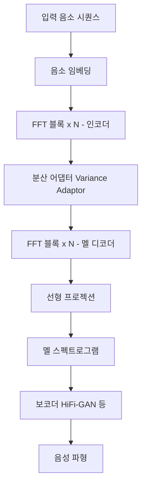
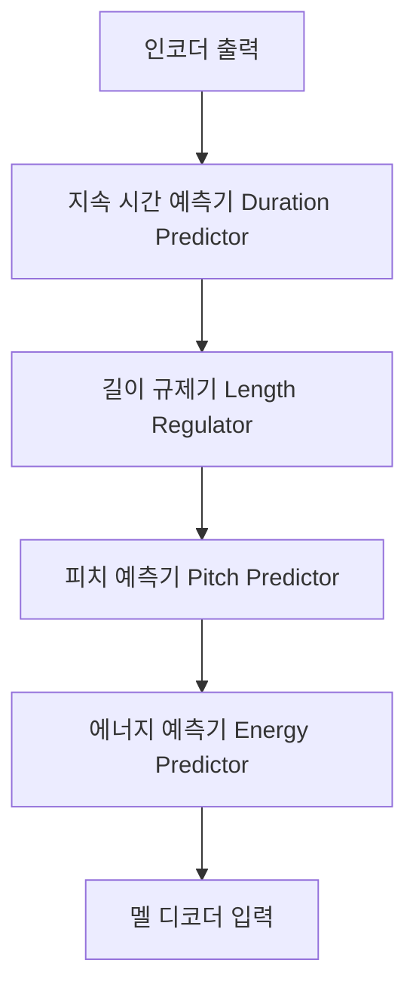
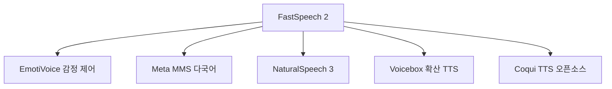

# FastSpeech 2 - 비자기회귀 고속 텍스트-음성 합성

## 배경

Tacotron 2와 같은 자기회귀(autoregressive) TTS 모델은 음질이 뛰어나지만, 프레임을 하나씩 순차 생성하므로 **추론 속도가 느리고** 어텐션 오류로 인한 발음 오류가 발생한다.

**FastSpeech**(Ren et al., Microsoft, 2019)는 비자기회귀(non-autoregressive) 방식으로 멜 스펙트로그램 전체를 **병렬 생성**하여 Tacotron 2 대비 270배 빠른 추론을 달성했다.

**FastSpeech 2**(Ren et al., 2021)는 FastSpeech의 훈련 복잡도를 낮추고 표현력을 강화한 개선 버전이다. 지속 시간(duration), 피치(pitch), 에너지(energy)를 명시적으로 예측하는 **가변 어댑터(Variance Adaptor)**를 도입했다.

## FastSpeech의 한계와 FastSpeech 2의 개선

| 항목 | FastSpeech | FastSpeech 2 |
|------|-----------|--------------|
| 지속 시간 레이블 | 교사 Tacotron 2 어텐션 사용 (복잡) | MFA(Montreal Forced Aligner) 직접 추출 |
| 피치/에너지 | 예측 안 함 | 명시적 분산 어댑터로 예측 |
| 표현력 | 단조로운 음성 | 피치/에너지 제어로 표현 다양화 |
| 훈련 의존성 | 교사 모델 필요 | 독립 훈련 가능 |

## 아키텍처 구조



### FFT 블록 (Feed-Forward Transformer Block)

Conformer와 유사하게 트랜스포머를 음성에 맞게 변형한 블록:


- 멀티헤드 셀프어텐션: 전역 문맥 포착
- 1D 컨볼루션 x2 (커널 크기 9와 1): 지역 패턴 포착
- 양방향 처리로 인코더/디코더 역할 분리

### 가변 어댑터 (Variance Adaptor)

FastSpeech 2의 핵심. 음소별 세 가지 운율(prosody) 속성을 예측하고 적용한다:



#### 1. 지속 시간 예측기 (Duration Predictor)

각 음소가 멜 스펙트로그램에서 몇 프레임에 해당하는지 예측:

- **학습 레이블**: MFA(Montreal Forced Aligner)로 정렬한 음소-프레임 대응
- **구조**: 2개 1D 컨볼루션 + ReLU + 레이어 정규화 + 선형 레이어
- **손실**: MSE (로그 스케일 지속 시간)

#### 2. 길이 규제기 (Length Regulator)

예측된 지속 시간만큼 각 음소 표현을 복제하여 멜 프레임 수에 맞게 확장:

$$\mathbf{H}_{\text{mel}} = \text{LR}(\mathbf{H}_{\text{phoneme}}, \mathbf{d})$$

음소 시퀀스보다 멜 시퀀스가 훨씬 길기 때문에, 단순 반복으로 정렬을 수행한다.

#### 3. 피치 예측기 (Pitch Predictor)

- **피치 추출**: WORLD 보코더 또는 PyWorld로 F0(기본 주파수) 추출
- **양자화**: 연속 F0를 256개 빈으로 양자화 → 임베딩으로 더함
- **예측**: 음소별 평균 피치를 MSE 손실로 학습

#### 4. 에너지 예측기 (Energy Predictor)

- **에너지 계산**: 각 프레임의 L2 노름 (STFT 진폭 제곱합)
- **양자화**: 256개 빈으로 양자화 → 임베딩으로 더함
- **예측**: 음소별 평균 에너지를 MSE 손실로 학습

## 학습

### 학습 설정

- **데이터**: LJSpeech (영어, 24시간), CSMSC (중국어), LibriTTS 등
- **손실**: 멜 MSE + 지속 시간 MSE + 피치 MSE + 에너지 MSE (모두 동일 가중치)
- **보코더**: HiFi-GAN (학습은 분리, 추론 시 결합)
- **옵티마이저**: Adam + 워밍업 4000 스텝

### FastSpeech 2s (음성 직접 생성)

FastSpeech 2s는 멜 스펙트로그램 중간 단계 없이 **파형을 직접 생성**하는 변형이다. WaveNet 스타일 디코더를 내장하여 완전 엔드투엔드를 달성하지만 품질은 FastSpeech 2 + 별도 보코더보다 낮다.

## 성능 및 비교

### 추론 속도 비교 (멜 생성, V100 GPU)

| 모델 | 속도 (RTF 기준) |
|------|--------------|
| Tacotron 2 | 1.0x (기준) |
| FastSpeech | 38x |
| **FastSpeech 2** | **270x** |

### 음질 비교 (LJSpeech MOS)

| 모델 | MOS |
|------|-----|
| 실제 음성 | 4.44 |
| Tacotron 2 | 4.06 |
| FastSpeech | 3.84 |
| **FastSpeech 2** | **4.02** |

FastSpeech 2는 Tacotron 2에 근접한 음질을 얻으면서 추론은 270배 빠르다.

## 제어 가능성

FastSpeech 2의 가장 큰 장점 중 하나는 **운율 제어**가 가능하다는 점이다:

- **말 속도 제어**: 지속 시간 예측 값에 스케일 계수 적용
- **피치 조절**: F0 예측 값에 오프셋 적용
- **에너지 조절**: 에너지 예측 값에 스케일 적용

```python
# 예: FastSpeech 2 추론 시 말 속도 조절 (ESPnet 기반)
output = model.inference(
    text,
    duration_scale=1.2,   # 20% 느리게
    pitch_scale=1.0,
    energy_scale=1.0,
)
```

## 파생 및 영향



- **EmotiVoice**: 감정 레이블을 가변 어댑터에 추가한 감정 TTS
- **Meta MMS**: 1100+ 언어 FastSpeech 2 기반 다국어 TTS
- **NaturalSpeech 3**: 가변 어댑터 개념을 확산 모델로 확장

## 실무 활용

- **엣지 디바이스 TTS**: 빠른 추론으로 스마트워치, 이어폰 내장 TTS 가능
- **다국어 TTS**: 언어별 음소 체계 + 단일 FastSpeech 2 구조
- **데이터 증강**: 자동화된 음성 데이터 생성으로 ASR 학습셋 확장
- **오픈소스 도구**: ESPnet, Coqui TTS, PaddleSpeech에 구현 포함

## 관련 문서

- [[tacotron-2-tts]]
- [[valle-zero-shot-tts]]
- [[voicebox-nonautoregressive-tts]]
- [[naturalspeech3-tts]]
- [[conformer-speech-recognition]]
- [[transformer-architecture]]
- [[diffusion-models]]
