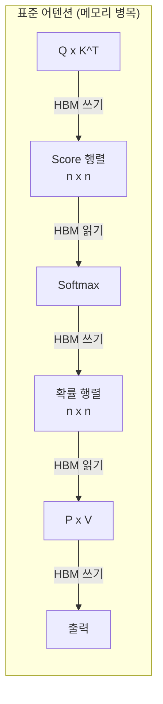
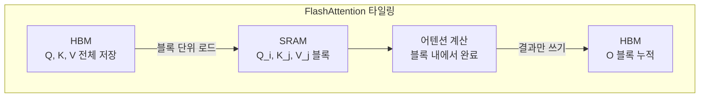

# FlashAttention 기초 (IO-Aware Exact Attention)

## 개요

FlashAttention은 Dao et al. (2022)이 제안한 **IO-aware exact attention** 알고리즘이다. 어텐션의 수학적 결과를 변경하지 않으면서(exact), [[kv-cache|GPU 메모리]] 계층 구조를 고려한 타일링(tiling)과 재계산(recomputation)으로 HBM 접근 횟수를 대폭 줄인다. 결과적으로 표준 어텐션 대비 최대 7.6x 빠르고, 메모리 사용량은 시퀀스 길이에 선형적이다. [[flashattention-4|FlashAttention-4]]는 이 기초 위에 Blackwell GPU의 비대칭 스케일링에 맞춘 커널 재설계를 추가한 것이다.

## 문제: 메모리 벽 (Memory Wall)

현대 GPU에서 연산 속도(FLOPS)는 메모리 대역폭보다 훨씬 빠르게 성장했다. 표준 어텐션은 Q, K, V 행렬 곱과 softmax를 별도의 GPU 커널로 실행하며, 각 단계마다 중간 결과를 **HBM(High Bandwidth Memory)**에 쓰고 다시 읽는다.

n x n 크기의 Score 행렬과 확률 행렬을 HBM에 물리적으로 저장(materialization)하는 것이 핵심 병목이다. 시퀀스 길이 n이 커지면 이 행렬들은 O(n^2) 메모리를 소비한다.

## 핵심 아이디어: 타일링 + 온라인 Softmax

FlashAttention의 해법은 두 가지 기법의 결합이다.

### 타일링 (Tiling)

Q, K, V를 SRAM 크기에 맞는 작은 블록으로 분할하여 HBM과 SRAM 사이 데이터 이동을 최소화한다.

1. 외부 루프: K, V 블록을 순회하며 SRAM에 로드
2. 내부 루프: Q 블록을 순회하며 SRAM에 로드
3. 각 블록 쌍에 대해 어텐션을 계산하고 출력을 HBM에 누적
4. **n x n 행렬을 HBM에 저장하지 않음** -- 핵심 메모리 절약

### 온라인 Softmax (Online Rescaling)

Softmax는 전체 시퀀스에 대한 정규화 상수(분모)가 필요하다. 타일 단위로 계산하면 전체 분모를 한 번에 알 수 없는 문제가 생긴다.

FlashAttention은 **점진적 softmax 재조정(online rescaling)**으로 이를 해결한다:
- 각 블록 처리 후 현재까지의 최대값과 합계를 갱신
- 이전 블록의 부분 결과를 새로운 정규화 상수로 재조정
- 모든 블록 처리 후 정확한(exact) softmax 결과를 얻음

이 방식은 수학적으로 표준 softmax와 동일한 결과를 보장하며, 근사가 아닌 정확한 어텐션이다.

## GPU 메모리 계층 구조

| 메모리 | 용량 | 대역폭 | 역할 |
|---|---|---|---|
| HBM (DRAM) | 40-80 GB | ~2 TB/s | 전체 데이터 저장 |
| SRAM (On-chip) | ~20 MB | ~19 TB/s | 블록 단위 연산 |
| 레지스터 | 수 KB | 최대 | 산술 연산 |

FlashAttention은 HBM 접근을 O(N^2 d^2 M^{-1})로 줄인다. 여기서 d는 헤드 차원(64-128), M은 SRAM 크기(~100KB)다. d^2이 M보다 훨씬 작으므로 표준 어텐션의 O(Nd + N^2) 대비 HBM 접근이 수배~수십 배 감소한다.

## 역방향 패스: 재계산 (Recomputation)

정방향에서 n x n 행렬을 저장하지 않았으므로 역방향 패스에서 기울기 계산 시 중간값이 없다. FlashAttention은 역방향에서 어텐션 행렬을 **재계산**한다. 이 추가 연산 비용은 HBM 접근 감소로 인한 이득보다 작다. 전체적으로 정방향 + 역방향 합산 벽시계 시간이 표준 어텐션보다 빠르다.

## 성능 요약

- **속도**: 표준 어텐션 대비 GPT-2에서 최대 7.6x 빠름
- **메모리**: O(N^2) 에서 O(N)으로 -- 시퀀스 길이에 선형적
- **정확도**: exact attention -- 근사 없이 동일한 수학적 결과

## FlashAttention-2 / 3 / 4로의 진화

| 버전 | 핵심 개선 | 하드웨어 |
|---|---|---|
| FA-1 (2022) | IO-aware 타일링 + 온라인 softmax | A100 |
| FA-2 (2023) | 작업 분할 최적화, 비인과적 마스크 지원 | A100/H100 |
| FA-3 (2024) | Hopper 비동기 실행, FP8 지원 | H100 |
| [[flashattention-4\|FA-4]] (2026) | Blackwell 비대칭 스케일링, 2-CTA MMA | B200 |

각 버전은 FlashAttention 기초의 타일링 + 온라인 softmax 원칙을 유지하면서 새로운 GPU 아키텍처의 특성에 맞춘 커널 수준 최적화를 추가한 것이다.

## 관련 문서

- [[flashattention-4]] -- Blackwell GPU 전용 최적화 (이 문서의 기초 위에 구축)
- [[kv-cache]] -- 추론 시 KV 캐시와 FlashAttention의 결합
- [[sparse-attention-patterns]] -- 어텐션 패턴 자체를 희소화하는 다른 접근
- [[multi-head-latent-attention]] -- 저랭크 분해 기반 어텐션 효율화
- [[gqa-mqa]] -- 어텐션 헤드 공유로 메모리를 줄이는 직교적 기법

## 참고 자료

- [FlashAttention: Fast and Memory-Efficient Exact Attention with IO-Awareness (NeurIPS 2022)](https://arxiv.org/abs/2205.14135)
- [FlashAttention from First Principles (Medium)](https://medium.com/@nandpatel1456/flashattention-from-first-principles-io-aware-exact-attention-via-tiling-and-recomputation-1a824ce1aec1)
- [Understanding Flash Attention: Writing the Algorithm from Scratch in Triton (Towards Data Science)](https://towardsdatascience.com/understanding-flash-attention-writing-the-algorithm-from-scratch-in-triton-5609f0b143ea/)
