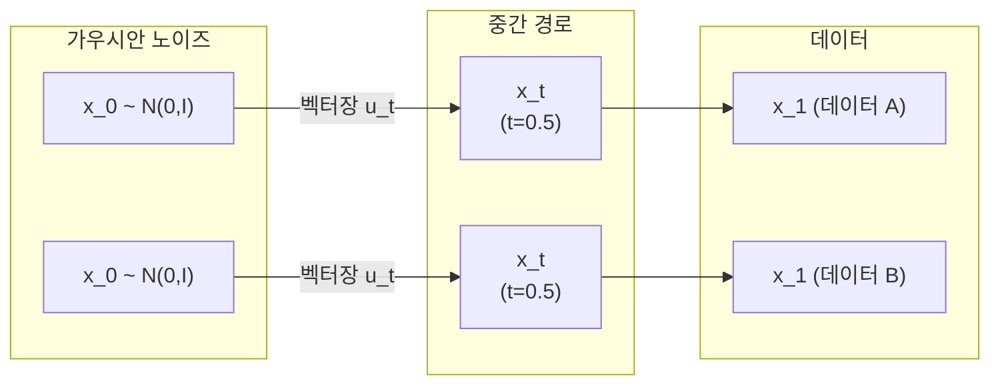

# 플로우 매칭 (Flow Matching)

플로우 매칭(Flow Matching)은 노이즈 분포 $p_0$에서 데이터 분포 $p_1$으로 향하는 확률 흐름(probability flow)을 ODE(Ordinary Differential Equation)로 정의하고, **벡터장(vector field) 회귀**로 학습하는 생성 모델 프레임워크다. Lipman et al. (2022)이 제안했으며, Stable Diffusion 3, Flux 등 최신 생성 모델에 채택됐다. 확산 모델보다 학습이 단순하고 샘플링이 고속이다.

## 핵심 아이디어

확산 모델은 역방향 SDE(Stochastic Differential Equation) 풀이가 필요한 반면, 플로우 매칭은 **결정론적 ODE**를 사용한다.

### 확률 흐름 ODE
$$\frac{dx}{dt} = u_t(x), \quad x(0) \sim p_0(\text{노이즈}), \quad x(1) \sim p_1(\text{데이터})$$

모델 $v_\theta(x_t, t)$가 이 벡터장 $u_t$를 근사한다.

### 학습 목표
조건부 플로우 매칭(Conditional Flow Matching, CFM) 손실:
$$\mathcal{L}_{CFM} = \mathbb{E}_{t, q(x_1), p_t(x|x_1)} \left\| v_\theta(x_t, t) - u_t(x|x_1) \right\|^2$$

각 데이터 포인트 $x_1$에 대해 조건부 경로를 정의하고, 그 경로의 속도(velocity)를 회귀 학습한다.

## ODE 경로 시각화

## 주요 변형

### Optimal Transport (OT) 플로우 매칭
노이즈-데이터 쌍 배정을 최적 수송(Optimal Transport) 기준으로 매칭한다. 교차하는 경로를 줄여 벡터장이 단순해지고 학습이 안정화된다.

### Rectified Flow
Liu et al. (2022)이 독립적으로 제안. 직선 경로(straight-line trajectories)를 학습한다: $x_t = (1-t)x_0 + t x_1$. 결과적으로 벡터장이 상수에 가까워져 **더 적은 NFE(Number of Function Evaluations)**로 샘플링이 가능하다.

## DDPM과의 수학적 관계

| 항목 | DDPM (확산) | 플로우 매칭 |
|------|------------|-----------|
| 학습 과정 | 역방향 SDE 근사 | 벡터장 ODE 회귀 |
| 샘플링 | 이산 역확산 스텝 | ODE 솔버 (Euler/RK4) |
| 이론적 연결 | Probability Flow ODE | 동일 ODE (다른 유도 방법) |
| 학습 노이즈 스케줄 | 세심한 설계 필요 | 선형 경로로 단순화 가능 |
| 샘플링 스텝 | 20-1000 | 2-20 (직선 경로 시) |

## SD3와 Flux에서의 채택

Stable Diffusion 3는 Rectified Flow + Diffusion Transformer(DiT) 조합을 사용한다. Flux는 SD3와 동일한 플로우 매칭 프레임워크에 Flux-specific 아키텍처 변형을 더한다. 두 모델 모두 기존 SD 1.x/2.x 대비 **더 적은 샘플링 스텝**에서 고품질 이미지를 생성한다.

## 왜 확산보다 단순한가

1. **학습**: SDE 기반 손실 대신 단순 MSE 벡터장 회귀
2. **이론**: 노이즈 스케줄 선택이 덜 중요 (직선 경로가 이미 좋음)
3. **샘플링**: 결정론적 ODE 솔버로 고속 생성 가능
4. **조건 경로 자유도**: 원하는 방식으로 중간 경로를 설계 가능

## 관련 문서
- [[latent-diffusion-model|잠재 확산 모델]]
- [[consistency-models|일관성 모델]]
- [[diffusion-transformer|Diffusion Transformer]]
- [[u-net|U-Net]]
